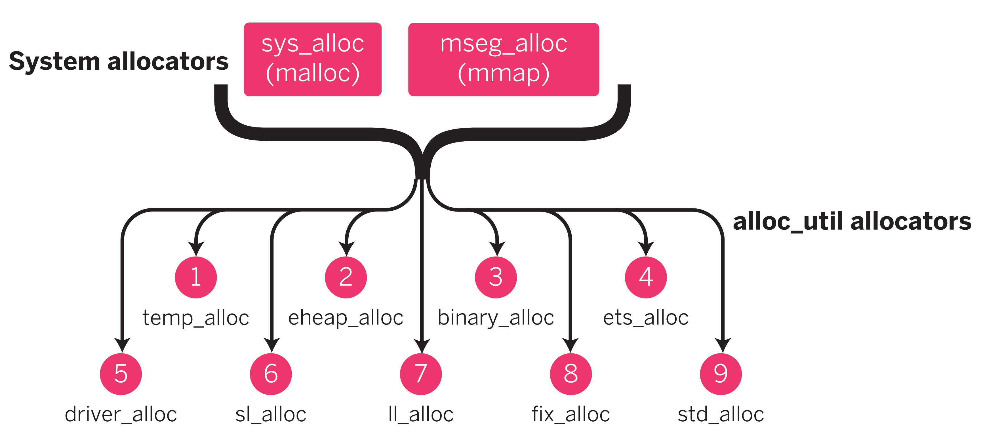
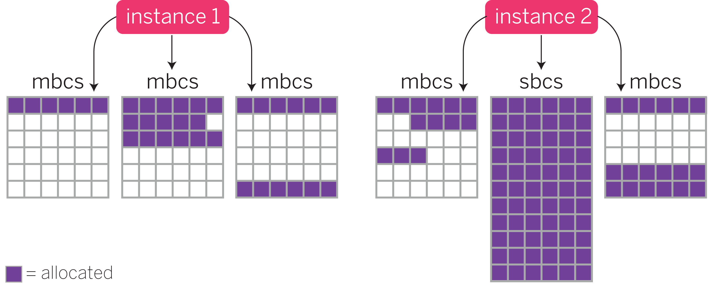
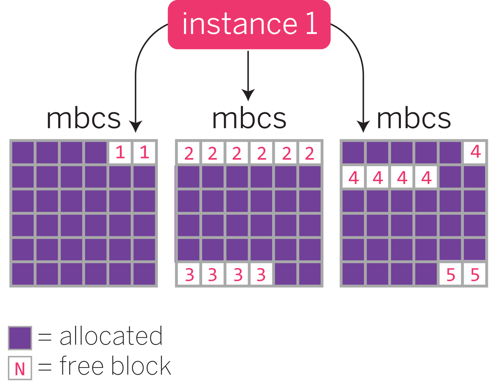
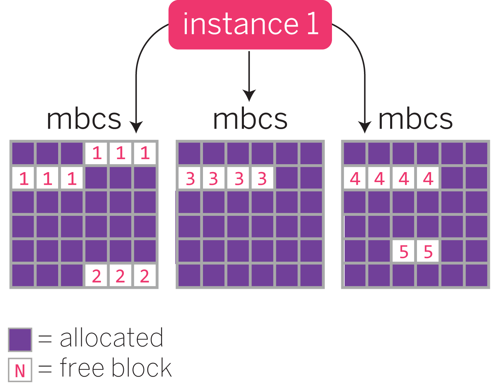

# Memory Leaks

There are truckloads of ways for an Erlang node to bleed memory. They go from extremely simple to astonishingly hard to figure out (fortunately, the latter type is also rarer), and it’s possible you’ll never encounter any problem with them.

You will find out about memory leaks in two ways:

A crash dump (see Chapter Reading Crash Dumps);

By finding a worrisome trend in the data you are monitoring.

This chapter will mostly focus on the latter kind of leak, because they’re easier to investigate and see grow in real time. We will focus on finding what is growing on the node and common remediation options, handling binary leaks (they’re a special case), and detecting memory fragmentation.

## Common Sources of Leaks

Whenever someone calls for help saying "oh no, my nodes are crashing", the first step is always to ask for data. Interesting questions to ask and pieces of data to consider are:

Do you have a crash dump and is it complaining about memory specifically? If not, the issue may be unrelated. If so, go dig into it, it’s full of data.

Are the crashes cyclical? How predictable are they? What else tends to happen at around the same time and could it be related?

Do crashes coincide with peaks in load on your systems, or do they seem to happen at more or less any time? Crashes that happen especially *during* peak times are often due to bad overload management (see Chapter Planning for Overload). Crashes that happen at any time, even when load goes down following a peak are more likely to be actual memory issues.

If all of this seems to point towards a memory leak, install one of the metrics libraries mentioned in Chapter Runtime Metrics and/or `recon` and get ready to dive in.[^1]

The first thing to look at in any of these cases is trends. Check for all types of memory using `erlang:memory()` or some variant of it you have in a library or metrics system. Check for the following points:

Is any type of memory growing faster than others?

Is there any type of memory that’s taking the majority of the space available?

Is there any type of memory that never seems to go down, and always up (other than atoms)?

Many options are available depending on the type of memory that’s growing.

### Atom

*Don’t use dynamic atoms!* Atoms go in a global table and are cached forever. Look for places where you call `erlang:binary_to_term/1` and `erlang:list_to_atom/1`, and consider switching to safer variants (`erlang:binary_to_term(Bin, [safe])` and`erlang:list_to_existing_atom/1`).

If you use the `xmerl` library that ships with Erlang, consider open source alternatives[^2] or figuring the way to add your own SAX parser that can be safe[^3].

If you do none of this, consider what you do to interact with the node. One specific case that bit me in production was that some of our common tools used random names to connect to nodes remotely, or generated nodes with random names that connected to each other from a central server.[^4] Erlang node names are converted to atoms, so just having this was enough to slowly but surely exhaust space on atom tables. Make sure you generate them from a fixed set, or slowly enough that it won’t be a problem in the long run.

### Binary

See Section Binaries.

### Code

The code on an Erlang node is loaded in memory in its own area, and sits there until it is garbage collected. Only two copies of a module can coexist at one time, so looking for very large modules should be easy-ish.

If none of them stand out, look for code compiled with HiPE[^5]. HiPE code, unlike regular BEAM code, is native code and cannot be garbage collected from the VM when new versions are loaded. Memory can accumulate, usually very slowly, if many or large modules are native-compiled and loaded at run time.

Alternatively, you may look for weird modules you didn’t load yourself on the node and panic if someone got access to your system!

### ETS

ETS tables are never garbage collected, and will maintain their memory usage as long as records will be left undeleted in a table. Only removing records manually (or deleting the table) will reclaim memory.

In the rare cases you’re actually leaking ETS data, call the undocumented `ets:i()` function in the shell. It will print out information regarding number of entries (`size`) and how much memory they take (`mem`). Figure out if anything is bad.

It’s entirely possible all the data there is legit, and you’re facing the difficult problem of needing to shard your data set and distribute it over many nodes. This is out of scope for this book, so best of luck to you. You can look into compression of your tables if you need to buy time, however.[^6]

### Processes

There are a lot of different ways in which process memory can grow. Most interesting cases will be related to a few common cases: process leaks (as in, you’re leaking processes), specific processes leaking their memory, and so on. It’s possible there’s more than one cause, so multiple metrics are worth investigating. Note that the process count itself is skipped and has been covered before.

#### Links and Monitors

Is the global process count indicative of a leak? If so, you may need to investigate unlinked processes, or peek inside supervisors’ children lists to see what may be weird-looking.

Finding unlinked (and unmonitored) processes is easy to do with a few basic commands:

```erlang-repl
1> [P || P <- processes(),
         [{_,Ls},{_,Ms}] <- [process_info(P, [links,monitors])],
         []==Ls, []==Ms].
```

This will return a list of processes with neither. For supervisors, just fetching `supervisor:count_children(SupervisorPidOrName)` and seeing what looks normal can be a good pointer.

#### Memory Used

The per-process memory model is briefly described in Subsection Erlang’s Memory Model, but generally speaking, you can find which individual processes use the most memory by looking for their `memory` attribute. You can look things up either as absolute terms or as a sliding window.

For memory leaks, unless you’re in a predictable fast increase, absolute values are usually those worth digging into first:

```erlang-repl
1> recon:proc_count(memory, 3).
[{<0.175.0>,325276504,
  [myapp_stats,
   {current_function,{gen_server,loop,6}},
   {initial_call,{proc_lib,init_p,5}}]},
 {<0.169.0>,73521608,
  [myapp_giant_sup,
   {current_function,{gen_server,loop,6}},
   {initial_call,{proc_lib,init_p,5}}]},
 {<0.72.0>,4193496,
  [gproc,
   {current_function,{gen_server,loop,6}},
   {initial_call,{proc_lib,init_p,5}}]}]
```

Attributes that may be interesting to check other than `memory` may be any other fields in Subsection Processes, including `message_queue_len`, but `memory` will usually encompass all other types.

#### Garbage Collections

It is very well possible that a process uses lots of memory, but only for short periods of time. For long-lived nodes with a large overhead for operations, this is usually not a problem, but whenever memory starts being scarce, such spiky behaviour might be something you want to get rid of.

Monitoring all garbage collections in real-time from the shell would be costly. Instead, setting up Erlang’s system monitor[^7] might be the best way to go at it.

Erlang’s system monitor will allow you to track information such as long garbage collection periods and large process heaps, among other things. A monitor can temporarily be set up as follows:

```erlang-repl
1> erlang:system_monitor().
undefined
2> erlang:system_monitor(self(), [{long_gc, 500}]).
undefined
3> flush().
Shell got {monitor,<4683.31798.0>,long_gc,
                   [{timeout,515},
                    {old_heap_block_size,0},
                    {heap_block_size,75113},
                    {mbuf_size,0},
                    {stack_size,19},
                    {old_heap_size,0},
                    {heap_size,33878}]}
5> erlang:system_monitor(undefined).
{<0.26706.4961>,[{long_gc,500}]}
6> erlang:system_monitor().
undefined
```

The first command checks that nothing (or nobody else) is using a system monitor yet — you don’t want to take this away from an existing application or coworker.

The second command will be notified every time a garbage collection takes over 500 milliseconds. The result is flushed in the third command. Feel free to also check for `{large_heap, NumWords}` if you want to monitor such sizes.
Be careful to start with large values at first if you’re unsure. You don’t want to flood your process’ mailbox with a bunch of heaps that are 1-word large or more, for example.

Command 5 unsets the system monitor (exiting or killing the monitor process also frees it up), and command 6 validates that everything worked.

You can then find out if such monitoring messages tend to coincide with the memory increases that seem to result in leaks or overuses, and try to catch culprits before things are too bad. Quickly reacting and digging into the process (possibly with `recon:info/1`) may help find out what’s wrong with the application.

### Nothing in Particular

If nothing seems to stand out in the preceding material, binary leaks (Section Binaries) and memory fragmentation (Section Memory Fragmentation) may be the culprits. If nothing there fits either, it’s possible a C driver, NIF, or even the VM itself is leaking. Of course, a possible scenario is that load on the node and memory usage were proportional, and nothing specifically ended up being leaky or modified. The system just needs more resources or nodes.

## Binaries

Erlang’s binaries are of two main types: ProcBins and Refc binaries[^8]. Binaries up to 64 bytes are allocated directly on the process’s heap, and their entire life cycle is spent in there. Binaries bigger than that get allocated in a global heap for binaries only, and each process to use one holds a local reference to it in its local heap. These binaries are reference-counted, and the deallocation will occur only once all references are garbage-collected from all processes that pointed to a specific binary.

In 99% of the cases, this mechanism works entirely fine. In some cases, however, the process will either:

do too little work to warrant allocations and garbage collection;

eventually grow a large stack or heap with various data structures, collect them, then get to work with a lot of refc binaries. Filling the heap again with binaries (even though a virtual heap is used to account for the refc binaries’ real size) may take a lot of time, giving long delays between garbage collections.

### Detecting Leaks

Detecting leaks for reference-counted binaries is easy enough: take a measure of all of each process’ list of binary references (using the `binary` attribute), force a global garbage collection, take another snapshot, and calculate the difference.

This can be done directly with `recon:bin_leak(Max)` and looking at the node’s total memory before and after the call:

```erlang-repl
1> recon:bin_leak(5).
[{<0.4612.0>,-5580,
  [{current_function,{gen_fsm,loop,7}},
   {initial_call,{proc_lib,init_p,5}}]},
 {<0.17479.0>,-3724,
  [{current_function,{gen_fsm,loop,7}},
   {initial_call,{proc_lib,init_p,5}}]},
 {<0.31798.0>,-3648,
  [{current_function,{gen_fsm,loop,7}},
   {initial_call,{proc_lib,init_p,5}}]},
 {<0.31797.0>,-3266,
  [{current_function,{gen,do_call,4}},
   {initial_call,{proc_lib,init_p,5}}]},
 {<0.22711.1>,-2532,
  [{current_function,{gen_fsm,loop,7}},
   {initial_call,{proc_lib,init_p,5}}]}]
```

This will show how many individual binaries were held and then freed by each process as a delta. The value `-5580` means there were 5580 fewer refc binaries after the call than before.

It is normal to have a given amount of them stored at any point in time, and not all numbers are a sign that something is bad. If you see the memory used by the VM go down drastically after running this call, you may have had a lot of idling refc binaries.

Similarly, if you instead see some processes hold impressively large numbers of them[^9], that might be a good sign you have a problem.

You can further validate the top consumers in total binary memory by using the special `binary_memory` attribute supported in `recon`:

```erlang-repl
1> recon:proc_count(binary_memory, 3).
[{<0.169.0>,77301349,
  [app_sup,
   {current_function,{gen_server,loop,6}},
   {initial_call,{proc_lib,init_p,5}}]},
 {<0.21928.1>,9733935,
  [{current_function,{erlang,hibernate,3}},
   {initial_call,{proc_lib,init_p,5}}]},
 {<0.12386.1172>,7208179,
  [{current_function,{erlang,hibernate,3}},
   {initial_call,{proc_lib,init_p,5}}]}]
```

This will return the `N` top processes sorted by the amount of memory the refc binaries reference to hold, and can help point to specific processes that hold a few large binaries, instead of their raw amount. You may want to try running this function *before* `recon:bin_leak/1`, given the latter garbage collects the entire node first.

### Fixing Leaks

Once you’ve established you’ve got a binary memory leak using `recon:bin_leak(Max)`, it should be simple enough to look at the top processes and see what they are and what kind of work they do.

Generally, refc binaries memory leaks can be solved in a few different ways, depending on the source:

call garbage collection manually at given intervals (icky, but somewhat efficient);

stop using binaries (often not desirable);

use `binary:copy/1-2`[^10] if keeping only a small fragment (usually less than 64 bytes) of a larger binary;[^11]

move work that involves larger binaries to temporary one-off processes that will die when they’re done (a lesser form of manual GC!);

or add hibernation calls when appropriate (possibly the cleanest solution for inactive processes).

The first two options are frankly not agreeable and should not be attempted before all else failed. The last three options are usually the best ones to be used.

#### Routing Binaries

There’s a specific solution for a specific use case some Erlang users have reported. The problematic use case is usually having a middleman process routing binaries from one process to another one. That middleman process will therefore acquire a reference to every binary passing through it and risks being a common major source of refc binaries leaks.

The solution to this pattern is to have the router process return the pid to route to and let the original caller move the binary around. This will make it so that only processes that do *need* to touch the binaries will do so.

A fix for this can be implemented transparently in the router’s API functions, without any visible change required by the callers.

## Memory Fragmentation

Memory fragmentation issues are intimately related to Erlang’s memory model, as described in Section Erlang’s Memory Model. It is by far one of the trickiest issues of running long-lived Erlang nodes (often when individual node uptime reaches many months), and will show up relatively rarely.

The general symptoms of memory fragmentation are large amounts of memory being allocated during peak load, and that memory not going away after the fact. The damning factor will be that the node will internally report much lower usage (through `erlang:memory()`) than what is reported by the operating system.

### Finding Fragmentation

The `recon_alloc` module was developed specifically to detect and help point towards the resolution of such issues.

Given how rare this type of issue has been so far over the community (or happened without the developers knowing what it was), only broad steps to detect things are defined. They’re all vague and require the operator’s judgement.

#### Check Allocated Memory

Calling `recon_alloc:memory/1` will report various memory metrics with more flexibility than `erlang:memory/0`. Here are the possibly relevant arguments:

1.  call `recon_alloc:memory(usage)`. This will return a value between 0 and 1 representing a percentage of memory that is being actively used by Erlang terms versus the memory that the Erlang VM has obtained from the OS for such purposes. If the usage is close to 100%, you likely do not have memory fragmentation issues. You’re just using a lot of it.

2.  check if `recon_alloc:memory(allocated)` matches what the OS reports.[^12] It should match it fairly closely if the problem is really about fragmentation or a memory leak from Erlang terms.

That should confirm if memory seems to be fragmented or not.

#### Find the Guilty Allocator

Call `recon_alloc:memory(allocated_types)` to see which type of util allocator (see Section Erlang’s Memory Model) is allocating the most memory. See if one looks like an obvious culprit when you compare the results with `erlang:memory()`.

Try `recon_alloc:fragmentation(current)`. The resulting data dump will show different allocators on the node with various usage ratios.[^13]

If you see very low ratios, check if they differ when calling `recon_alloc:fragmentation(max)`, which should show what the usage patterns were like under your max memory load.

If there is a big difference, you are likely having issues with memory fragmentation for a few specific allocator types following usage spikes.

### Erlang’s Memory Model

#### The Global Level

To understand where memory goes, one must first understand the many allocators being used. Erlang’s memory model, for the entire virtual machine, is hierarchical. As shown in Figure Erlang’s Memory Model, there are two main allocators, and a bunch of sub-allocators (numbered 1-9). The sub-allocators are the specific allocators used directly by Erlang code and the VM for most data types:[^14]



`temp_alloc`: does temporary allocations for short use cases (such as data living within a single C function call).

`eheap_alloc`: heap data, used for things such as the Erlang processes’ heaps.

`binary_alloc`: the allocator used for reference counted binaries (what their ’global heap’ is). Reference counted binaries stored in an ETS table remain in this allocator.

`ets_alloc`: ETS tables store their data in an isolated part of memory that isn’t garbage collected, but allocated and deallocated as long as terms are being stored in tables.

`driver_alloc`: used to store driver data in particular, which doesn’t keep drivers that generate Erlang terms from using other allocators. The driver data allocated here contains locks/mutexes, options, Erlang ports, etc.

`sl_alloc`: short-lived memory blocks will be stored there, and include items such as some of the VM’s scheduling information or small buffers used for some data types’ handling.

`ll_alloc`: long-lived allocations will be in there. Examples include Erlang code itself and the atom table, which stay there.

`fix_alloc`: allocator used for frequently used fixed-size blocks of memory. One example of data used there is the internal processes’ C struct, used internally by the VM.

`std_alloc`: catch-all allocator for whatever didn’t fit the previous categories. The process registry for named process is there.

By default, there will be one instance of each allocator per scheduler (and you should have one scheduler per core), plus one instance to be used by linked-in drivers using async threads. This ends up giving you a structure a bit like in Figure Erlang’s Memory Model, but split it in `N` parts at each leaf.

Each of these sub-allocators will request memory from `mseg_alloc` and `sys_alloc` depending on the use case, and in two possible ways. The first way is to act as a multiblock carrier (`mbcs`), which will fetch chunks of memory that will be used for many Erlang terms at once. For each `mbc`, the VM will set aside a given amount of memory (about 8MB by default in our case, which can be configured by tweaking VM options), and each term allocated will be free to go look into the many multiblock carriers to find some decent space in which to reside.

Whenever the item to be allocated is greater than the single block carrier threshold (`sbct`)[^15], the allocator switches this allocation into a single block carrier (`sbcs`). A single block carrier will request memory directly from `mseg_alloc` for the first `mmsbc`[^16] entries, and then switch over to `sys_alloc` and store the term there until it’s deallocated.

So looking at something such as the binary allocator, we may end up with something similar to Figure Erlang’s Memory Model



Whenever a multiblock carrier (or the first `mmsbc`[^17] single block carriers) can be reclaimed, `mseg_alloc` will try to keep it in memory for a while so that the next allocation spike that hits your VM can use pre-allocated memory rather than needing to ask the system for more each time.

You then need to know the different memory allocation strategies of the Erlang virtual machine:

Best fit (`bf`)

Address order best fit (`aobf`)

Address order first fit (`aoff`)

Address order first fit carrier best fit (`aoffcbf`)

Address order first fit carrier address order best fit (`aoffcaobf`)

Good fit (`gf`)

A fit (`af`)

Each of these strategies can be configured individually for each `alloc_util` allocator[^18]



For *best fit* (`bf`), the VM builds a balanced binary tree of all the free blocks’ sizes, and will try to find the smallest one that will accommodate the piece of data and allocate it there. In Figure Erlang’s Memory Model, having a piece of data that requires three blocks would likely end in area 3.

*Address order best fit* (`aobf`) will work similarly, but the tree instead is based on the addresses of the blocks. So the VM will look for the smallest block available that can accommodate the data, but if many of the same size exist, it will favor picking one that has a lower address. If I have a piece of data that requires three blocks, I’ll still likely end up in area 3, but if I need two blocks, this strategy will favor the first `mbcs` in Figure Erlang’s Memory Model with area 1 (instead of area 5). This could make the VM have a tendency to favor the same carriers for many allocations.

*Address order first fit* (`aoff`) will favor the address order for its search, and as soon as a block fits, `aoff` uses it. Where `aobf` and bf would both have picked area 3 to allocate four blocks in Figure Erlang’s Memory Model, this one will get area 2 as a first priority given its address is lowest. In Figure Erlang’s Memory Model, if we were to allocate four blocks, we’d favor block 1 to block 3 because its address is lower, whereas `bf` would have picked either 3 or 4, and `aobf` would have picked 3.



*Address order first fit carrier best fit* (`aoffcbf`) is a strategy that will first favor a carrier that can accommodate the size and then look for the best fit within that one. So if we were to allocate two blocks in Figure Erlang’s Memory Model, `bf` and `aobf` would both favor block 5, `aoff` would pick block 1. `aoffcbf` would pick area 2, because the first `mbcs` can accommodate it fine, and area 2 fits it better than area 1.

*Address order first fit carrier address order best fit* (`aoffcaobf`) will be similar to `aoffcbf`, but if multiple areas within a carrier have the same size, it will favor the one with the smallest address between the two rather than leaving it unspecified.

*Good fit* (`gf`) is a different kind of allocator; it will try to work like best fit (`bf`), but will only search for a limited amount of time. If it doesn’t find a perfect fit there and then, it will pick the best one encountered so far. The value is configurable through the `mbsd`[^19] VM argument.

*A fit* (`af`), finally, is an allocator behaviour for temporary data that looks for a single existing memory block, and if the data can fit, `af` uses it. If the data can’t fit, `af` allocates a new one.

Each of these strategies can be applied individually to every kind of allocator, so that the heap allocator and the binary allocator do not necessarily share the same strategy.

Finally, starting with Erlang version 17.0, each `alloc_util` allocator on each scheduler has what is called a *`mbcs` pool*. The `mbcs` pool is a feature used to fight against memory fragmentation on the VM. When an allocator gets to have one of its multiblock carriers become mostly empty,[^20] the carrier becomes *abandoned*.

This abandoned carrier will stop being used for new allocations, until new multiblock carriers start being required. When this happens, the carrier will be fetched from the `mbcs` pool. This can be done across multiple `alloc_util` allocators of the same type across schedulers. This allows the VM to cache mostly-empty carriers without forcing deallocation of their memory.[^21] It also enables the migration of carriers across schedulers when they contain little data, according to their needs.

#### The Process Level

On a smaller scale, for each Erlang process, the layout still is a bit different. It basically has this piece of memory that can be imagined as one box:

```text
[                  ]
```

On one end you have the heap, and on the other, you have the stack:

```text
[heap |     | stack]
```

In practice there’s more data (you have an old heap and a new heap, for generational GC, and also a virtual binary heap, to account for the space of reference-counted binaries on a specific sub-allocator not used by the process — `binary_alloc` vs. `eheap_alloc`):

```text
[heap   ||    stack]
```

The space is allocated more and more up until either the stack or the heap can’t fit in anymore. This triggers a minor GC. The minor GC moves the data that can be kept into the old heap. It then collects the rest, and may end up reallocating more space.

After a given number of minor GCs and/or reallocations, a full-sweep GC is performed, which inspects both the new and old heaps, frees up more space, and so on. When a process dies, both the stack and heap are taken out at once. reference-counted binaries are decreased, and if the counter is at 0, they vanish.

When that happens, over 80% of the time, the only thing that happens is that the memory is marked as available in the sub-allocator and can be taken back by new processes or other ones that may need to be resized. Only after having this memory unused — and the multiblock carrier unused also — is it returned to `mseg_alloc` or `sys_alloc`, which may or may not keep it for a while longer.

### Fixing Memory Fragmentation with a Different Allocation Strategy

Tweaking your VM’s options for memory allocation may help.

You will likely need to have a good understanding of what your type of memory load and usage is, and be ready to do a lot of in-depth testing. The `recon_alloc` module contains a few helper functions to provide guidance, and the module’s documentation[^22] should be read at this point.

You will need to figure out what the average data size is, the frequency of allocation and deallocation, whether the data fits in `mbcs` or `sbcs`, and you will then need to try playing with a bunch of the options mentioned in `recon_alloc`, try the different strategies, deploy them, and see if things improve or if they impact times negatively.

This is a very long process for which there is no shortcut, and if issues happen only every few months per node, you may be in for the long haul.

## Exercises

### Review Questions

1.  Name some of the common sources of leaks in Erlang programs.

2.  What are the two main types of binaries in Erlang?

3.  What could be to blame if no specific data type seems to be the source of a leak?

4.  If you find the node died with a process having a lot of memory, what could you do to find out which one it was?

5.  How could code itself cause a leak?

6.  How can you find out if garbage collections are taking too long to run?

### Open-ended Questions

1.  How could you verify if a leak is caused by forgetting to kill processes, or by processes using too much memory on their own?

2.  A process opens a 150MB log file in binary mode to go extract a piece of information from it, and then stores that information in an ETS table. After figuring out you have a binary memory leak, what should be done to minimize binary memory usage on the node?

3.  What could you use to find out if ETS tables are growing too fast?

4.  What steps should you go through to find out that a node is likely suffering from fragmentation? How could you disprove the idea that is could be due to a NIF or driver leaking memory?

5.  How could you find out if a process with a large mailbox (from reading `message_queue_len`) seems to be leaking data from there, or never handling new messages?

6.  A process with a large memory footprint seems to be rarely running garbage collections. What could explain this?

7.  When should you alter the allocation strategies on your nodes? Should you prefer to tweak this, or the way you wrote code?

### Hands-On

1.  Using any system you know or have to maintain in Erlang (including toy systems), can you figure out if there are any binary memory leaks on there?

[^1]: See Chapter Connecting to Remote Nodes if you need help to connect to a running node

[^2]: I don’t dislike [exml](https://github.com/paulgray/exml) or [erlsom](https://github.com/willemdj/erlsom)

[^3]: See Ulf Wiger at <http://erlang.org/pipermail/erlang-questions/2013-July/074901.html>

[^4]: This is a common approach to figuring out how to connect nodes together: have one or two central nodes with fixed names, and have every other one log to them. Connections will then propagate automatically.

[^5]: <http://www.erlang.org/doc/man/HiPE_app.html>

[^6]: See the [`compressed` option for `ets:new/2`](http://www.erlang.org/doc/man/ets.html#new-2)

[^7]: <http://www.erlang.org/doc/man/erlang.html#system_monitor-2>

[^8]: <http://www.erlang.org/doc/efficiency_guide/binaryhandling.html#id65798>

[^9]: We’ve seen some processes hold hundreds of thousands of them during leak investigations at Heroku!

[^10]: <http://www.erlang.org/doc/man/binary.html#copy-1>

[^11]: It might be worth copying even a larger fragment of a refc binary. For example, copying 10 megabytes off a 2 gigabytes binary should be worth the short-term overhead if it allows the 2 gigabytes binary to be garbage-collected while keeping the smaller fragment longer.

[^12]: You can call `recon_alloc:set_unit(Type)` to set the values reported by `recon_alloc` in bytes, kilobytes, megabytes, or gigabytes

[^13]: More information is available at <http://ferd.github.io/recon/recon_alloc.html>

[^14]: The complete list of where each data type lives can be found in [erts/emulator/beam/erl\_alloc.types](https://github.com/erlang/otp/blob/maint/erts/emulator/beam/erl_alloc.types)

[^15]: <http://erlang.org/doc/man/erts_alloc.html#M_sbct>

[^16]: <http://erlang.org/doc/man/erts_alloc.html#M_mmsbc>

[^17]: <http://erlang.org/doc/man/erts_alloc.html#M_mmsbc>

[^18]: <http://erlang.org/doc/man/erts_alloc.html#M_as>

[^19]: <http://www.erlang.org/doc/man/erts_alloc.html#M_mbsd>

[^20]: The threshold is configurable through <http://www.erlang.org/doc/man/erts_alloc.html#M_acul>

[^21]: In cases this consumes too much memory, the feature can be disabled with the options `+MBacul 0`.

[^22]: <http://ferd.github.io/recon/recon_alloc.html>
