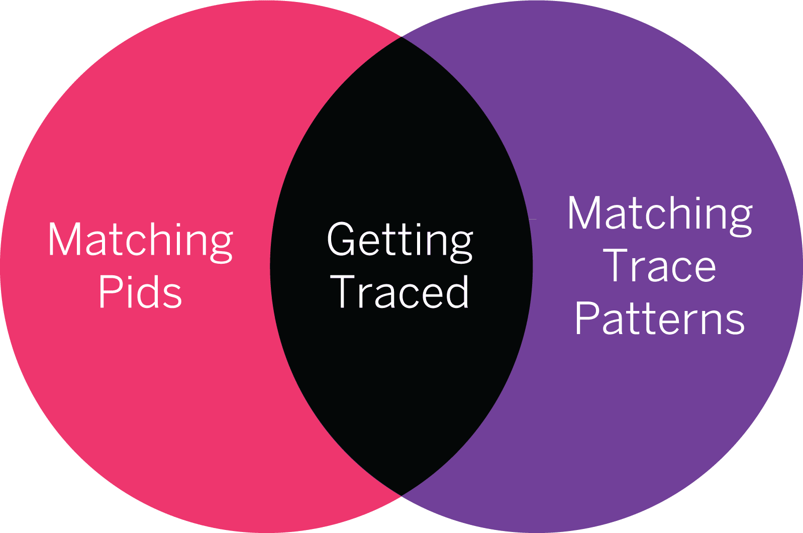

# Tracing

One of the lesser known and absolutely under-used features of Erlang and the BEAM virtual machine is just about how much tracing you can do on there.

Forget your debuggers, their use is too limited.[^1] Tracing makes sense in Erlang at all steps of your system’s life cycle, whether it’s for development or for diagnosing a running production system.

There are a few options available to trace Erlang programs:

-   `sys`[^2] comes standard with OTP and allows the user to set custom tracing functions, log all kinds of events, and so on. It’s generally complete and fine to use for development. It suffers a bit in production because it doesn’t redirect IO to remote shells, and doesn’t have rate-limiting capabilities for trace messages. It is still recommended to read the documentation for the module.

-   `dbg`[^3] also comes standard with Erlang/OTP. Its interface is a bit clunky in terms of usability, but it’s entirely good enough to do what you need. The problem with it is that you *have to know what you’re doing*, because `dbg` can log absolutely everything on the node and kill one in under two seconds.

-   *tracing BIFs* are available as part of the `erlang` module. They’re mostly the raw blocks used by all the applications mentioned in this list, but their lower level of abstraction makes them rather difficult to use.

-   `redbug`[^4] is a production-safe tracing library, part of the `eper`[^5] suite. It has an internal rate-limiter, and a nice usable interface. To use it, you must however be willing to add in all of `eper`’s dependencies. The toolkit is fairly comprehensive and can be a very interesting install.

-   `recon_trace`[^6] is `recon`’s take on tracing. The objective was to allow the same levels of safety as with `redbug`, but without the dependencies. The interface is different, and the rate-limiting options aren’t entirely identical. It can also only trace function calls, and not messages.[^7]

This chapter will focus on tracing with `recon_trace`, but the terminology and the concepts used mostly carry over to any other Erlang tracing tool that can be used.

## Tracing Principles

The Erlang Trace BIFs allow to trace any Erlang code at all[^8]. They work in two parts: *pid specifications*, and *trace patterns*.

Pid specifications lets the user decide which processes to target. They can be specific pids, `all` pids, `existing` pids, or `new` pids (those not spawned at the time of the function call).

The trace patterns represent functions. Functions can be specified in two parts: specifying the modules, functions, and arity, and then with Erlang match specifications[^9] to add constraints to arguments.

What defines whether a specific function call gets traced or not is the intersection of both, as seen in Figure Tracing Principles.



If either the pid specification excludes a process or a trace pattern excludes a given call, no trace will be received.

Tools like `dbg` (and trace BIFs) force you to work with this Venn diagram in mind. You specify sets of matching pids and sets of trace patterns independently, and whatever happens to be at the intersection of both sets gets to be displayed.

Tools like `redbug` and `recon_trace`, on the other hand, abstract this away.

## Tracing with Recon

Recon, by default, will match all processes. This will often be good enough for a lot of debugging cases. The interesting part you’ll want to play with most of the time is specification of trace patterns. Recon support a few basic ways to declare them.

The most basic form is `{Mod, Fun, Arity}`, where `Mod` is a literal module, `Fun` is a function name, and `Arity` is the number of arguments of the function to trace. Any of these may also be replaced by wildcards (`’_’`). Recon will forbid forms that match too widely on everything (such as `{’_’,’_’,’_’}`), as they could be plain dangerous to run in production.

A fancier form will be to replace the arity by a function to match on lists of arguments. The function is limited to those usable by match specifications similar to what is available in ETS[^10]. Finally, multiple patterns can be put into a list to broaden the matching scope.

It will also be possible to rate limit based on two manners: a static count, or a number of matches per time interval.

Rather than going more in details, here’s a list of examples and how to trace for them.

```erlang
%% All calls from the queue module, with 10 calls printed at most:
recon_trace:calls({queue, '_', '_'}, 10)

%% All calls to lists:seq(A,B), with 100 calls printed at most:
recon_trace:calls({lists, seq, 2}, 100)

%% All calls to lists:seq(A,B), with 100 calls per second at most:
recon_trace:calls({lists, seq, 2}, {100, 1000})

%% All calls to lists:seq(A,B,2) (all sequences increasing by two) with 100 calls
%% at most:
recon_trace:calls({lists, seq, fun([_,_,2]) -> ok end}, 100)

%% All calls to iolist_to_binary/1 made with a binary as an argument already
%% (a kind of tracking for useless conversions):
recon_trace:calls({erlang, iolist_to_binary,
                   fun([X]) when is_binary(X) -> ok end},
                  10)

%% Calls to the queue module only in a given process Pid, at a rate of 50 per
%% second at most:
recon_trace:calls({queue, '_', '_'}, {50,1000}, [{pid, Pid}])

%% Print the traces with the function arity instead of literal arguments:
recon_trace:calls(TSpec, Max, [{args, arity}])

%% Matching the filter/2 functions of both dict and lists modules, across new
%% processes only:
recon_trace:calls([{dict,filter,2},{lists,filter,2}], 10, [{pid, new}])

%% Tracing the handle_call/3 functions of a given module for all new processes,
%% and those of an existing one registered with gproc:
recon_trace:calls({Mod,handle_call,3}, {1,100}, [{pid, [{via, gproc, Name}, new]}

%% Show the result of a given function call, the important bit being the
%% return_trace() call or the {return_trace} match spec value.
recon_trace:calls({Mod,Fun,fun(_) -> return_trace() end}, Max, Opts)
recon_trace:calls({Mod,Fun,[{'_', [], [{return_trace}]}]}, Max, Opts)
```

Each call made will override the previous one, and all calls can be cancelled with `recon_trace:clear/0`.

There’s a few more combination possible, with more options:

`{pid, PidSpec}`  
Which processes to trace. Valid options is any of `all`, `new`, `existing`, or a process descriptor (`{A,B,C}`, `"<A.B.C>"`, an atom representing a name, `{global, Name}`, `{via, Registrar, Name}`, or a pid). It’s also possible to specify more than one by putting them in a list.

`{timestamp, formatter | trace}`  
By default, the formatter process adds timestamps to messages received. If accurate timestamps are required, it’s possible to force the usage of timestamps within trace messages by adding the option `{timestamp, trace}`.

`{args, arity | args}`  
Whether to print the arity in function calls or their (by default) literal representation.

`{scope, global | local}`  
By default, only ’global’ (fully qualified function calls) are traced, not calls made internally. To force tracing of local calls, pass in `{scope, local}`. This is useful whenever you want to track the changes of code in a process that isn’t called with `Module:Fun(Args)`, but just `Fun(Args)`.

With these options, the multiple ways to pattern match on specific calls for specific functions and whatnot, a lot of development and production issues can more quickly be diagnosed. If the idea ever comes to say "hm, maybe I should add more logging there to see what could cause that funny behaviour", tracing can usually be a very fast shortcut to get the data you need without deploying any code or altering its readability.

## Example Sessions

First let’s trace the queue:new functions in any process:

```erlang-repl
1> recon_trace:calls({queue, new, '_'}, 1).
1
13:14:34.086078 <0.44.0> queue:new()
Recon tracer rate limit tripped.
```

The limit was set to 1 trace message at most, and recon let us know when that limit was reached.

Let’s instead look for all the `queue:in/2` calls, to see what it is we’re inserting in queues:

```erlang-repl
2> recon_trace:calls({queue, in, 2}, 1).
1
13:14:55.365157 <0.44.0> queue:in(a, {[],[]})
Recon tracer rate limit tripped.
```

In order to see the content we want, we should change the trace patterns to use a fun that matches on all arguments in a list (`_`) and returns `return_trace()`. This last part will generate a second trace for each call that includes the return value:

```erlang-repl
3> recon_trace:calls({queue, in, fun(_) -> return_trace() end}, 3).
1

13:15:27.655132 <0.44.0> queue:in(a, {[],[]})

13:15:27.655467 <0.44.0> queue:in/2 --> {[a],[]}

13:15:27.757921 <0.44.0> queue:in(a, {[],[]})
Recon tracer rate limit tripped.
```

Matching on argument lists can be done in a more complex manner:

```erlang-repl
4> recon_trace:calls(
4>   {queue, '_',
4>    fun([A,_]) when is_list(A); is_integer(A) andalso A > 1 ->
4>        return_trace()
4>    end},
4>   {10,100}
4> ).
32

13:24:21.324309 <0.38.0> queue:in(3, {[],[]})

13:24:21.371473 <0.38.0> queue:in/2 --> {[3],[]}

13:25:14.694865 <0.53.0> queue:split(4, {[10,9,8,7],[1,2,3,4,5,6]})

13:25:14.695194 <0.53.0> queue:split/2 --> {{[4,3,2],[1]},{[10,9,8,7],[5,6]}}

5> recon_trace:clear().
ok
```

Note that in the pattern above, no specific function (`’_’`) was matched against. Instead, the fun used restricted functions to those having two arguments, the first of which is either a list or an integer greater than 1.

Be aware that extremely broad patterns with lax rate-limitting (or very high absolute limits) may impact your node’s stability in ways `recon_trace` cannot easily help you with. Similarly, tracing extremely large amounts of function calls (all of them, or all of `io` for example) can be risky if more trace messages are generated than any process on the node could ever handle, despite the precautions taken by the library.

In doubt, start with the most restrictive tracing possible, with low limits, and progressively increase your scope.

## Exercises

### Review Questions

1.  Why is debugger use generally limited on Erlang?

2.  What are the options you can use to trace OTP processes?

3.  What determines whether a given set of functions or processes get traced?

4.  How can you stop tracing with `recon_trace`? With other tools?

5.  How can you trace non-exported function calls?

### Open-ended Questions

1.  When would you want to move time stamping of traces to the VM’s trace mechanisms directly? What would be a possible downside of doing this?

2.  Imagine that traffic sent out of a node does so over SSL, over a multi-tenant system. However, due to wanting to validate data sent (following a customer complain), you need to be able to inspect what was seen clear text. Can you think up a plan to be able to snoop in the data sent to their end through the `ssl` socket, without snooping on the data sent to any other customer?

### Hands-On

Using the code at <https://github.com/ferd/recon_demo> (these may require a decent understanding of the code there):

1.  Can chatty processes (`council_member`) message themselves? (*hint: can this work with registered names? Do you need to check the chattiest process and see if it messages itself?*)

2.  Can you estimate the overall frequency at which messages are sent globally?

3.  Can you crash a node using any of the tracing tools? (*hint: dbg makes it easier due to its greater flexibility*)

[^1]: One common issue with debuggers that let you insert break points and step through a program is that they are incompatible with many Erlang programs: put a break point in one process and the ones around keep going. In practice, this turns debugging into a very limited activity because as soon as a process needs to interact with the one you’re debugging, its calls start timing out and crashing, possibly taking down the entire node with it. Tracing, on the other hand, doesn’t interfere with program execution, but still gives you all the data you need.

[^2]: <http://www.erlang.org/doc/man/sys.html>

[^3]: <http://www.erlang.org/doc/man/dbg.html>

[^4]: <https://github.com/massemanet/eper/blob/master/doc/redbug.txt>

[^5]: <https://github.com/massemanet/eper>

[^6]: <http://ferd.github.io/recon/recon_trace.html>

[^7]: Messages may be supported in future iterations of the library. In practice, the author hasn’t found the need when using OTP, given behaviours and matching on specific arguments allows the user to get something roughly equivalent.

[^8]: In cases where processes contain sensitive information, data can be forced to be kept private by calling `process_flag(sensitive, true)`

[^9]: <http://www.erlang.org/doc/apps/erts/match_spec.html>

[^10]: <http://www.erlang.org/doc/man/ets.html#fun2ms-1>
