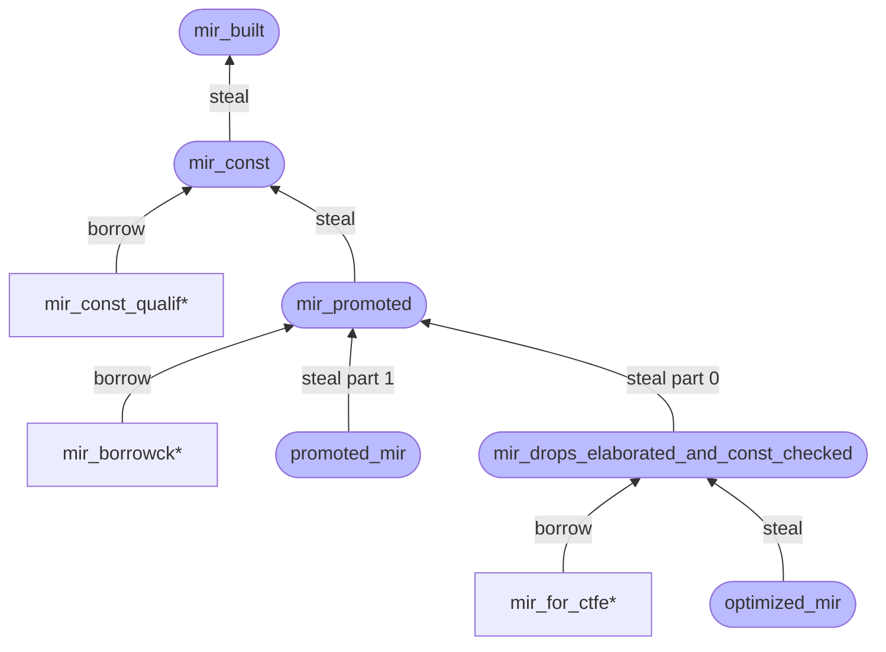

# The THIR

The THIR ("Typed High-Level Intermediate Representation"), previously called HAIR for
"High-Level Abstract IR", is another IR used by rustc that is generated after
[type checking]. It is (as of <!-- date-check --> January 2024) used for
[MIR construction], [exhaustiveness checking], and [unsafety checking].

[type checking]: ./hir-typeck/summary.md
[MIR construction]: ./mir/construction.md
[exhaustiveness checking]: ./pat-exhaustive-checking.md
[unsafety checking]: ./unsafety-checking.md

As the name might suggest, the THIR is a lowered version of the [HIR] where all
the types have been filled in, which is possible after type checking has completed.
But it has some other interesting features that distinguish it from the HIR:

- Like the MIR, the THIR only represents bodies, i.e. "executable code"; this includes
  function bodies, but also `const` initializers, for example. Specifically, all [body owners] have
  THIR created. Consequently, the THIR has no representation for items like `struct`s or `trait`s.

- Each body of THIR is only stored temporarily and is dropped as soon as it's no longer
  needed, as opposed to being stored until the end of the compilation process (which
  is what is done with the HIR).

- Besides making the types of all nodes available, the THIR also has additional
  desugaring compared to the HIR. For example, automatic references and dereferences
  are made explicit, and method calls and overloaded operators are converted into
  plain function calls. Destruction scopes are also made explicit.

- Statements, expressions, and match arms are stored separately. For example, statements in the
  `stmts` array reference expressions by their index (represented as a [`ExprId`]) in the `exprs`
  array.

[HIR]: ./hir.md
[`ExprId`]: https://doc.rust-lang.org/nightly/nightly-rustc/rustc_middle/thir/struct.ExprId.html
[body owners]: https://doc.rust-lang.org/nightly/nightly-rustc/rustc_hir/hir/enum.BodyOwnerKind.html

The THIR lives in [`rustc_mir_build::thir`][thir-docs]. To construct a [`thir::Expr`],
you can use the [`thir_body`] function, passing in the memory arena where the THIR
will be allocated. Dropping this arena will result in the THIR being destroyed,
which is useful to keep peak memory in check. Having a THIR representation of
all bodies of a crate in memory at the same time would be very heavy.

You can get a debug representation of the THIR by passing the `-Zunpretty=thir-tree` flag
to `rustc`.

To demonstrate, let's use the following example:

```rust
fn main() {
    let x = 1 + 2;
}
```

Here is how that gets represented in THIR (as of <!-- date-check --> Aug 2022):

```rust,no_run
Thir {
    // no match arms
    arms: [],
    exprs: [
        // expression 0, a literal with a value of 1
        Expr {
            ty: i32,
            temp_lifetime: Some(
                Node(1),
            ),
            span: oneplustwo.rs:2:13: 2:14 (#0),
            kind: Literal {
                lit: Spanned {
                    node: Int(
                        1,
                        Unsuffixed,
                    ),
                    span: oneplustwo.rs:2:13: 2:14 (#0),
                },
                neg: false,
            },
        },
        // expression 1, scope surrounding literal 1
        Expr {
            ty: i32,
            temp_lifetime: Some(
                Node(1),
            ),
            span: oneplustwo.rs:2:13: 2:14 (#0),
            kind: Scope {
                // reference to expression 0 above
                region_scope: Node(3),
                lint_level: Explicit(
                    HirId {
                        owner: DefId(0:3 ~ oneplustwo[6932]::main),
                        local_id: 3,
                    },
                ),
                value: e0,
            },
        },
        // expression 2, literal 2
        Expr {
            ty: i32,
            temp_lifetime: Some(
                Node(1),
            ),
            span: oneplustwo.rs:2:17: 2:18 (#0),
            kind: Literal {
                lit: Spanned {
                    node: Int(
                        2,
                        Unsuffixed,
                    ),
                    span: oneplustwo.rs:2:17: 2:18 (#0),
                },
                neg: false,
            },
        },
        // expression 3, scope surrounding literal 2
        Expr {
            ty: i32,
            temp_lifetime: Some(
                Node(1),
            ),
            span: oneplustwo.rs:2:17: 2:18 (#0),
            kind: Scope {
                region_scope: Node(4),
                lint_level: Explicit(
                    HirId {
                        owner: DefId(0:3 ~ oneplustwo[6932]::main),
                        local_id: 4,
                    },
                ),
                // reference to expression 2 above
                value: e2,
            },
        },
        // expression 4, represents 1 + 2
        Expr {
            ty: i32,
            temp_lifetime: Some(
                Node(1),
            ),
            span: oneplustwo.rs:2:13: 2:18 (#0),
            kind: Binary {
                op: Add,
                // references to scopes surrounding literals above
                lhs: e1,
                rhs: e3,
            },
        },
        // expression 5, scope surrounding expression 4
        Expr {
            ty: i32,
            temp_lifetime: Some(
                Node(1),
            ),
            span: oneplustwo.rs:2:13: 2:18 (#0),
            kind: Scope {
                region_scope: Node(5),
                lint_level: Explicit(
                    HirId {
                        owner: DefId(0:3 ~ oneplustwo[6932]::main),
                        local_id: 5,
                    },
                ),
                value: e4,
            },
        },
        // expression 6, block around statement
        Expr {
            ty: (),
            temp_lifetime: Some(
                Node(9),
            ),
            span: oneplustwo.rs:1:11: 3:2 (#0),
            kind: Block {
                body: Block {
                    targeted_by_break: false,
                    region_scope: Node(8),
                    opt_destruction_scope: None,
                    span: oneplustwo.rs:1:11: 3:2 (#0),
                    // reference to statement 0 below
                    stmts: [
                        s0,
                    ],
                    expr: None,
                    safety_mode: Safe,
                },
            },
        },
        // expression 7, scope around block in expression 6
        Expr {
            ty: (),
            temp_lifetime: Some(
                Node(9),
            ),
            span: oneplustwo.rs:1:11: 3:2 (#0),
            kind: Scope {
                region_scope: Node(9),
                lint_level: Explicit(
                    HirId {
                        owner: DefId(0:3 ~ oneplustwo[6932]::main),
                        local_id: 9,
                    },
                ),
                value: e6,
            },
        },
        // destruction scope around expression 7
        Expr {
            ty: (),
            temp_lifetime: Some(
                Node(9),
            ),
            span: oneplustwo.rs:1:11: 3:2 (#0),
            kind: Scope {
                region_scope: Destruction(9),
                lint_level: Inherited,
                value: e7,
            },
        },
    ],
    stmts: [
        // let statement
        Stmt {
            kind: Let {
                remainder_scope: Remainder { block: 8, first_statement_index: 0},
                init_scope: Node(1),
                pattern: Pat {
                    ty: i32,
                    span: oneplustwo.rs:2:9: 2:10 (#0),
                    kind: Binding {
                        mutability: Not,
                        name: "x",
                        mode: ByValue,
                        var: LocalVarId(
                            HirId {
                                owner: DefId(0:3 ~ oneplustwo[6932]::main),
                                local_id: 7,
                            },
                        ),
                        ty: i32,
                        subpattern: None,
                        is_primary: true,
                    },
                },
                initializer: Some(
                    e5,
                ),
                else_block: None,
                lint_level: Explicit(
                    HirId {
                        owner: DefId(0:3 ~ oneplustwo[6932]::main),
                        local_id: 6,
                    },
                ),
            },
            opt_destruction_scope: Some(
                Destruction(1),
            ),
        },
    ],
}
```

[thir-docs]: https://doc.rust-lang.org/nightly/nightly-rustc/rustc_mir_build/thir/index.html
[`thir::Expr`]: https://doc.rust-lang.org/nightly/nightly-rustc/rustc_middle/thir/struct.Expr.html
[`thir_body`]: https://doc.rust-lang.org/nightly/nightly-rustc/rustc_middle/ty/context/struct.TyCtxt.html#method.thir_body


---

# The MIR (Mid-level IR)

MIR is Rust's _Mid-level Intermediate Representation_. It is
constructed from [HIR](../hir.html). MIR was introduced in
[RFC 1211]. It is a radically simplified form of Rust that is used for
certain flow-sensitive safety checks – notably the borrow checker! –
and also for optimization and code generation.

If you'd like a very high-level introduction to MIR, as well as some
of the compiler concepts that it relies on (such as control-flow
graphs and desugaring), you may enjoy the
[rust-lang blog post that introduced MIR][blog].

[blog]: https://blog.rust-lang.org/2016/04/19/MIR.html

## Introduction to MIR

MIR is defined in the [`compiler/rustc_middle/src/mir/`][mir] module, but much of the code
that manipulates it is found in [`compiler/rustc_mir_build`][mirmanip_build],
[`compiler/rustc_mir_transform`][mirmanip_transform], and
[`compiler/rustc_mir_dataflow`][mirmanip_dataflow].

[RFC 1211]: https://rust-lang.github.io/rfcs/1211-mir.html

Some of the key characteristics of MIR are:

- It is based on a [control-flow graph][cfg].
- It does not have nested expressions.
- All types in MIR are fully explicit.

[cfg]: ../appendix/background.html#cfg

## Key MIR vocabulary

This section introduces the key concepts of MIR, summarized here:

- **Basic blocks**: units of the control-flow graph, consisting of:
  - **statements:** actions with one successor
  - **terminators:** actions with potentially multiple successors; always at
    the end of a block
  - (if you're not familiar with the term *basic block*, see the [background
    chapter][cfg])
- **Locals:** Memory locations allocated on the stack (conceptually, at
  least), such as function arguments, local variables, and
  temporaries. These are identified by an index, written with a
  leading underscore, like `_1`. There is also a special "local"
  (`_0`) allocated to store the return value.
- **Places:** expressions that identify a location in memory, like `_1` or
  `_1.f`.
- **Rvalues:** expressions that produce a value. The "R" stands for
  the fact that these are the "right-hand side" of an assignment.
  - **Operands:** the arguments to an rvalue, which can either be a
    constant (like `22`) or a place (like `_1`).

You can get a feeling for how MIR is constructed by translating simple
programs into MIR and reading the pretty printed output. In fact, the
playground makes this easy, since it supplies a MIR button that will
show you the MIR for your program. Try putting this program into play
(or [clicking on this link][sample-play]), and then clicking the "MIR"
button on the top:

[sample-play]: https://play.rust-lang.org/?gist=30074856e62e74e91f06abd19bd72ece&version=stable&edition=2021

```rust
fn main() {
    let mut vec = Vec::new();
    vec.push(1);
    vec.push(2);
}
```

You should see something like:

```mir
// WARNING: This output format is intended for human consumers only
// and is subject to change without notice. Knock yourself out.
fn main() -> () {
    ...
}
```

This is the MIR format for the `main` function.
MIR shown by above link is optimized.
Some statements like `StorageLive` are removed in optimization.
This happens because the compiler notices the value is never accessed in the code.
We can use `rustc [filename].rs -Z mir-opt-level=0 --emit mir` to view unoptimized MIR.
This requires the nightly toolchain.


**Variable declarations.** If we drill in a bit, we'll see it begins
with a bunch of variable declarations. They look like this:

```mir
let mut _0: ();                      // return place
let mut _1: std::vec::Vec<i32>;      // in scope 0 at src/main.rs:2:9: 2:16
let mut _2: ();
let mut _3: &mut std::vec::Vec<i32>;
let mut _4: ();
let mut _5: &mut std::vec::Vec<i32>;
```

You can see that variables in MIR don't have names, they have indices,
like `_0` or `_1`.  We also intermingle the user's variables (e.g.,
`_1`) with temporary values (e.g., `_2` or `_3`). You can tell apart
user-defined variables because they have debuginfo associated to them (see below).

**User variable debuginfo.** Below the variable declarations, we find the only
hint that `_1` represents a user variable:
```mir
scope 1 {
    debug vec => _1;                 // in scope 1 at src/main.rs:2:9: 2:16
}
```
Each `debug <Name> => <Place>;` annotation describes a named user variable,
and where (i.e. the place) a debugger can find the data of that variable.
Here the mapping is trivial, but optimizations may complicate the place,
or lead to multiple user variables sharing the same place.
Additionally, closure captures are described using the same system, and so
they're complicated even without optimizations, e.g.: `debug x => (*((*_1).0: &T));`.

The "scope" blocks (e.g., `scope 1 { .. }`) describe the lexical structure of
the source program (which names were in scope when), so any part of the program
annotated with `// in scope 0` would be missing `vec`, if you were stepping
through the code in a debugger, for example.

**Basic blocks.** Reading further, we see our first **basic block** (naturally
it may look slightly different when you view it, and I am ignoring some of the
comments):

```mir
bb0: {
    StorageLive(_1);
    _1 = const <std::vec::Vec<T>>::new() -> bb2;
}
```

A basic block is defined by a series of **statements** and a final
**terminator**.  In this case, there is one statement:

```mir
StorageLive(_1);
```

This statement indicates that the variable `_1` is "live", meaning
that it may be used later – this will persist until we encounter a
`StorageDead(_1)` statement, which indicates that the variable `_1` is
done being used. These "storage statements" are used by LLVM to
allocate stack space.

The **terminator** of the block `bb0` is the call to `Vec::new`:

```mir
_1 = const <std::vec::Vec<T>>::new() -> bb2;
```

Terminators are different from statements because they can have more
than one successor – that is, control may flow to different
places. Function calls like the call to `Vec::new` are always
terminators because of the possibility of unwinding, although in the
case of `Vec::new` we are able to see that indeed unwinding is not
possible, and hence we list only one successor block, `bb2`.

If we look ahead to `bb2`, we will see it looks like this:

```mir
bb2: {
    StorageLive(_3);
    _3 = &mut _1;
    _2 = const <std::vec::Vec<T>>::push(move _3, const 1i32) -> [return: bb3, unwind: bb4];
}
```

Here there are two statements: another `StorageLive`, introducing the `_3`
temporary, and then an assignment:

```mir
_3 = &mut _1;
```

Assignments in general have the form:

```text
<Place> = <Rvalue>
```

A place is an expression like `_3`, `_3.f` or `*_3` – it denotes a
location in memory.  An **Rvalue** is an expression that creates a
value: in this case, the rvalue is a mutable borrow expression, which
looks like `&mut <Place>`. So we can kind of define a grammar for
rvalues like so:

```text
<Rvalue>  = & (mut)? <Place>
          | <Operand> + <Operand>
          | <Operand> - <Operand>
          | ...

<Operand> = Constant
          | copy Place
          | move Place
```

As you can see from this grammar, rvalues cannot be nested – they can
only reference places and constants. Moreover, when you use a place,
we indicate whether we are **copying it** (which requires that the
place have a type `T` where `T: Copy`) or **moving it** (which works
for a place of any type). So, for example, if we had the expression `x
= a + b + c` in Rust, that would get compiled to two statements and a
temporary:

```mir
TMP1 = a + b
x = TMP1 + c
```

([Try it and see][play-abc], though you may want to do release mode to skip
over the overflow checks.)

[play-abc]: https://play.rust-lang.org/?gist=1751196d63b2a71f8208119e59d8a5b6&version=stable

## MIR data types

The MIR data types are defined in the [`compiler/rustc_middle/src/mir/`][mir]
module. Each of the key concepts mentioned in the previous section
maps in a fairly straightforward way to a Rust type.

The main MIR data type is [`Body`]. It contains the data for a single
function (along with sub-instances of Mir for "promoted constants",
but [you can read about those below](#promoted)).

- **Basic blocks**: The basic blocks are stored in the field
  [`Body::basic_blocks`][basicblocks]; this is a vector
  of [`BasicBlockData`] structures. Nobody ever references a
  basic block directly: instead, we pass around [`BasicBlock`]
  values, which are [newtype'd] indices into this vector.
- **Statements** are represented by the type [`Statement`].
- **Terminators** are represented by the [`Terminator`].
- **Locals** are represented by a [newtype'd] index type [`Local`].
  The data for a local variable is found in the
  [`Body::local_decls`][localdecls] vector. There is also a special constant
  [`RETURN_PLACE`] identifying the special "local" representing the return value.
- **Places** are identified by the struct [`Place`]. There are a few
  fields:
  - Local variables like `_1`
  - **Projections**, which are fields or other things that "project
    out" from a base place. These are represented by the [newtype'd] type
    [`ProjectionElem`]. So e.g. the place `_1.f` is a projection,
    with `f` being the "projection element" and `_1` being the base
    path. `*_1` is also a projection, with the `*` being represented
    by the [`ProjectionElem::Deref`] element.
- **Rvalues** are represented by the enum [`Rvalue`].
- **Operands** are represented by the enum [`Operand`].

## Representing constants

When code has reached the MIR stage, constants can generally come in two forms:
*MIR constants* ([`mir::Constant`]) and *type system constants* ([`ty::Const`]).
MIR constants are used as operands: in `x + CONST`, `CONST` is a MIR constant;
similarly, in `x + 2`, `2` is a MIR constant. Type system constants are used in
the type system, in particular for array lengths but also for const generics.

Generally, both kinds of constants can be "unevaluated" or "already evaluated".
An unevaluated constant simply stores the `DefId` of what needs to be evaluated
to compute this result. An evaluated constant (a "value") has already been
computed; their representation differs between type system constants and MIR
constants: MIR constants evaluate to a `mir::ConstValue`; type system constants
evaluate to a `ty::ValTree`.

Type system constants have some more variants to support const generics: they
can refer to local const generic parameters, and they are subject to inference.
Furthermore, the `mir::Constant::Ty` variant lets us use an arbitrary type
system constant as a MIR constant; this happens whenever a const generic
parameter is used as an operand.

### MIR constant values

In general, a MIR constant value (`mir::ConstValue`) was computed by evaluating
some constant the user wrote. This [const evaluation](../const-eval.md) produces
a very low-level representation of the result in terms of individual bytes. We
call this an "indirect" constant (`mir::ConstValue::Indirect`) since the value
is stored in-memory.

However, storing everything in-memory would be awfully inefficient. Hence there
are some other variants in `mir::ConstValue` that can represent certain simple
and common values more efficiently. In particular, everything that can be
directly written as a literal in Rust (integers, floats, chars, bools, but also
`"string literals"` and `b"byte string literals"`) has an optimized variant that
avoids the full overhead of the in-memory representation.

### ValTrees

An evaluated type system constant is a "valtree". The `ty::ValTree` datastructure
allows us to represent

* arrays,
* many structs,
* tuples,
* enums and,
* most primitives.

The most important rule for
this representation is that every value must be uniquely represented. In other
words: a specific value must only be representable in one specific way. For example: there is only
one way to represent an array of two integers as a `ValTree`:
`Branch([Leaf(first_int), Leaf(second_int)])`.
Even though theoretically a `[u32; 2]` could be encoded in a `u64` and thus just be a
`Leaf(bits_of_two_u32)`, that is not a legal construction of `ValTree`
(and is very complex to do, so it is unlikely anyone is tempted to do so).

These rules also mean that some values are not representable. There can be no `union`s in type
level constants, as it is not clear how they should be represented, because their active variant
is unknown. Similarly there is no way to represent raw pointers, as addresses are unknown at
compile-time and thus we cannot make any assumptions about them. References on the other hand
*can* be represented, as equality for references is defined as equality on their value, so we
ignore their address and just look at the backing value. We must make sure that the pointer values
of the references are not observable at compile time. We thus encode `&42` exactly like `42`.
Any conversion from
valtree back to a MIR constant value must reintroduce an actual indirection. At codegen time the
addresses may be deduplicated between multiple uses or not, entirely depending on arbitrary
optimization choices.

As a consequence, all decoding of `ValTree` must happen by matching on the type first and making
decisions depending on that. The value itself gives no useful information without the type that
belongs to it.

<a id="promoted"></a>

### Promoted constants

See the const-eval WG's [docs on promotion](https://github.com/rust-lang/const-eval/blob/master/promotion.md).


[mir]: https://doc.rust-lang.org/nightly/nightly-rustc/rustc_middle/mir/index.html
[mirmanip_build]: https://doc.rust-lang.org/nightly/nightly-rustc/rustc_mir_build/index.html
[mirmanip_transform]: https://doc.rust-lang.org/nightly/nightly-rustc/rustc_mir_transform/index.html
[mirmanip_dataflow]: https://doc.rust-lang.org/nightly/nightly-rustc/rustc_mir_dataflow/index.html
[`Body`]: https://doc.rust-lang.org/nightly/nightly-rustc/rustc_middle/mir/struct.Body.html
[newtype'd]: ../appendix/glossary.html#newtype
[basicblocks]: https://doc.rust-lang.org/nightly/nightly-rustc/rustc_middle/mir/struct.Body.html#structfield.basic_blocks
[`BasicBlock`]: https://doc.rust-lang.org/nightly/nightly-rustc/rustc_middle/mir/struct.BasicBlock.html
[`BasicBlockData`]: https://doc.rust-lang.org/nightly/nightly-rustc/rustc_middle/mir/struct.BasicBlockData.html
[`Statement`]: https://doc.rust-lang.org/nightly/nightly-rustc/rustc_middle/mir/struct.Statement.html
[`Terminator`]: https://doc.rust-lang.org/nightly/nightly-rustc/rustc_middle/mir/terminator/struct.Terminator.html
[`Local`]: https://doc.rust-lang.org/nightly/nightly-rustc/rustc_middle/mir/struct.Local.html
[localdecls]: https://doc.rust-lang.org/nightly/nightly-rustc/rustc_middle/mir/struct.Body.html#structfield.local_decls
[`RETURN_PLACE`]: https://doc.rust-lang.org/nightly/nightly-rustc/rustc_middle/mir/constant.RETURN_PLACE.html
[`Place`]: https://doc.rust-lang.org/nightly/nightly-rustc/rustc_middle/mir/struct.Place.html
[`ProjectionElem`]: https://doc.rust-lang.org/nightly/nightly-rustc/rustc_middle/mir/enum.ProjectionElem.html
[`ProjectionElem::Deref`]: https://doc.rust-lang.org/nightly/nightly-rustc/rustc_middle/mir/enum.ProjectionElem.html#variant.Deref
[`Rvalue`]: https://doc.rust-lang.org/nightly/nightly-rustc/rustc_middle/mir/enum.Rvalue.html
[`Operand`]: https://doc.rust-lang.org/nightly/nightly-rustc/rustc_middle/mir/enum.Operand.html
[`mir::Constant`]: https://doc.rust-lang.org/nightly/nightly-rustc/rustc_middle/mir/enum.Const.html
[`ty::Const`]: https://doc.rust-lang.org/nightly/nightly-rustc/rustc_middle/ty/struct.Const.html


---

# MIR construction

The lowering of [HIR] to [MIR] occurs for the following (probably incomplete)
list of items:

* Function and closure bodies
* Initializers of `static` and `const` items
* Initializers of enum discriminants
* Glue and shims of any kind
    * Tuple struct initializer functions
    * Drop code (the `Drop::drop` function is not called directly)
    * Drop implementations of types without an explicit `Drop` implementation

The lowering is triggered by calling the [`mir_built`] query. The MIR builder does
not actually use the HIR but operates on the [THIR] instead, processing THIR
expressions recursively.

The lowering creates local variables for every argument as specified in the signature.
Next, it creates local variables for every binding specified (e.g. `(a, b): (i32, String)`)
produces 3 bindings, one for the argument, and two for the bindings. Next, it generates
field accesses that read the fields from the argument and writes the value to the binding
variable.

With this initialization out of the way, the lowering triggers a recursive call
to a function that generates the MIR for the body (a `Block` expression) and
writes the result into the `RETURN_PLACE`.

## `unpack!` all the things

Functions that generate MIR tend to fall into one of two patterns.
First, if the function generates only statements, then it will take a
basic block as argument onto which those statements should be appended.
It can then return a result as normal:

```rust,ignore
fn generate_some_mir(&mut self, block: BasicBlock) -> ResultType {
   ...
}
```

But there are other functions that may generate new basic blocks as well.
For example, lowering an expression like `if foo { 22 } else { 44 }`
requires generating a small "diamond-shaped graph".
In this case, the functions take a basic block where their code starts
and return a (potentially) new basic block where the code generation ends.
The `BlockAnd` type is used to represent this:

```rust,ignore
fn generate_more_mir(&mut self, block: BasicBlock) -> BlockAnd<ResultType> {
    ...
}
```

When you invoke these functions, it is common to have a local variable `block`
that is effectively a "cursor". It represents the point at which we are adding new MIR.
When you invoke `generate_more_mir`, you want to update this cursor.
You can do this manually, but it's tedious:

```rust,ignore
let mut block;
let v = match self.generate_more_mir(..) {
    BlockAnd { block: new_block, value: v } => {
        block = new_block;
        v
    }
};
```

For this reason, we offer a macro that lets you write
`let v = unpack!(block = self.generate_more_mir(...))`.
It simply extracts the new block and overwrites the
variable `block` that you named in the `unpack!`.

## Lowering expressions into the desired MIR

There are essentially four kinds of representations one might want of an expression:

* `Place` refers to a (or part of a) preexisting memory location (local, static, promoted)
* `Rvalue` is something that can be assigned to a `Place`
* `Operand` is an argument to e.g. a `+` operation or a function call
* a temporary variable containing a copy of the value

The following image depicts a general overview of the interactions between the
representations:


[Click here for a more detailed view](mir_detailed.svg)

We start out with lowering the function body to an `Rvalue` so we can create an
assignment to `RETURN_PLACE`, This `Rvalue` lowering will in turn trigger lowering to
`Operand` for its arguments (if any). `Operand` lowering either produces a `const`
operand, or moves/copies out of a `Place`, thus triggering a `Place` lowering. An
expression being lowered to a `Place` can in turn trigger a temporary to be created
if the expression being lowered contains operations. This is where the snake bites its
own tail and we need to trigger an `Rvalue` lowering for the expression to be written
into the local.

## Operator lowering

Operators on builtin types are not lowered to function calls (which would end up being
infinite recursion calls, because the trait impls just contain the operation itself
again). Instead there are `Rvalue`s for binary and unary operators and index operations.
These `Rvalue`s later get codegened to llvm primitive operations or llvm intrinsics.

Operators on all other types get lowered to a function call to their `impl` of the
operator's corresponding trait.

Regardless of the lowering kind, the arguments to the operator are lowered to `Operand`s.
This means all arguments are either constants, or refer to an already existing value
somewhere in a local or static.

## Method call lowering

Method calls are lowered to the same `TerminatorKind` that function calls are.
In [MIR] there is no difference between method calls and function calls anymore.

## Conditions

`if` conditions and `match` statements for `enum`s with variants that have no fields are
lowered to `TerminatorKind::SwitchInt`. Each possible value (so `0` and `1` for `if`
conditions) has a corresponding `BasicBlock` to which the code continues.
The argument being branched on is (again) an `Operand` representing the value of
the if condition.

### Pattern matching

`match` statements for `enum`s with variants that have fields are lowered to
`TerminatorKind::SwitchInt`, too, but the `Operand` refers to a `Place` where the
discriminant of the value can be found. This often involves reading the discriminant
to a new temporary variable.

## Aggregate construction

Aggregate values of any kind (e.g. structs or tuples) are built via `Rvalue::Aggregate`.
All fields are
lowered to `Operator`s. This is essentially equivalent to one assignment
statement per aggregate field plus an assignment to the discriminant in the
case of `enum`s.

[MIR]: ./index.html
[HIR]: ../hir.html
[THIR]: https://doc.rust-lang.org/nightly/nightly-rustc/rustc_mir_build/thir/index.html

[`rustc_mir_build::thir::cx::expr`]: https://doc.rust-lang.org/nightly/nightly-rustc/rustc_mir_build/thir/cx/expr/index.html
[`mir_built`]: https://doc.rust-lang.org/nightly/nightly-rustc/rustc_mir_transform/fn.mir_built.html


---

# MIR visitor

The MIR visitor is a convenient tool for traversing the MIR and either
looking for things or making changes to it. The visitor traits are
defined in [the `rustc_middle::mir::visit` module][m-v] – there are two of
them, generated via a single macro: `Visitor` (which operates on a
`&Mir` and gives back shared references) and `MutVisitor` (which
operates on a `&mut Mir` and gives back mutable references).

[m-v]: https://doc.rust-lang.org/nightly/nightly-rustc/rustc_middle/mir/visit/index.html

To implement a visitor, you have to create a type that represents
your visitor. Typically, this type wants to "hang on" to whatever
state you will need while processing MIR:

```rust,ignore
struct MyVisitor<...> {
    tcx: TyCtxt<'tcx>,
    ...
}
```

and you then implement the `Visitor` or `MutVisitor` trait for that type:

```rust,ignore
impl<'tcx> MutVisitor<'tcx> for MyVisitor {
    fn visit_foo(&mut self, ...) {
        ...
        self.super_foo(...);
    }
}
```

As shown above, within the impl, you can override any of the
`visit_foo` methods (e.g., `visit_terminator`) in order to write some
code that will execute whenever a `foo` is found. If you want to
recursively walk the contents of the `foo`, you then invoke the
`super_foo` method. (NB. You never want to override `super_foo`.)

A very simple example of a visitor can be found in [`LocalFinder`].
By implementing `visit_local` method, this visitor identifies local variables that
can be candidates for reordering.

[`LocalFinder`]: https://doc.rust-lang.org/nightly/nightly-rustc/rustc_mir_transform/prettify/struct.LocalFinder.html

## Traversal

In addition the visitor, [the `rustc_middle::mir::traversal` module][t]
contains useful functions for walking the MIR CFG in
[different standard orders][traversal] (e.g. pre-order, reverse
post-order, and so forth).

[t]: https://doc.rust-lang.org/nightly/nightly-rustc/rustc_middle/mir/traversal/index.html
[traversal]: https://en.wikipedia.org/wiki/Tree_traversal


---

# MIR queries and passes

If you would like to get the MIR:

- for a function - you can use the `optimized_mir` query (typically used by codegen) or the `mir_for_ctfe` query (typically used by compile time function evaluation, i.e., *CTFE*);
- for a promoted - you can use the `promoted_mir` query.

These will give you back the final, optimized MIR. For foreign def-ids, we simply read the MIR
from the other crate's metadata. But for local def-ids, the query will
construct the optimized MIR by requesting a pipeline of upstream queries[^query].
Each query will contain a series of passes.
This section describes how those queries and passes work and how you can extend them.

To produce the optimized MIR for a given def-id `D`, `optimized_mir(D)`
goes through several suites of passes, each grouped by a
query. Each suite consists of passes which perform linting, analysis, transformation or
optimization. Each query represent a useful intermediate point
where we can access the MIR dialect for type checking or other purposes:

- `mir_built(D)` – it gives the initial MIR just after it's built;
- `mir_const(D)` – it applies some simple transformation passes to make MIR ready for
  const qualification;
- `mir_promoted(D)` - it extracts promotable temps into separate MIR bodies, and also makes MIR
  ready for borrow checking;
- `mir_drops_elaborated_and_const_checked(D)` - it performs borrow checking, runs major
  transformation passes (such as drop elaboration) and makes MIR ready for optimization;
- `optimized_mir(D)` – it performs all enabled optimizations and reaches the final state.

[^query]: See the [Queries](../query.md) chapter for the general concept of query.

## Implementing and registering a pass

A `MirPass` is some bit of code that processes the MIR, typically transforming it along the way
somehow. But it may also do other things like linting (e.g., [`CheckPackedRef`][lint1],
[`CheckConstItemMutation`][lint2], [`FunctionItemReferences`][lint3], which implement `MirLint`) or
optimization (e.g., [`SimplifyCfg`][opt1], [`RemoveUnneededDrops`][opt2]). While most MIR passes
are defined in the [`rustc_mir_transform`][mirtransform] crate, the `MirPass` trait itself is
[found][mirpass] in the `rustc_middle` crate, and it basically consists of one primary method,
`run_pass`, that simply gets an `&mut Body` (along with the `tcx`).
The MIR is therefore modified in place (which helps to keep things efficient).

A basic example of a MIR pass is [`RemoveStorageMarkers`], which walks
the MIR and removes all storage marks if they won't be emitted during codegen. As you
can see from its source, a MIR pass is defined by first defining a
dummy type, a struct with no fields:

```rust
pub struct RemoveStorageMarkers;
```

for which we implement the `MirPass` trait. We can then insert
this pass into the appropriate list of passes found in a query like
`mir_built`, `optimized_mir`, etc. (If this is an optimization, it
should go into the `optimized_mir` list.)

Another example of a simple MIR pass is [`CleanupPostBorrowck`][cleanup-pass], which walks
the MIR and removes all statements that are not relevant to code generation. As you can see from
its [source][cleanup-source], it is defined by first defining a dummy type, a struct with no
fields:

```rust
pub struct CleanupPostBorrowck;
```

for which we implement the `MirPass` trait:

```rust
impl<'tcx> MirPass<'tcx> for CleanupPostBorrowck {
    fn run_pass(&self, tcx: TyCtxt<'tcx>, body: &mut Body<'tcx>) {
        ...
    }
}
```

We [register][pass-register] this pass inside the `mir_drops_elaborated_and_const_checked` query.
(If this is an optimization, it should go into the `optimized_mir` list.)

If you are writing a pass, there's a good chance that you are going to
want to use a [MIR visitor]. MIR visitors are a handy way to walk all
the parts of the MIR, either to search for something or to make small
edits.

## Stealing

The intermediate queries `mir_const()` and `mir_promoted()` yield up
a `&'tcx Steal<Body<'tcx>>`, allocated using `tcx.alloc_steal_mir()`.
This indicates that the result may be **stolen** by a subsequent query – this is an
optimization to avoid cloning the MIR. Attempting to use a stolen
result will cause a panic in the compiler. Therefore, it is important
that you do not accidentally read from these intermediate queries without
the consideration of the dependency in the MIR processing pipeline.

Because of this stealing mechanism, some care must be taken to
ensure that, before the MIR at a particular phase in the processing
pipeline is stolen, anyone who may want to read from it has already
done so.

Concretely, this means that if you have a query `foo(D)`
that wants to access the result of `mir_promoted(D)`, you need to have `foo(D)`
calling the `mir_const(D)` query first. This will force it
to execute even though you don't directly require its result.

> This mechanism is a bit dodgy. There is a discussion of more elegant
alternatives in [rust-lang/rust#41710].

### Overview

Below is an overview of the stealing dependency in the MIR processing pipeline[^part]:



The stadium-shape queries (e.g., `mir_built`) with a deep color are the primary queries in the
pipeline, while the rectangle-shape queries (e.g., `mir_const_qualif*`[^star]) with a shallow color
are those subsequent queries that need to read the results from `&'tcx Steal<Body<'tcx>>`. With the
stealing mechanism, the rectangle-shape queries must be performed before any stadium-shape queries,
that have an equal or larger height in the dependency tree, ever do.

[^part]: The `mir_promoted` query will yield up a tuple
`(&'tcx Steal<Body<'tcx>>, &'tcx Steal<IndexVec<Promoted, Body<'tcx>>>)`, `promoted_mir` will steal
part 1 (`&'tcx Steal<IndexVec<Promoted, Body<'tcx>>>`) and `mir_drops_elaborated_and_const_checked`
will steal part 0 (`&'tcx Steal<Body<'tcx>>`). And their stealing is irrelevant to each other,
i.e., can be performed separately.

[^star]: Note that the `*` suffix in the queries represent a set of queries with the same prefix.
For example, `mir_borrowck*` represents `mir_borrowck`, `mir_borrowck_const_arg` and
`mir_borrowck_opt_const_arg`.

### Example

As an example, consider MIR const qualification. It wants to read the result produced by the
`mir_const` query. However, that result will be **stolen** by the `mir_promoted` query at some
time in the pipeline. Before `mir_promoted` is ever queried, calling the `mir_const_qualif` query
will succeed since `mir_const` will produce (if queried the first time) or cache (if queried
multiple times) the `Steal` result and the result is **not** stolen yet. After `mir_promoted` is
queried, the result would be stolen and calling the `mir_const_qualif` query to read the result
would cause a panic.

Therefore, with this stealing mechanism, `mir_promoted` should guarantee any `mir_const_qualif*`
queries are called before it actually steals, thus ensuring that the reads have already happened
(remember that [queries are memoized](../query.html), so executing a query twice
simply loads from a cache the second time).

[rust-lang/rust#41710]: https://github.com/rust-lang/rust/issues/41710
[mirpass]: https://doc.rust-lang.org/nightly/nightly-rustc/rustc_mir_transform/pass_manager/trait.MirPass.html
[lint1]: https://doc.rust-lang.org/nightly/nightly-rustc/rustc_mir_transform/check_packed_ref/struct.CheckPackedRef.html
[lint2]: https://doc.rust-lang.org/nightly/nightly-rustc/rustc_mir_transform/check_const_item_mutation/struct.CheckConstItemMutation.html
[lint3]: https://doc.rust-lang.org/nightly/nightly-rustc/rustc_mir_transform/function_item_references/struct.FunctionItemReferences.html
[opt1]: https://doc.rust-lang.org/nightly/nightly-rustc/rustc_mir_transform/simplify/enum.SimplifyCfg.html
[opt2]: https://doc.rust-lang.org/nightly/nightly-rustc/rustc_mir_transform/remove_unneeded_drops/struct.RemoveUnneededDrops.html
[mirtransform]: https://doc.rust-lang.org/nightly/nightly-rustc/rustc_mir_transform/
[`RemoveStorageMarkers`]: https://doc.rust-lang.org/nightly/nightly-rustc/rustc_mir_transform/remove_storage_markers/struct.RemoveStorageMarkers.html
[cleanup-pass]: https://doc.rust-lang.org/nightly/nightly-rustc/rustc_mir_transform/cleanup_post_borrowck/struct.CleanupPostBorrowck.html
[cleanup-source]: https://github.com/rust-lang/rust/blob/e2b52ff73edc8b0b7c74bc28760d618187731fe8/compiler/rustc_mir_transform/src/cleanup_post_borrowck.rs#L27
[pass-register]: https://github.com/rust-lang/rust/blob/e2b52ff73edc8b0b7c74bc28760d618187731fe8/compiler/rustc_mir_transform/src/lib.rs#L413
[MIR visitor]: ./visitor.html


---

# Inline assembly

## Overview

Inline assembly in rustc mostly revolves around taking an `asm!` macro invocation and plumbing it
through all of the compiler layers down to LLVM codegen. Throughout the various stages, an
`InlineAsm` generally consists of 3 components:

- The template string, which is stored as an array of `InlineAsmTemplatePiece`. Each piece
represents either a literal or a placeholder for an operand (just like format strings).

  ```rust
  pub enum InlineAsmTemplatePiece {
      String(String),
      Placeholder { operand_idx: usize, modifier: Option<char>, span: Span },
  }
  ```

- The list of operands to the `asm!` (`in`, `[late]out`, `in[late]out`, `sym`, `const`). These are
represented differently at each stage of lowering, but follow a common pattern:
  - `in`, `out` and `inout` all have an associated register class (`reg`) or explicit register
(`"eax"`).
  - `inout` has 2 forms: one with a single expression that is both read from and written to, and
one with two separate expressions for the input and output parts.
  - `out` and `inout` have a `late` flag (`lateout` / `inlateout`) to indicate that the register
allocator is allowed to reuse an input register for this output.
  - `out` and the split variant of `inout` allow `_` to be specified for an output, which means
that the output is discarded. This is used to allocate scratch registers for assembly code.
  - `const` refers to an anonymous constants and generally works like an inline const.
  - `sym` is a bit special since it only accepts a path expression, which must point to a `static`
or a `fn`.

- The options set at the end of the `asm!` macro. The only ones that are of particular interest to
rustc are `NORETURN` which makes `asm!` return `!` instead of `()`, and `RAW` which disables format
string parsing. The remaining options are mostly passed through to LLVM with little processing.

  ```rust
  bitflags::bitflags! {
      pub struct InlineAsmOptions: u16 {
          const PURE = 1 << 0;
          const NOMEM = 1 << 1;
          const READONLY = 1 << 2;
          const PRESERVES_FLAGS = 1 << 3;
          const NORETURN = 1 << 4;
          const NOSTACK = 1 << 5;
          const ATT_SYNTAX = 1 << 6;
          const RAW = 1 << 7;
          const MAY_UNWIND = 1 << 8;
      }
  }
  ```

## AST

`InlineAsm` is represented as an expression in the AST with the [`ast::InlineAsm` type][inline_asm_ast].

The `asm!` macro is implemented in `rustc_builtin_macros` and outputs an `InlineAsm` AST node. The
template string is parsed using `fmt_macros`, positional and named operands are resolved to
explicit operand indices. Since target information is not available to macro invocations,
validation of the registers and register classes is deferred to AST lowering.

[inline_asm_ast]: https://doc.rust-lang.org/nightly/nightly-rustc/rustc_ast/ast/struct.InlineAsm.html

## HIR

`InlineAsm` is represented as an expression in the HIR with the [`hir::InlineAsm` type][inline_asm_hir].

AST lowering is where `InlineAsmRegOrRegClass` is converted from `Symbol`s to an actual register or
register class. If any modifiers are specified for a template string placeholder, these are
validated against the set allowed for that operand type. Finally, explicit registers for inputs and
outputs are checked for conflicts (same register used for different operands).

[inline_asm_hir]: https://doc.rust-lang.org/nightly/nightly-rustc/rustc_hir/hir/struct.InlineAsm.html

## Type checking

Each register class has a whitelist of types that it may be used with. After the types of all
operands have been determined, the `intrinsicck` pass will check that these types are in the
whitelist. It also checks that split `inout` operands have compatible types and that `const`
operands are integers or floats. Suggestions are emitted where needed if a template modifier should
be used for an operand based on the type that was passed into it.

## THIR

`InlineAsm` is represented as an expression in the THIR with the [`InlineAsmExpr` type][inline_asm_thir].

The only significant change compared to HIR is that `Sym` has been lowered to either a `SymFn`
whose `expr` is a `Literal` ZST of the `fn`, or a `SymStatic` which points to the `DefId` of a
`static`.

[inline_asm_thir]: https://doc.rust-lang.org/nightly/nightly-rustc/rustc_middle/thir/struct.InlineAsmExpr.html

## MIR

`InlineAsm` is represented as a `Terminator` in the MIR with the [`TerminatorKind::InlineAsm` variant][inline_asm_mir]

As part of THIR lowering, `InOut` and `SplitInOut` operands are lowered to a split form with a
separate `in_value` and `out_place`.

Semantically, the `InlineAsm` terminator is similar to the `Call` terminator except that it has
multiple output places where a `Call` only has a single return place output.

[inline_asm_mir]: https://doc.rust-lang.org/nightly/nightly-rustc/rustc_middle/mir/enum.TerminatorKind.html#variant.InlineAsm

## Codegen

Operands are lowered one more time before being passed to LLVM codegen, this is represented by the [`InlineAsmOperandRef` type][inline_asm_codegen] from `rustc_codegen_ssa`.

The operands are lowered to LLVM operands and constraint codes as follows:
- `out` and the output part of `inout` operands are added first, as required by LLVM. Late output
operands have a `=` prefix added to their constraint code, non-late output operands have a `=&`
prefix added to their constraint code.
- `in` operands are added normally.
- `inout` operands are tied to the matching output operand.
- `sym` operands are passed as function pointers or pointers, using the `"s"` constraint.
- `const` operands are formatted to a string and directly inserted in the template string.

The template string is converted to LLVM form:
- `$` characters are escaped as `$$`.
- `const` operands are converted to strings and inserted directly.
- Placeholders are formatted as `${X:M}` where `X` is the operand index and `M` is the modifier
character. Modifiers are converted from the Rust form to the LLVM form.

The various options are converted to clobber constraints or LLVM attributes, refer to the
[RFC](https://github.com/Amanieu/rfcs/blob/inline-asm/text/0000-inline-asm.md#mapping-to-llvm-ir)
for more details.

Note that LLVM is sometimes rather picky about what types it accepts for certain constraint codes
so we sometimes need to insert conversions to/from a supported type. See the target-specific
ISelLowering.cpp files in LLVM for details of what types are supported for each register class.

[inline_asm_codegen]: https://doc.rust-lang.org/nightly/nightly-rustc/rustc_codegen_ssa/traits/enum.InlineAsmOperandRef.html

## Adding support for new architectures

Adding inline assembly support to an architecture is mostly a matter of defining the registers and
register classes for that architecture. All the definitions for register classes are located in
`compiler/rustc_target/asm/`.

Additionally you will need to implement lowering of these register classes to LLVM constraint codes
in `compiler/rustc_codegen_llvm/asm.rs`.

When adding a new architecture, make sure to cross-reference with the LLVM source code:
- LLVM has restrictions on which types can be used with a particular constraint code. Refer to the
`getRegForInlineAsmConstraint` function in `lib/Target/${ARCH}/${ARCH}ISelLowering.cpp`.
- LLVM reserves certain registers for its internal use, which causes them to not be saved/restored
properly around inline assembly blocks. These registers are listed in the `getReservedRegs`
function in `lib/Target/${ARCH}/${ARCH}RegisterInfo.cpp`. Any "conditionally" reserved register
such as the frame/base pointer must always be treated as reserved for Rust purposes because we
can't know ahead of time whether a function will require a frame/base pointer.

## Tests

Various tests for inline assembly are available:

- `tests/assembly-llvm/asm`
- `tests/ui/asm`
- `tests/codegen-llvm/asm-*`

Every architecture supported by inline assembly must have exhaustive tests in
`tests/assembly-llvm/asm` which test all combinations of register classes and types.
