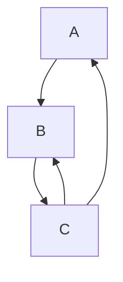

# Trait resolution (old-style)

This chapter describes the general process of _trait resolution_ and points out
some non-obvious things.

**Note:** This chapter (and its subchapters) describe how the trait
solver **currently** works. However, we are in the process of
designing a new trait solver. If you'd prefer to read about *that*,
see [*this* subchapter](./chalk.html).

## Major concepts

Trait resolution is the process of pairing up an impl with each
reference to a trait. So, for example, if there is a generic function like:

```rust,ignore
fn clone_slice<T:Clone>(x: &[T]) -> Vec<T> { ... }
```

and then a call to that function:

```rust,ignore
let v: Vec<isize> = clone_slice(&[1, 2, 3])
```

it is the job of trait resolution to figure out whether there exists an impl of
(in this case) `isize : Clone`.

Note that in some cases, like generic functions, we may not be able to
find a specific impl, but we can figure out that the caller must
provide an impl. For example, consider the body of `clone_slice`:

```rust,ignore
fn clone_slice<T:Clone>(x: &[T]) -> Vec<T> {
    let mut v = Vec::new();
    for e in &x {
        v.push((*e).clone()); // (*)
    }
}
```

The line marked `(*)` is only legal if `T` (the type of `*e`)
implements the `Clone` trait. Naturally, since we don't know what `T`
is, we can't find the specific impl; but based on the bound `T:Clone`,
we can say that there exists an impl which the caller must provide.

We use the term *obligation* to refer to a trait reference in need of
an impl. Basically, the trait resolution system resolves an obligation
by proving that an appropriate impl does exist.

During type checking, we do not store the results of trait selection.
We simply wish to verify that trait selection will succeed. Then
later, at codegen time, when we have all concrete types available, we
can repeat the trait selection to choose an actual implementation, which
will then be generated in the output binary.

## Overview

Trait resolution consists of three major parts:

- **Selection**: Deciding how to resolve a specific obligation. For
  example, selection might decide that a specific obligation can be
  resolved by employing an impl which matches the `Self` type, or by using a
  parameter bound (e.g. `T: Trait`). In the case of an impl, selecting one
  obligation can create *nested obligations* because of where clauses
  on the impl itself. It may also require evaluating those nested
  obligations to resolve ambiguities.

- **Fulfillment**: The fulfillment code is what tracks that obligations
  are completely fulfilled. Basically it is a worklist of obligations
  to be selected: once selection is successful, the obligation is
  removed from the worklist and any nested obligations are enqueued.
  Fulfillment constrains inference variables.

- **Evaluation**: Checks whether obligations holds without constraining
  any inference variables. Used by selection.

## Selection

Selection is the process of deciding whether an obligation can be
resolved and, if so, how it is to be resolved (via impl, where clause, etc).
The main interface is the `select()` function, which takes an obligation
and returns a `SelectionResult`. There are three possible outcomes:

- `Ok(Some(selection))` – yes, the obligation can be resolved, and
  `selection` indicates how. If the impl was resolved via an impl,
  then `selection` may also indicate nested obligations that are required
  by the impl.

- `Ok(None)` – we are not yet sure whether the obligation can be
  resolved or not. This happens most commonly when the obligation
  contains unbound type variables.

- `Err(err)` – the obligation definitely cannot be resolved due to a
  type error or because there are no impls that could possibly apply.

The basic algorithm for selection is broken into two big phases:
candidate assembly and confirmation.

Note that because of how lifetime inference works, it is not possible to
give back immediate feedback as to whether a unification or subtype
relationship between lifetimes holds or not. Therefore, lifetime
matching is *not* considered during selection. This is reflected in
the fact that subregion assignment is infallible. This may yield
lifetime constraints that will later be found to be in error (in
contrast, the non-lifetime-constraints have already been checked
during selection and can never cause an error, though naturally they
may lead to other errors downstream).

### Candidate assembly

**TODO**: Talk about _why_ we have different candidates, and why it needs to happen in a probe.

Searches for impls/where-clauses/etc that might
possibly be used to satisfy the obligation. Each of those is called
a candidate. To avoid ambiguity, we want to find exactly one
candidate that is definitively applicable. In some cases, we may not
know whether an impl/where-clause applies or not – this occurs when
the obligation contains unbound inference variables.

The subroutines that decide whether a particular impl/where-clause/etc applies
to a particular obligation are collectively referred to as the process of
_matching_. For `impl` candidates <!-- date-check: Oct 2022 -->,
this amounts to unifying the impl header (the `Self` type and the trait arguments)
while ignoring  nested obligations. If matching succeeds then we add it
to a set of candidates. There are other rules when assembling candidates for
built-in traits such as `Copy`, `Sized`, and `CoerceUnsized`.

Once this first pass is done, we can examine the set of candidates. If
it is a singleton set, then we are done: this is the only impl in
scope that could possibly apply. Otherwise, we can **winnow** down the set
of candidates by using where clauses and other conditions. Winnowing uses
`evaluate_candidate` to check whether the nested obligations may apply.
If this still leaves more than 1 candidate, we use ` fn candidate_should_be_dropped_in_favor_of`
to prefer some candidates over others.


If this reduced set yields a single, unambiguous entry, we're good to go,
otherwise the result is considered ambiguous.

#### Winnowing: Resolving ambiguities

But what happens if there are multiple impls where all the types
unify? Consider this example:

```rust,ignore
trait Get {
    fn get(&self) -> Self;
}

impl<T: Copy> Get for T {
    fn get(&self) -> T {
        *self
    }
}

impl<T: Get> Get for Box<T> {
    fn get(&self) -> Box<T> {
        Box::new(<T>::get(self))
    }
}
```

What happens when we invoke `get(&Box::new(1_u16))`, for example? In this
case, the `Self` type is `Box<u16>` – that unifies with both impls,
because the first applies to all types `T`, and the second to all
`Box<T>`. In order for this to be unambiguous, the compiler does a *winnowing*
pass that considers `where` clauses
and attempts to remove candidates. In this case, the first impl only
applies if `Box<u16> : Copy`, which doesn't hold. After winnowing,
then, we are left with just one candidate, so we can proceed.

#### `where` clauses

Besides an impl, the other major way to resolve an obligation is via a
where clause. The selection process is always given a [parameter
environment] which contains a list of where clauses, which are
basically obligations that we can assume are satisfiable. We will iterate
over that list and check whether our current obligation can be found
in that list. If so, it is considered satisfied. More precisely, we
want to check whether there is a where-clause obligation that is for
the same trait (or some subtrait) and which can match against the obligation.

[parameter environment]: ../typing-parameter-envs.html

Consider this simple example:

```rust,ignore
trait A1 {
    fn do_a1(&self);
}
trait A2 : A1 { ... }

trait B {
    fn do_b(&self);
}

fn foo<X:A2+B>(x: X) {
    x.do_a1(); // (*)
    x.do_b();  // (#)
}
```

In the body of `foo`, clearly we can use methods of `A1`, `A2`, or `B`
on variable `x`. The line marked `(*)` will incur an obligation `X: A1`,
while the line marked `(#)` will incur an obligation `X: B`. Meanwhile,
the parameter environment will contain two where-clauses: `X : A2` and `X : B`.
For each obligation, then, we search this list of where-clauses. The
obligation `X: B` trivially matches against the where-clause `X: B`.
To resolve an obligation `X:A1`, we would note that `X:A2` implies that `X:A1`.

### Confirmation

_Confirmation_ unifies the output type parameters of the trait with the
values found in the obligation, possibly yielding a type error.

Suppose we have the following variation of the `Convert` example in the
previous section:

```rust,ignore
trait Convert<Target> {
    fn convert(&self) -> Target;
}

impl Convert<usize> for isize { ... } // isize -> usize
impl Convert<isize> for usize { ... } // usize -> isize

let x: isize = ...;
let y: char = x.convert(); // NOTE: `y: char` now!
```

Confirmation is where an error would be reported because the impl specified
that `Target` would be `usize`, but the obligation reported `char`. Hence the
result of selection would be an error.

Note that the candidate impl is chosen based on the `Self` type, but
confirmation is done based on (in this case) the `Target` type parameter.

### Selection during codegen

As mentioned above, during type checking, we do not store the results of trait
selection. At codegen time, we repeat the trait selection to choose a particular
impl for each method call. This is done using `fn codegen_select_candidate`.
In this second selection, we do not consider any where-clauses to be in scope
because we know that each resolution will resolve to a particular impl.

One interesting twist has to do with nested obligations. In general, in codegen,
we only need to figure out which candidate applies, and we do not care about nested obligations,
as these are already assumed to be true. Nonetheless, we *do* currently fulfill all of them.
That is because it can sometimes inform the results of type inference.
That is, we do not have the full substitutions in terms of the type variables
of the impl available to us, so we must run trait selection to figure
everything out.


---

# Higher-ranked trait bounds

One of the more subtle concepts in trait resolution is *higher-ranked trait
bounds*. An example of such a bound is `for<'a> MyTrait<&'a isize>`.
Let's walk through how selection on higher-ranked trait references
works.

## Basic matching and placeholder leaks

Suppose we have a trait `Foo`:

```rust
trait Foo<X> {
    fn foo(&self, x: X) { }
}
```

Let's say we have a function `want_hrtb` that wants a type which
implements `Foo<&'a isize>` for any `'a`:

```rust,ignore
fn want_hrtb<T>() where T : for<'a> Foo<&'a isize> { ... }
```

Now we have a struct `AnyInt` that implements `Foo<&'a isize>` for any
`'a`:

```rust,ignore
struct AnyInt;
impl<'a> Foo<&'a isize> for AnyInt { }
```

And the question is, does `AnyInt : for<'a> Foo<&'a isize>`? We want the
answer to be yes. The algorithm for figuring it out is closely related
to the subtyping for higher-ranked types (which is described [here][hrsubtype]
and also in a [paper by SPJ]. If you wish to understand higher-ranked
subtyping, we recommend you read the paper). There are a few parts:

1. Replace bound regions in the obligation with placeholders.
2. Match the impl against the [placeholder] obligation.
3. Check for _placeholder leaks_.

[hrsubtype]: ./hrtb.md
[placeholder]: ../appendix/glossary.html#placeholder
[paper by SPJ]: https://www.microsoft.com/en-us/research/publication/practical-type-inference-for-arbitrary-rank-types

So let's work through our example.

1. The first thing we would do is to
replace the bound region in the obligation with a placeholder, yielding 
`AnyInt : Foo<&'0 isize>` (here `'0` represents placeholder region #0). 
Note that we now have no quantifiers;
in terms of the compiler type, this changes from a `ty::PolyTraitRef`
to a `TraitRef`. We would then create the `TraitRef` from the impl,
using fresh variables for it's bound regions (and thus getting
`Foo<&'$a isize>`, where `'$a` is the inference variable for `'a`).

2. Next
we relate the two trait refs, yielding a graph with the constraint
that `'0 == '$a`.

3. Finally, we check for placeholder "leaks" – a
leak is basically any attempt to relate a placeholder region to another
placeholder region, or to any region that pre-existed the impl match.
The leak check is done by searching from the placeholder region to find
the set of regions that it is related to in any way. This is called
the "taint" set. To pass the check, that set must consist *solely* of
itself and region variables from the impl. If the taint set includes
any other region, then the match is a failure. In this case, the taint
set for `'0` is `{'0, '$a}`, and hence the check will succeed.

Let's consider a failure case. Imagine we also have a struct

```rust,ignore
struct StaticInt;
impl Foo<&'static isize> for StaticInt;
```

We want the obligation `StaticInt : for<'a> Foo<&'a isize>` to be
considered unsatisfied. The check begins just as before. `'a` is
replaced with a placeholder `'0` and the impl trait reference is instantiated to
`Foo<&'static isize>`. When we relate those two, we get a constraint
like `'static == '0`. This means that the taint set for `'0` is `{'0,
'static}`, which fails the leak check.

**TODO**: This is because `'static` is not a region variable but is in the
taint set, right?

## Higher-ranked trait obligations

Once the basic matching is done, we get to another interesting topic:
how to deal with impl obligations. I'll work through a simple example
here. Imagine we have the traits `Foo` and `Bar` and an associated impl:

```rust
trait Foo<X> {
    fn foo(&self, x: X) { }
}

trait Bar<X> {
    fn bar(&self, x: X) { }
}

impl<X,F> Foo<X> for F
    where F : Bar<X>
{
}
```

Now let's say we have an obligation `Baz: for<'a> Foo<&'a isize>` and we match
this impl. What obligation is generated as a result? We want to get
`Baz: for<'a> Bar<&'a isize>`, but how does that happen?

After the matching, we are in a position where we have a placeholder
substitution like `X => &'0 isize`. If we apply this substitution to the
impl obligations, we get `F : Bar<&'0 isize>`. Obviously this is not
directly usable because the placeholder region `'0` cannot leak out of
our computation.

What we do is to create an inverse mapping from the taint set of `'0`
back to the original bound region (`'a`, here) that `'0` resulted
from. (This is done in `higher_ranked::plug_leaks`). We know that the
leak check passed, so this taint set consists solely of the placeholder
region itself plus various intermediate region variables. We then walk
the trait-reference and convert every region in that taint set back to
a late-bound region, so in this case we'd wind up with
`Baz: for<'a> Bar<&'a isize>`.


---

# Caching and subtle considerations therewith

In general, we attempt to cache the results of trait selection.  This
is a somewhat complex process. Part of the reason for this is that we
want to be able to cache results even when all the types in the trait
reference are not fully known. In that case, it may happen that the
trait selection process is also influencing type variables, so we have
to be able to not only cache the *result* of the selection process,
but *replay* its effects on the type variables.

## An example

The high-level idea of how the cache works is that we first replace
all unbound inference variables with placeholder versions. Therefore,
if we had a trait reference `usize : Foo<$t>`, where `$t` is an unbound
inference variable, we might replace it with `usize : Foo<$0>`, where
`$0` is a placeholder type. We would then look this up in the cache.

If we found a hit, the hit would tell us the immediate next step to
take in the selection process (e.g. apply impl #22, or apply where
clause `X : Foo<Y>`).

On the other hand, if there is no hit, we need to go through the [selection
process] from scratch. Suppose, we come to the conclusion that the only
possible impl is this one, with def-id 22:

[selection process]: ./resolution.html#selection

```rust,ignore
impl Foo<isize> for usize { ... } // Impl #22
```

We would then record in the cache `usize : Foo<$0> => ImplCandidate(22)`. Next
we would [confirm] `ImplCandidate(22)`, which would (as a side-effect) unify
`$t` with `isize`.

[confirm]: ./resolution.html#confirmation

Now, at some later time, we might come along and see a `usize :
Foo<$u>`. When replaced with a placeholder, this would yield `usize : Foo<$0>`, just as
before, and hence the cache lookup would succeed, yielding
`ImplCandidate(22)`. We would confirm `ImplCandidate(22)` which would
(as a side-effect) unify `$u` with `isize`.

## Where clauses and the local vs global cache

One subtle interaction is that the results of trait lookup will vary
depending on what where clauses are in scope. Therefore, we actually
have *two* caches, a local and a global cache. The local cache is
attached to the [`ParamEnv`], and the global cache attached to the
[`tcx`]. We use the local cache whenever the result might depend on the
where clauses that are in scope. The determination of which cache to
use is done by the method `pick_candidate_cache` in `select.rs`. At
the moment, we use a very simple, conservative rule: if there are any
where-clauses in scope, then we use the local cache.  We used to try
and draw finer-grained distinctions, but that led to a series of
annoying and weird bugs like [#22019] and [#18290]. This simple rule seems
to be pretty clearly safe and also still retains a very high hit rate
(~95% when compiling rustc).

**TODO**: it looks like `pick_candidate_cache` no longer exists. In
general, is this section still accurate at all?

[`ParamEnv`]: ../typing-parameter-envs.html
[`tcx`]: ../ty.html
[#18290]: https://github.com/rust-lang/rust/issues/18290
[#22019]: https://github.com/rust-lang/rust/issues/22019


---

# Implied bounds

We currently add implied region bounds to avoid explicit annotations. e.g.
`fn foo<'a, T>(x: &'a T)` can freely assume that `T: 'a` holds without specifying it.

There are two kinds of implied bounds: explicit and implicit. Explicit implied bounds
get added to the `fn predicates_of` of the relevant item while implicit ones are
handled... well... implicitly.

## explicit implied bounds

The explicit implied bounds are computed in [`fn inferred_outlives_of`]. Only ADTs and
lazy type aliases have explicit implied bounds which are computed via a fixpoint algorithm
in the [`fn inferred_outlives_crate`] query.

We use [`fn insert_required_predicates_to_be_wf`] on all fields of all ADTs in the crate.
This function computes the outlives bounds for each component of the field using a
separate implementation.

For ADTs, trait objects, and associated types the initially required predicates are
computed in [`fn check_explicit_predicates`]. This simply uses `fn explicit_predicates_of`
without elaborating them.

Region predicates are added via [`fn insert_outlives_predicate`]. This function takes
an outlives predicate, decomposes it and adds the components as explicit predicates only
if the outlived region is a region parameter. [It does not add `'static` requirements][nostatic].

 [`fn inferred_outlives_of`]: https://github.com/rust-lang/rust/blob/5b8bc568d28b2e922290c9a966b3231d0ce9398b/compiler/rustc_hir_analysis/src/outlives/mod.rs#L20
 [`fn inferred_outlives_crate`]: https://github.com/rust-lang/rust/blob/5b8bc568d28b2e922290c9a966b3231d0ce9398b/compiler/rustc_hir_analysis/src/outlives/mod.rs#L83
 [`fn insert_required_predicates_to_be_wf`]: https://github.com/rust-lang/rust/blob/5b8bc568d28b2e922290c9a966b3231d0ce9398b/compiler/rustc_hir_analysis/src/outlives/implicit_infer.rs#L89
 [`fn check_explicit_predicates`]: https://github.com/rust-lang/rust/blob/5b8bc568d28b2e922290c9a966b3231d0ce9398b/compiler/rustc_hir_analysis/src/outlives/implicit_infer.rs#L238
 [`fn insert_outlives_predicate`]: https://github.com/rust-lang/rust/blob/5b8bc568d28b2e922290c9a966b3231d0ce9398b/compiler/rustc_hir_analysis/src/outlives/utils.rs#L15
 [nostatic]: https://github.com/rust-lang/rust/blob/5b8bc568d28b2e922290c9a966b3231d0ce9398b/compiler/rustc_hir_analysis/src/outlives/utils.rs#L159-L165

## implicit implied bounds

As we are unable to handle implications in binders yet, we cannot simply add the outlives
requirements of impls and functions as explicit predicates.

### using implicit implied bounds as assumptions

These bounds are not added to the `ParamEnv` of the affected item itself. For lexical
region resolution they are added using [`fn OutlivesEnvironment::from_normalized_bounds`].
Similarly, during MIR borrowck we add them using
[`fn UniversalRegionRelationsBuilder::add_implied_bounds`].

[We add implied bounds for the function signature and impl header in MIR borrowck][mir].
Outside of MIR borrowck we add the outlives requirements for the types returned by the
[`fn assumed_wf_types`] query.

The assumed outlives constraints for implicit bounds are computed using the
[`fn implied_outlives_bounds`] query. This directly
[extracts the required outlives bounds from `fn wf::obligations`][boundsfromty].

MIR borrowck adds the outlives constraints for both the normalized and unnormalized types,
lexical region resolution [only uses the unnormalized types][notnorm].

[`fn OutlivesEnvironment::from_normalized_bounds`]: https://github.com/rust-lang/rust/blob/8239a37f9c0951a037cfc51763ea52a20e71e6bd/compiler/rustc_infer/src/infer/outlives/env.rs#L50-L55
[`fn UniversalRegionRelationsBuilder::add_implied_bounds`]: https://github.com/rust-lang/rust/blob/5b8bc568d28b2e922290c9a966b3231d0ce9398b/compiler/rustc_borrowck/src/type_check/free_region_relations.rs#L316
[mir]: https://github.com/rust-lang/rust/blob/91cae1dcdcf1a31bd8a92e4a63793d65cfe289bb/compiler/rustc_borrowck/src/type_check/free_region_relations.rs#L258-L332
[`fn assumed_wf_types`]: https://github.com/rust-lang/rust/blob/5b8bc568d28b2e922290c9a966b3231d0ce9398b/compiler/rustc_ty_utils/src/implied_bounds.rs#L21
[`fn implied_outlives_bounds`]: https://github.com/rust-lang/rust/blob/5b8bc568d28b2e922290c9a966b3231d0ce9398b/compiler/rustc_traits/src/implied_outlives_bounds.rs#L18C4-L18C27
[boundsfromty]: https://github.com/rust-lang/rust/blob/5b8bc568d28b2e922290c9a966b3231d0ce9398b/compiler/rustc_trait_selection/src/traits/query/type_op/implied_outlives_bounds.rs#L95-L96
[notnorm]: https://github.com/rust-lang/rust/blob/91cae1dcdcf1a31bd8a92e4a63793d65cfe289bb/compiler/rustc_trait_selection/src/traits/engine.rs#L227-L250

### proving implicit implied bounds

As the implicit implied bounds are not included in `fn predicates_of` we have to
separately make sure they actually hold. We generally handle this by checking that
all used types are well formed by emitting `WellFormed` predicates.

We cannot emit `WellFormed` predicates when instantiating impls, as this would result
in - currently often inductive - trait solver cycles. We also do not emit constraints
involving higher ranked regions as we're lacking the implied bounds from their binder.

This results in multiple unsoundnesses:
- by using subtyping: [#25860]
- by using super trait upcasting for a higher ranked trait bound: [#84591]
- by being able to normalize a projection when using an impl while not being able
  to normalize it when checking the impl: [#100051]

[#25860]: https://github.com/rust-lang/rust/issues/25860
[#84591]: https://github.com/rust-lang/rust/issues/84591
[#100051]: https://github.com/rust-lang/rust/issues/100051


---

# Specialization

**TODO**: where does Chalk fit in? Should we mention/discuss it here?

Defined in the `specialize` module.

The basic strategy is to build up a *specialization graph* during
coherence checking (coherence checking looks for [overlapping impls](../coherence.md)). 
Insertion into the graph locates the right place
to put an impl in the specialization hierarchy; if there is no right
place (due to partial overlap but no containment), you get an overlap
error. Specialization is consulted when selecting an impl (of course),
and the graph is consulted when propagating defaults down the
specialization hierarchy.

You might expect that the specialization graph would be used during
selection – i.e. when actually performing specialization. This is
not done for two reasons:

- It's merely an optimization: given a set of candidates that apply,
  we can determine the most specialized one by comparing them directly
  for specialization, rather than consulting the graph. Given that we
  also cache the results of selection, the benefit of this
  optimization is questionable.

- To build the specialization graph in the first place, we need to use
  selection (because we need to determine whether one impl specializes
  another). Dealing with this reentrancy would require some additional
  mode switch for selection. Given that there seems to be no strong
  reason to use the graph anyway, we stick with a simpler approach in
  selection, and use the graph only for propagating default
  implementations.

Trait impl selection can succeed even when multiple impls can apply,
as long as they are part of the same specialization family. In that
case, it returns a *single* impl on success – this is the most
specialized impl *known* to apply. However, if there are any inference
variables in play, the returned impl may not be the actual impl we
will use at codegen time. Thus, we take special care to avoid projecting
associated types unless either (1) the associated type does not use
`default` and thus cannot be overridden or (2) all input types are
known concretely.

## Additional Resources

[This talk][talk] by @sunjay may be useful. Keep in mind that the talk only
gives a broad overview of the problem and the solution (it was presented about
halfway through @sunjay's work). Also, it was given in June 2018, and some
things may have changed by the time you watch it.

[talk]: https://www.youtube.com/watch?v=rZqS4bLPL24


---

# Chalk-based trait solving

[Chalk][chalk] is an experimental trait solver for Rust that is
(as of <!-- date-check --> May 2022) under development by the [Types team].
Its goal is to enable a lot of trait system features and bug fixes
that are hard to implement (e.g. GATs or specialization). If you would like to
help in hacking on the new solver, drop by on the rust-lang Zulip in the [`#t-types`]
channel and say hello!

[Types team]: https://github.com/rust-lang/types-team
[`#t-types`]: https://rust-lang.zulipchat.com/#narrow/stream/144729-t-types

The new-style trait solver is based on the work done in [chalk]. Chalk
recasts Rust's trait system explicitly in terms of logic programming. It does
this by "lowering" Rust code into a kind of logic program we can then execute
queries against.

The key observation here is that the Rust trait system is basically a
kind of logic, and it can be mapped onto standard logical inference
rules. We can then look for solutions to those inference rules in a
very similar fashion to how e.g. a [Prolog] solver works. It turns out
that we can't *quite* use Prolog rules (also called Horn clauses) but
rather need a somewhat more expressive variant.

[Prolog]: https://en.wikipedia.org/wiki/Prolog

You can read more about chalk itself in the
[Chalk book](https://rust-lang.github.io/chalk/book/) section.

## Ongoing work
The design of the new-style trait solving happens in two places:

**chalk**. The [chalk] repository is where we experiment with new ideas
and designs for the trait system.

**rustc**. Once we are happy with the logical rules, we proceed to
implementing them in rustc. We map our struct, trait, and impl declarations
into logical inference rules in the lowering module in rustc.

[chalk]: https://github.com/rust-lang/chalk
[rustc_traits]: https://github.com/rust-lang/rust/tree/HEAD/compiler/rustc_traits


---

# Lowering to logic

The key observation here is that the Rust trait system is basically a
kind of logic, and it can be mapped onto standard logical inference
rules. We can then look for solutions to those inference rules in a
very similar fashion to how e.g. a [Prolog] solver works. It turns out
that we can't *quite* use Prolog rules (also called Horn clauses) but
rather need a somewhat more expressive variant.

[Prolog]: https://en.wikipedia.org/wiki/Prolog

## Rust traits and logic

One of the first observations is that the Rust trait system is
basically a kind of logic. As such, we can map our struct, trait, and
impl declarations into logical inference rules. For the most part,
these are basically Horn clauses, though we'll see that to capture the
full richness of Rust – and in particular to support generic
programming – we have to go a bit further than standard Horn clauses.

To see how this mapping works, let's start with an example. Imagine
we declare a trait and a few impls, like so:

```rust
trait Clone { }
impl Clone for usize { }
impl<T> Clone for Vec<T> where T: Clone { }
```

We could map these declarations to some Horn clauses, written in a
Prolog-like notation, as follows:

```text
Clone(usize).
Clone(Vec<?T>) :- Clone(?T).

// The notation `A :- B` means "A is true if B is true".
// Or, put another way, B implies A.
```

In Prolog terms, we might say that `Clone(Foo)` – where `Foo` is some
Rust type – is a *predicate* that represents the idea that the type
`Foo` implements `Clone`. These rules are **program clauses**; they
state the conditions under which that predicate can be proven (i.e.,
considered true). So the first rule just says "Clone is implemented
for `usize`". The next rule says "for any type `?T`, Clone is
implemented for `Vec<?T>` if clone is implemented for `?T`". So
e.g. if we wanted to prove that `Clone(Vec<Vec<usize>>)`, we would do
so by applying the rules recursively:

- `Clone(Vec<Vec<usize>>)` is provable if:
  - `Clone(Vec<usize>)` is provable if:
    - `Clone(usize)` is provable. (Which it is, so we're all good.)

But now suppose we tried to prove that `Clone(Vec<Bar>)`. This would
fail (after all, I didn't give an impl of `Clone` for `Bar`):

- `Clone(Vec<Bar>)` is provable if:
  - `Clone(Bar)` is provable. (But it is not, as there are no applicable rules.)

We can easily extend the example above to cover generic traits with
more than one input type. So imagine the `Eq<T>` trait, which declares
that `Self` is equatable with a value of type `T`:

```rust,ignore
trait Eq<T> { ... }
impl Eq<usize> for usize { }
impl<T: Eq<U>> Eq<Vec<U>> for Vec<T> { }
```

That could be mapped as follows:

```text
Eq(usize, usize).
Eq(Vec<?T>, Vec<?U>) :- Eq(?T, ?U).
```

So far so good.

## Type-checking normal functions

OK, now that we have defined some logical rules that are able to
express when traits are implemented and to handle associated types,
let's turn our focus a bit towards **type-checking**. Type-checking is
interesting because it is what gives us the goals that we need to
prove. That is, everything we've seen so far has been about how we
derive the rules by which we can prove goals from the traits and impls
in the program; but we are also interested in how to derive the goals
that we need to prove, and those come from type-checking.

Consider type-checking the function `foo()` here:

```rust,ignore
fn foo() { bar::<usize>() }
fn bar<U: Eq<U>>() { }
```

This function is very simple, of course: all it does is to call
`bar::<usize>()`. Now, looking at the definition of `bar()`, we can see
that it has one where-clause `U: Eq<U>`. So, that means that `foo()` will
have to prove that `usize: Eq<usize>` in order to show that it can call `bar()`
with `usize` as the type argument.

If we wanted, we could write a Prolog predicate that defines the
conditions under which `bar()` can be called. We'll say that those
conditions are called being "well-formed":

```text
barWellFormed(?U) :- Eq(?U, ?U).
```

Then we can say that `foo()` type-checks if the reference to
`bar::<usize>` (that is, `bar()` applied to the type `usize`) is
well-formed:

```text
fooTypeChecks :- barWellFormed(usize).
```

If we try to prove the goal `fooTypeChecks`, it will succeed:

- `fooTypeChecks` is provable if:
  - `barWellFormed(usize)`, which is provable if:
    - `Eq(usize, usize)`, which is provable because of an impl.

Ok, so far so good. Let's move on to type-checking a more complex function.

## Type-checking generic functions: beyond Horn clauses

In the last section, we used standard Prolog horn-clauses (augmented with Rust's
notion of type equality) to type-check some simple Rust functions. But that only
works when we are type-checking non-generic functions. If we want to type-check
a generic function, it turns out we need a stronger notion of goal than what Prolog
can provide. To see what I'm talking about, let's revamp our previous
example to make `foo` generic:

```rust,ignore
fn foo<T: Eq<T>>() { bar::<T>() }
fn bar<U: Eq<U>>() { }
```

To type-check the body of `foo`, we need to be able to hold the type
`T` "abstract".  That is, we need to check that the body of `foo` is
type-safe *for all types `T`*, not just for some specific type. We might express
this like so:

```text
fooTypeChecks :-
  // for all types T...
  forall<T> {
    // ...if we assume that Eq(T, T) is provable...
    if (Eq(T, T)) {
      // ...then we can prove that `barWellFormed(T)` holds.
      barWellFormed(T)
    }
  }.
```

This notation I'm using here is the notation I've been using in my
prototype implementation; it's similar to standard mathematical
notation but a bit Rustified. Anyway, the problem is that standard
Horn clauses don't allow universal quantification (`forall`) or
implication (`if`) in goals (though many Prolog engines do support
them, as an extension). For this reason, we need to accept something
called "first-order hereditary harrop" (FOHH) clauses – this long
name basically means "standard Horn clauses with `forall` and `if` in
the body". But it's nice to know the proper name, because there is a
lot of work describing how to efficiently handle FOHH clauses; see for
example Gopalan Nadathur's excellent
["A Proof Procedure for the Logic of Hereditary Harrop Formulas"][pphhf]
in [the bibliography of Chalk Book][bibliography].

[bibliography]: https://rust-lang.github.io/chalk/book/bibliography.html
[pphhf]: https://rust-lang.github.io/chalk/book/bibliography.html#pphhf

It turns out that supporting FOHH is not really all that hard. And
once we are able to do that, we can easily describe the type-checking
rule for generic functions like `foo` in our logic.

## Source

This page is a lightly adapted version of a
[blog post by Nicholas Matsakis][lrtl].

[lrtl]: http://smallcultfollowing.com/babysteps/blog/2017/01/26/lowering-rust-traits-to-logic/


---

# Goals and clauses

In logic programming terms, a **goal** is something that you must
prove and a **clause** is something that you know is true. As
described in the [lowering to logic](./lowering-to-logic.html)
chapter, Rust's trait solver is based on an extension of hereditary
harrop (HH) clauses, which extend traditional Prolog Horn clauses with
a few new superpowers.

## Goals and clauses meta structure

In Rust's solver, **goals** and **clauses** have the following forms
(note that the two definitions reference one another):

```text
Goal = DomainGoal           // defined in the section below
        | Goal && Goal
        | Goal || Goal
        | exists<K> { Goal }   // existential quantification
        | forall<K> { Goal }   // universal quantification
        | if (Clause) { Goal } // implication
        | true                 // something that's trivially true
        | ambiguous            // something that's never provable

Clause = DomainGoal
        | Clause :- Goal     // if can prove Goal, then Clause is true
        | Clause && Clause
        | forall<K> { Clause }

K = <type>     // a "kind"
    | <lifetime>
```

The proof procedure for these sorts of goals is actually quite
straightforward.  Essentially, it's a form of depth-first search. The
paper
["A Proof Procedure for the Logic of Hereditary Harrop Formulas"][pphhf]
gives the details.

In terms of code, these types are defined in
[`rustc_middle/src/traits/mod.rs`][traits_mod] in rustc, and in
[`chalk-ir/src/lib.rs`][chalk_ir] in chalk.

[pphhf]: https://rust-lang.github.io/chalk/book/bibliography.html#pphhf
[traits_mod]: https://github.com/rust-lang/rust/blob/HEAD/compiler/rustc_middle/src/traits/mod.rs
[chalk_ir]: https://github.com/rust-lang/chalk/blob/master/chalk-ir/src/lib.rs

<a id="domain-goals"></a>

## Domain goals

*Domain goals* are the atoms of the trait logic. As can be seen in the
definitions given above, general goals basically consist in a combination of
domain goals.

Moreover, flattening a bit the definition of clauses given previously, one can
see that clauses are always of the form:
```text
forall<K1, ..., Kn> { DomainGoal :- Goal }
```
hence domain goals are in fact clauses' LHS. That is, at the most granular level,
domain goals are what the trait solver will end up trying to prove.

<a id="trait-ref"></a>

To define the set of domain goals in our system, we need to first
introduce a few simple formulations. A **trait reference** consists of
the name of a trait along with a suitable set of inputs P0..Pn:

```text
TraitRef = P0: TraitName<P1..Pn>
```

So, for example, `u32: Display` is a trait reference, as is `Vec<T>:
IntoIterator`. Note that Rust surface syntax also permits some extra
things, like associated type bindings (`Vec<T>: IntoIterator<Item =
T>`), that are not part of a trait reference.

<a id="projection"></a>

A **projection** consists of an associated item reference along with
its inputs P0..Pm:

```text
Projection = <P0 as TraitName<P1..Pn>>::AssocItem<Pn+1..Pm>
```

Given these, we can define a `DomainGoal` as follows:

```text
DomainGoal = Holds(WhereClause)
            | FromEnv(TraitRef)
            | FromEnv(Type)
            | WellFormed(TraitRef)
            | WellFormed(Type)
            | Normalize(Projection -> Type)

WhereClause = Implemented(TraitRef)
            | ProjectionEq(Projection = Type)
            | Outlives(Type: Region)
            | Outlives(Region: Region)
```

`WhereClause` refers to a `where` clause that a Rust user would actually be able
to write in a Rust program. This abstraction exists only as a convenience as we
sometimes want to only deal with domain goals that are effectively writable in
Rust.

Let's break down each one of these, one-by-one.

#### Implemented(TraitRef)
e.g. `Implemented(i32: Copy)`

True if the given trait is implemented for the given input types and lifetimes.

#### ProjectionEq(Projection = Type)
e.g. `ProjectionEq<T as Iterator>::Item = u8`

The given associated type `Projection` is equal to `Type`; this can be proved
with either normalization or using placeholder associated types. See
[the section on associated types in Chalk Book][at].

#### Normalize(Projection -> Type)
e.g. `ProjectionEq<T as Iterator>::Item -> u8`

The given associated type `Projection` can be [normalized][n] to `Type`.

As discussed in [the section on associated
types in Chalk Book][at], `Normalize` implies `ProjectionEq`,
but not vice versa. In general, proving `Normalize(<T as Trait>::Item -> U)`
also requires proving `Implemented(T: Trait)`.

[n]: https://rust-lang.github.io/chalk/book/clauses/type_equality.html#normalize
[at]: https://rust-lang.github.io/chalk/book/clauses/type_equality.html

#### FromEnv(TraitRef)
e.g. `FromEnv(Self: Add<i32>)`

True if the inner `TraitRef` is *assumed* to be true,
that is, if it can be derived from the in-scope where clauses.

For example, given the following function:

```rust
fn loud_clone<T: Clone>(stuff: &T) -> T {
    println!("cloning!");
    stuff.clone()
}
```

Inside the body of our function, we would have `FromEnv(T: Clone)`. In-scope
where clauses nest, so a function body inside an impl body inherits the
impl body's where clauses, too.

This and the next rule are used to implement [implied bounds]. As we'll see
in the section on lowering, `FromEnv(TraitRef)` implies `Implemented(TraitRef)`,
but not vice versa. This distinction is crucial to implied bounds.

#### FromEnv(Type)
e.g. `FromEnv(HashSet<K>)`

True if the inner `Type` is *assumed* to be well-formed, that is, if it is an
input type of a function or an impl.

For example, given the following code:

```rust,ignore
struct HashSet<K> where K: Hash { ... }

fn loud_insert<K>(set: &mut HashSet<K>, item: K) {
    println!("inserting!");
    set.insert(item);
}
```

`HashSet<K>` is an input type of the `loud_insert` function. Hence, we assume it
to be well-formed, so we would have `FromEnv(HashSet<K>)` inside the body of our
function. As we'll see in the section on lowering, `FromEnv(HashSet<K>)` implies
`Implemented(K: Hash)` because the
`HashSet` declaration was written with a `K: Hash` where clause. Hence, we don't
need to repeat that bound on the `loud_insert` function: we rather automatically
assume that it is true.

#### WellFormed(Item)
These goals imply that the given item is *well-formed*.

We can talk about different types of items being well-formed:

* *Types*, like `WellFormed(Vec<i32>)`, which is true in Rust, or
  `WellFormed(Vec<str>)`, which is not (because `str` is not `Sized`.)

* *TraitRefs*, like `WellFormed(Vec<i32>: Clone)`.

Well-formedness is important to [implied bounds]. In particular, the reason
it is okay to assume `FromEnv(T: Clone)` in the `loud_clone` example is that we
_also_ verify `WellFormed(T: Clone)` for each call site of `loud_clone`.
Similarly, it is okay to assume `FromEnv(HashSet<K>)` in the `loud_insert`
example because we will verify `WellFormed(HashSet<K>)` for each call site of
`loud_insert`.

#### Outlives(Type: Region), Outlives(Region: Region)
e.g. `Outlives(&'a str: 'b)`, `Outlives('a: 'static)`

True if the given type or region on the left outlives the right-hand region.

<a id="coinductive"></a>

## Coinductive goals

Most goals in our system are "inductive". In an inductive goal,
circular reasoning is disallowed. Consider this example clause:

```text
    Implemented(Foo: Bar) :-
        Implemented(Foo: Bar).
```

Considered inductively, this clause is useless: if we are trying to
prove `Implemented(Foo: Bar)`, we would then recursively have to prove
`Implemented(Foo: Bar)`, and that cycle would continue ad infinitum
(the trait solver will terminate here, it would just consider that
`Implemented(Foo: Bar)` is not known to be true).

However, some goals are *co-inductive*. Simply put, this means that
cycles are OK. So, if `Bar` were a co-inductive trait, then the rule
above would be perfectly valid, and it would indicate that
`Implemented(Foo: Bar)` is true.

*Auto traits* are one example in Rust where co-inductive goals are used.
Consider the `Send` trait, and imagine that we have this struct:

```rust
struct Foo {
    next: Option<Box<Foo>>
}
```

The default rules for auto traits say that `Foo` is `Send` if the
types of its fields are `Send`. Therefore, we would have a rule like

```text
Implemented(Foo: Send) :-
    Implemented(Option<Box<Foo>>: Send).
```

As you can probably imagine, proving that `Option<Box<Foo>>: Send` is
going to wind up circularly requiring us to prove that `Foo: Send`
again. So this would be an example where we wind up in a cycle – but
that's ok, we *do* consider `Foo: Send` to hold, even though it
references itself.

In general, co-inductive traits are used in Rust trait solving when we
want to enumerate a fixed set of possibilities. In the case of auto
traits, we are enumerating the set of reachable types from a given
starting point (i.e., `Foo` can reach values of type
`Option<Box<Foo>>`, which implies it can reach values of type
`Box<Foo>`, and then of type `Foo`, and then the cycle is complete).

In addition to auto traits, `WellFormed` predicates are co-inductive.
These are used to achieve a similar "enumerate all the cases" pattern,
as described in the section on [implied bounds].

[implied bounds]: https://rust-lang.github.io/chalk/book/clauses/implied_bounds.html#implied-bounds

## Incomplete chapter

Some topics yet to be written:

- Elaborate on the proof procedure
- SLG solving – introduce negative reasoning


---

# Canonical queries

The "start" of the trait system is the **canonical query** (these are
both queries in the more general sense of the word – something you
would like to know the answer to – and in the
[rustc-specific sense](../query.html)).  The idea is that the type
checker or other parts of the system, may in the course of doing their
thing want to know whether some trait is implemented for some type
(e.g., is `u32: Debug` true?). Or they may want to
normalize some associated type.

This section covers queries at a fairly high level of abstraction. The
subsections look a bit more closely at how these ideas are implemented
in rustc.

## The traditional, interactive Prolog query

In a traditional Prolog system, when you start a query, the solver
will run off and start supplying you with every possible answer it can
find. So given something like this:

```text
?- Vec<i32>: AsRef<?U>
```

The solver might answer:

```text
Vec<i32>: AsRef<[i32]>
    continue? (y/n)
```

This `continue` bit is interesting. The idea in Prolog is that the
solver is finding **all possible** instantiations of your query that
are true. In this case, if we instantiate `?U = [i32]`, then the query
is true (note that a traditional Prolog interface does not, directly,
tell us a value for `?U`, but we can infer one by unifying the
response with our original query – Rust's solver gives back a
substitution instead). If we were to hit `y`, the solver might then
give us another possible answer:

```text
Vec<i32>: AsRef<Vec<i32>>
    continue? (y/n)
```

This answer derives from the fact that there is a reflexive impl
(`impl<T> AsRef<T> for T`) for `AsRef`. If were to hit `y` again,
then we might get back a negative response:

```text
no
```

Naturally, in some cases, there may be no possible answers, and hence
the solver will just give me back `no` right away:

```text
?- Box<i32>: Copy
    no
```

In some cases, there might be an infinite number of responses. So for
example if I gave this query, and I kept hitting `y`, then the solver
would never stop giving me back answers:

```text
?- Vec<?U>: Clone
    Vec<i32>: Clone
        continue? (y/n)
    Vec<Box<i32>>: Clone
        continue? (y/n)
    Vec<Box<Box<i32>>>: Clone
        continue? (y/n)
    Vec<Box<Box<Box<i32>>>>: Clone
        continue? (y/n)
```

As you can imagine, the solver will gleefully keep adding another
layer of `Box` until we ask it to stop, or it runs out of memory.

Another interesting thing is that queries might still have variables
in them. For example:

```text
?- Rc<?T>: Clone
```

might produce the answer:

```text
Rc<?T>: Clone
    continue? (y/n)
```

After all, `Rc<?T>` is true **no matter what type `?T` is**.

<a id="query-response"></a>

## A trait query in rustc

The trait queries in rustc work somewhat differently. Instead of
trying to enumerate **all possible** answers for you, they are looking
for an **unambiguous** answer. In particular, when they tell you the
value for a type variable, that means that this is the **only possible
instantiation** that you could use, given the current set of impls and
where-clauses, that would be provable.

The response to a trait query in rustc is typically a
`Result<QueryResult<T>, NoSolution>` (where the `T` will vary a bit
depending on the query itself). The `Err(NoSolution)` case indicates
that the query was false and had no answers (e.g., `Box<i32>: Copy`).
Otherwise, the `QueryResult` gives back information about the possible answer(s)
we did find. It consists of four parts:

- **Certainty:** tells you how sure we are of this answer. It can have two
  values:
  - `Proven` means that the result is known to be true.
    - This might be the result for trying to prove `Vec<i32>: Clone`,
      say, or `Rc<?T>: Clone`.
  - `Ambiguous` means that there were things we could not yet prove to
    be either true *or* false, typically because more type information
    was needed. (We'll see an example shortly.)
    - This might be the result for trying to prove `Vec<?T>: Clone`.
- **Var values:** Values for each of the unbound inference variables
  (like `?T`) that appeared in your original query. (Remember that in Prolog,
  we had to infer these.)
  - As we'll see in the example below, we can get back var values even
    for `Ambiguous` cases.
- **Region constraints:** these are relations that must hold between
  the lifetimes that you supplied as inputs. We'll ignore these here.
- **Value:** The query result also comes with a value of type `T`. For
  some specialized queries – like normalizing associated types –
  this is used to carry back an extra result, but it's often just
  `()`.

### Examples

Let's work through an example query to see what all the parts mean.
Consider [the `Borrow` trait][borrow]. This trait has a number of
impls; among them, there are these two (for clarity, I've written the
`Sized` bounds explicitly):

[borrow]: https://doc.rust-lang.org/std/borrow/trait.Borrow.html

```rust,ignore
impl<T> Borrow<T> for T where T: ?Sized
impl<T> Borrow<[T]> for Vec<T> where T: Sized
```

**Example 1.** Imagine we are type-checking this (rather artificial)
bit of code:

```rust,ignore
fn foo<A, B>(a: A, vec_b: Option<B>) where A: Borrow<B> { }

fn main() {
    let mut t: Vec<_> = vec![]; // Type: Vec<?T>
    let mut u: Option<_> = None; // Type: Option<?U>
    foo(t, u); // Example 1: requires `Vec<?T>: Borrow<?U>`
    ...
}
```

As the comments indicate, we first create two variables `t` and `u`;
`t` is an empty vector and `u` is a `None` option. Both of these
variables have unbound inference variables in their type: `?T`
represents the elements in the vector `t` and `?U` represents the
value stored in the option `u`.  Next, we invoke `foo`; comparing the
signature of `foo` to its arguments, we wind up with `A = Vec<?T>` and
`B = ?U`. Therefore, the where clause on `foo` requires that `Vec<?T>:
Borrow<?U>`. This is thus our first example trait query.

There are many possible solutions to the query `Vec<?T>: Borrow<?U>`;
for example:

- `?U = Vec<?T>`,
- `?U = [?T]`,
- `?T = u32, ?U = [u32]`
- and so forth.

Therefore, the result we get back would be as follows (I'm going to
ignore region constraints and the "value"):

- Certainty: `Ambiguous` – we're not sure yet if this holds
- Var values: `[?T = ?T, ?U = ?U]` – we learned nothing about the values of
  the variables

In short, the query result says that it is too soon to say much about
whether this trait is proven. During type-checking, this is not an
immediate error: instead, the type checker would hold on to this
requirement (`Vec<?T>: Borrow<?U>`) and wait. As we'll see in the next
example, it may happen that `?T` and `?U` wind up constrained from
other sources, in which case we can try the trait query again.

**Example 2.** We can now extend our previous example a bit,
and assign a value to `u`:

```rust,ignore
fn foo<A, B>(a: A, vec_b: Option<B>) where A: Borrow<B> { }

fn main() {
    // What we saw before:
    let mut t: Vec<_> = vec![]; // Type: Vec<?T>
    let mut u: Option<_> = None; // Type: Option<?U>
    foo(t, u); // `Vec<?T>: Borrow<?U>` => ambiguous

    // New stuff:
    u = Some(vec![]); // ?U = Vec<?V>
}
```

As a result of this assignment, the type of `u` is forced to be
`Option<Vec<?V>>`, where `?V` represents the element type of the
vector. This in turn implies that `?U` is [unified] to `Vec<?V>`.

[unified]: ../hir-typeck/summary.md

Let's suppose that the type checker decides to revisit the
"as-yet-unproven" trait obligation we saw before, `Vec<?T>:
Borrow<?U>`. `?U` is no longer an unbound inference variable; it now
has a value, `Vec<?V>`. So, if we "refresh" the query with that value, we get:

```text
Vec<?T>: Borrow<Vec<?V>>
```

This time, there is only one impl that applies, the reflexive impl:

```text
impl<T> Borrow<T> for T where T: ?Sized
```

Therefore, the trait checker will answer:

- Certainty: `Proven`
- Var values: `[?T = ?T, ?V = ?T]`

Here, it is saying that we have indeed proven that the obligation
holds, and we also know that `?T` and `?V` are the same type (but we
don't know what that type is yet!).

(In fact, as the function ends here, the type checker would give an
error at this point, since the element types of `t` and `u` are still
not yet known, even though they are known to be the same.)


---

# Canonicalization

> **NOTE**: FIXME: The content of this chapter has some overlap with
> [Next-gen trait solving Canonicalization chapter](../solve/canonicalization.html).
> It is suggested to reorganize these contents in the future.

Canonicalization is the process of **isolating** an inference value
from its context. It is a key part of implementing
[canonical queries][cq], and you may wish to read the parent chapter
to get more context.

Canonicalization is really based on a very simple concept: every
[inference variable](../type-inference.html#vars) is always in one of
two states: either it is **unbound**, in which case we don't know yet
what type it is, or it is **bound**, in which case we do. So to
isolate some data-structure T that contains types/regions from its
environment, we just walk down and find the unbound variables that
appear in T; those variables get replaced with "canonical variables",
starting from zero and numbered in a fixed order (left to right, for
the most part, but really it doesn't matter as long as it is
consistent).

[cq]: ./canonical-queries.html

So, for example, if we have the type `X = (?T, ?U)`, where `?T` and
`?U` are distinct, unbound inference variables, then the canonical
form of `X` would be `(?0, ?1)`, where `?0` and `?1` represent these
**canonical placeholders**. Note that the type `Y = (?U, ?T)` also
canonicalizes to `(?0, ?1)`. But the type `Z = (?T, ?T)` would
canonicalize to `(?0, ?0)` (as would `(?U, ?U)`). In other words, the
exact identity of the inference variables is not important – unless
they are repeated.

We use this to improve caching as well as to detect cycles and other
things during trait resolution. Roughly speaking, the idea is that if
two trait queries have the same canonical form, then they will get
the same answer. That answer will be expressed in terms of the
canonical variables (`?0`, `?1`), which we can then map back to the
original variables (`?T`, `?U`).

## Canonicalizing the query

To see how it works, imagine that we are asking to solve the following
trait query: `?A: Foo<'static, ?B>`, where `?A` and `?B` are unbound.
This query contains two unbound variables, but it also contains the
lifetime `'static`. The trait system generally ignores all lifetimes
and treats them equally, so when canonicalizing, we will *also*
replace any [free lifetime](../appendix/background.html#free-vs-bound) with a
canonical variable (Note that `'static` is actually a _free_ lifetime
variable here. We are not considering it in the typing context of the whole
program but only in the context of this trait reference. Mathematically, we
are not quantifying over the whole program, but only this obligation).
Therefore, we get the following result:

```text
?0: Foo<'?1, ?2>
```

Sometimes we write this differently, like so:

```text
for<T,L,T> { ?0: Foo<'?1, ?2> }
```

This `for<>` gives some information about each of the canonical
variables within.  In this case, each `T` indicates a type variable,
so `?0` and `?2` are types; the `L` indicates a lifetime variable, so
`?1` is a lifetime. The `canonicalize` method *also* gives back a
`CanonicalVarValues` array OV with the "original values" for each
canonicalized variable:

```text
[?A, 'static, ?B]
```

We'll need this vector OV later, when we process the query response.

## Executing the query

Once we've constructed the canonical query, we can try to solve it.
To do so, we will wind up creating a fresh inference context and
**instantiating** the canonical query in that context. The idea is that
we create a substitution S from the canonical form containing a fresh
inference variable (of suitable kind) for each canonical variable.
So, for our example query:

```text
for<T,L,T> { ?0: Foo<'?1, ?2> }
```

the substitution S might be:

```text
S = [?A, '?B, ?C]
```

We can then replace the bound canonical variables (`?0`, etc) with
these inference variables, yielding the following fully instantiated
query:

```text
?A: Foo<'?B, ?C>
```

Remember that substitution S though! We're going to need it later.

OK, now that we have a fresh inference context and an instantiated
query, we can go ahead and try to solve it. The trait solver itself is
explained in more detail in [another section](../solve/the-solver.md), but
suffice to say that it will compute a [certainty value][cqqr] (`Proven` or
`Ambiguous`) and have side-effects on the inference variables we've
created. For example, if there were only one impl of `Foo`, like so:

[cqqr]: ./canonical-queries.html#query-response

```rust,ignore
impl<'a, X> Foo<'a, X> for Vec<X>
where X: 'a
{ ... }
```

then we might wind up with a certainty value of `Proven`, as well as
creating fresh inference variables `'?D` and `?E` (to represent the
parameters on the impl) and unifying as follows:

- `'?B = '?D`
- `?A = Vec<?E>`
- `?C = ?E`

We would also accumulate the region constraint `?E: '?D`, due to the
where clause.

In order to create our final query result, we have to "lift" these
values out of the query's inference context and into something that
can be reapplied in our original inference context. We do that by
**re-applying canonicalization**, but to the **query result**.

## Canonicalizing the query result

As discussed in [the parent section][cqqr], most trait queries wind up
with a result that brings together a "certainty value" `certainty`, a
result substitution `var_values`, and some region constraints. To
create this, we wind up re-using the substitution S that we created
when first instantiating our query. To refresh your memory, we had a query

```text
for<T,L,T> { ?0: Foo<'?1, ?2> }
```

for which we made a substutition S:

```text
S = [?A, '?B, ?C]
```

We then did some work which unified some of those variables with other things.
If we "refresh" S with the latest results, we get:

```text
S = [Vec<?E>, '?D, ?E]
```

These are precisely the new values for the three input variables from
our original query. Note though that they include some new variables
(like `?E`). We can make those go away by canonicalizing again! We don't
just canonicalize S, though, we canonicalize the whole query response QR:

```text
QR = {
    certainty: Proven,             // or whatever
    var_values: [Vec<?E>, '?D, ?E] // this is S
    region_constraints: [?E: '?D], // from the impl
    value: (),                     // for our purposes, just (), but
                                   // in some cases this might have
                                   // a type or other info
}
```

The result would be as follows:

```text
Canonical(QR) = for<T, L> {
    certainty: Proven,
    var_values: [Vec<?0>, '?1, ?0]
    region_constraints: [?0: '?1],
    value: (),
}
```

(One subtle point: when we canonicalize the query **result**, we do not
use any special treatment for free lifetimes. Note that both
references to `'?D`, for example, were converted into the same
canonical variable (`?1`). This is in contrast to the original query,
where we canonicalized every free lifetime into a fresh canonical
variable.)

Now, this result must be reapplied in each context where needed.

## Processing the canonicalized query result

In the previous section we produced a canonical query result. We now have
to apply that result in our original context. If you recall, way back in the
beginning, we were trying to prove this query:

```text
?A: Foo<'static, ?B>
```

We canonicalized that into this:

```text
for<T,L,T> { ?0: Foo<'?1, ?2> }
```

and now we got back a canonical response:

```text
for<T, L> {
    certainty: Proven,
    var_values: [Vec<?0>, '?1, ?0]
    region_constraints: [?0: '?1],
    value: (),
}
```

We now want to apply that response to our context. Conceptually, how
we do that is to (a) instantiate each of the canonical variables in
the result with a fresh inference variable, (b) unify the values in
the result with the original values, and then (c) record the region
constraints for later. Doing step (a) would yield a result of

```text
{
      certainty: Proven,
      var_values: [Vec<?C>, '?D, ?C]
                       ^^   ^^^ fresh inference variables
      region_constraints: [?C: '?D],
      value: (),
}
```

Step (b) would then unify:

```text
?A with Vec<?C>
'static with '?D
?B with ?C
```

And finally the region constraint of `?C: 'static` would be recorded
for later verification.

(What we *actually* do is a mildly optimized variant of that: Rather
than eagerly instantiating all of the canonical values in the result
with variables, we instead walk the vector of values, looking for
cases where the value is just a canonical variable. In our example,
`values[2]` is `?C`, so that means we can deduce that `?C := ?B` and
`'?D := 'static`. This gives us a partial set of values. Anything for
which we do not find a value, we create an inference variable.)


---

# Trait solving (new)

This chapter describes how trait solving works with the new WIP solver located in
[`rustc_trait_selection/solve`][solve]. Feel free to also look at the docs for
[the current solver](../traits/resolution.md) and [the chalk solver](../traits/chalk.md).

## Core concepts

The goal of the trait system is to check whether a given trait bound is satisfied.
Most notably when typechecking the body of - potentially generic - functions.
For example:

```rust
fn uses_vec_clone<T: Clone>(x: Vec<T>) -> (Vec<T>, Vec<T>) {
    (x.clone(), x)
}
```
Here the call to `x.clone()` requires us to prove that `Vec<T>` implements `Clone` given
the assumption that `T: Clone` is true. We can assume `T: Clone` as that will be proven by
callers of this function.

The concept of "prove the `Vec<T>: Clone` with the assumption `T: Clone`" is called a [`Goal`].
Both `Vec<T>: Clone` and `T: Clone` are represented using [`Predicate`]. There are other
predicates, most notably equality bounds on associated items: `<Vec<T> as IntoIterator>::Item == T`.
See the `PredicateKind` enum for an exhaustive list. A `Goal` is represented as the `predicate` we
have to prove and the `param_env` in which this predicate has to hold.

We prove goals by checking whether each possible [`Candidate`] applies for the given goal by
recursively proving its nested goals. For a list of possible candidates with examples, look at
[`CandidateSource`]. The most important candidates are `Impl` candidates, i.e. trait implementations
written by the user, and `ParamEnv` candidates, i.e. assumptions in our current environment.

Looking at the above example, to prove `Vec<T>: Clone` we first use
`impl<T: Clone> Clone for Vec<T>`. To use this impl we have to prove the nested
goal that `T: Clone` holds. This can use the assumption `T: Clone` from the `ParamEnv`
which does not have any nested goals. Therefore `Vec<T>: Clone` holds.

The trait solver can either return success, ambiguity or an error as a [`CanonicalResponse`].
For success and ambiguity it also returns constraints inference and region constraints.

[solve]: https://doc.rust-lang.org/nightly/nightly-rustc/rustc_trait_selection/solve/index.html
[`Goal`]: https://doc.rust-lang.org/nightly/nightly-rustc/rustc_infer/infer/canonical/ir/solve/struct.Goal.html
[`Predicate`]: https://doc.rust-lang.org/nightly/nightly-rustc/rustc_middle/ty/struct.Predicate.html
[`Candidate`]: https://doc.rust-lang.org/nightly/nightly-rustc/rustc_next_trait_solver/solve/assembly/struct.Candidate.html
[`CandidateSource`]: https://doc.rust-lang.org/nightly/nightly-rustc/rustc_infer/infer/canonical/ir/solve/enum.CandidateSource.html
[`CanonicalResponse`]: https://doc.rust-lang.org/nightly/nightly-rustc/rustc_trait_selection/traits/solve/type.CanonicalResponse.html


---

# Invariants of the type system

FIXME: This file talks about invariants of the type system as a whole, not only the solver

There are a lot of invariants - things the type system guarantees to be true at all times -
which are desirable or expected from other languages and type systems. Unfortunately, quite
a few of them do not hold in Rust right now. This is either fundamental to its design or
caused by bugs, and something that may change in the future.

It is important to know about the things you can assume while working on, and with, the
type system, so here's an incomplete and unofficial list of invariants of
the core type system:

- ✅: this invariant mostly holds, with some weird exceptions or current bugs
- ❌: this invariant does not hold, and is unlikely to do so in the future; do not rely on it for soundness or have to be incredibly careful when doing so

### `wf(X)` implies `wf(normalize(X))` ✅

If a type containing aliases is well-formed, it should also be
well-formed after normalizing said aliases. We rely on this as
otherwise we would have to re-check for well-formedness for these
types.

This currently does not hold due to a type system unsoundness: [#84533](https://github.com/rust-lang/rust/issues/84533).

### Structural equality modulo regions implies semantic equality ✅

If you have a some type and equate it to itself after replacing any regions with unique
inference variables in both the lhs and rhs, the now potentially structurally different
types should still be equal to each other.

This is needed to prevent goals from succeeding in HIR typeck and then failing in MIR borrowck.
If this invariant is broken, MIR typeck ends up failing with an ICE.

### Applying inference results from a goal does not change its result ❌

TODO: this invariant is formulated in a weird way and needs to be elaborated.
Pretty much: I would like this check to only fail if there's a solver bug:
<https://github.com/rust-lang/rust/blob/2ffeb4636b4ae376f716dc4378a7efb37632dc2d/compiler/rustc_trait_selection/src/solve/eval_ctxt.rs#L391-L407>.
We should readd this check and see where it breaks :3

If we prove some goal/equate types/whatever, apply the resulting inference constraints,
and then redo the original action, the result should be the same.

This unfortunately does not hold - at least in the new solver - due to a few annoying reasons.

### The trait solver has to be *locally sound* ✅

This means that we must never return *success* for goals for which no `impl` exists. That would
mean we assume a trait is implemented even though it is not, which is very likely to result in
actual unsoundness. When using `where`-bounds to prove a goal, the `impl` will be provided by the
user of the item.

This invariant only holds if we check region constraints. As we do not check region constraints
during implicit negative overlap check in coherence, this invariant is broken there. As this check
relies on *completeness* of the trait solver, it is not able to use the current region constraints
check - `InferCtxt::resolve_regions` - as its handling of type outlives goals is incomplete.

### Normalization of semantically equal aliases in empty environments results in a unique type ✅

Normalization for alias types/consts has to have a unique result. Otherwise we can easily 
implement transmute in safe code. Given the following function, we have to make sure that
the input and output types always get normalized to the same concrete type.

```rust
fn foo<T: Trait>(
    x: <T as Trait>::Assoc
) -> <T as Trait>::Assoc {
    x
}
```

Many of the currently known unsound issues end up relying on this invariant being broken.
It is however very difficult to imagine a sound type system without this invariant, so
the issue is that the invariant is broken, not that we incorrectly rely on it.

### The type system is complete ❌

The type system is not complete.
It often adds unnecessary inference constraints, and errors even though the goal could hold.

- method selection
- opaque type inference
- handling type outlives constraints
- preferring `ParamEnv` candidates over `Impl` candidates during candidate selection
in the trait solver

### Goals keep their result from HIR typeck afterwards ✅

Having a goal which succeeds during HIR typeck but fails when being reevaluated during MIR borrowck causes ICE, e.g. [#140211](https://github.com/rust-lang/rust/issues/140211).

Having a goal which succeeds during HIR typeck but fails after being instantiated is unsound, e.g. [#140212](https://github.com/rust-lang/rust/issues/140212).

It is interesting that we allow some incompleteness in the trait solver while still maintaining this limitation. It would be nice if there was a clear way to separate the "allowed incompleteness" from behavior which would break this invariant.

#### Normalization must not change results

This invariant is relied on to allow the normalization of generic aliases. Breaking
it can easily result in unsoundness, e.g. [#57893](https://github.com/rust-lang/rust/issues/57893).

#### Goals may still overflow after instantiation

This happens they start to hit the recursion limit.
We also have diverging aliases which are scuffed.
It's unclear how these should be handled :3

### Trait goals in empty environments are proven by a unique impl ✅

If a trait goal holds with an empty environment, there should be a unique `impl`,
either user-defined or builtin, which is used to prove that goal. This is
necessary to select unique methods and associated items.

We do however break this invariant in a few cases, some of which are due to bugs, some by design:
- *marker traits* are allowed to overlap as they do not have associated items
- *specialization* allows specializing impls to overlap with their parent
- the builtin trait object trait implementation can overlap with a user-defined impl:
[#57893](https://github.com/rust-lang/rust/issues/57893)

### Goals with can be proven in a non-empty environment also hold during monomorphization ✅

If a goal can be proven in a generic environment, the goal should still hold after instantiating
it with fully concrete types and no where-clauses in scope.

This is assumed by codegen which ICEs when encountering non-overflow ambiguity. This invariant is currently broken by specialization ([#147507](https://github.com/rust-lang/rust/issues/147507)) and by marker traits ([#149502](https://github.com/rust-lang/rust/issues/149502)).

#### The type system is complete during the implicit negative overlap check in coherence ✅

For more on overlap checking, see [Coherence chapter].

During the implicit negative overlap check in coherence,
we must never return *error* for goals which can be proven.
This would allow for overlapping impls with potentially different associated items,
breaking a bunch of other invariants.

This invariant is currently broken in many different ways while actually something we rely on.
We have to be careful as it is quite easy to break:
- generalization of aliases
- generalization during subtyping binders (luckily not exploitable in coherence)

### Trait solving must not depend on lifetimes being different ✅

If a goal holds with lifetimes being different, it must also hold with these lifetimes being the same. We otherwise get post-monomorphization errors during codegen or unsoundness due to invalid vtables.

We could also just get inconsistent behavior when first proving a goal with different lifetimes which are later constrained to be equal.

### Trait solving in bodies must not depend on lifetimes being equal ✅

We also have to be careful with relying on equality of regions in the trait solver.
This is fine for codegen, as we treat all erased regions as equal. We can however
lose equality information from HIR to MIR typeck.

This currently does not hold with the new solver: [trait-system-refactor-initiative#27](https://github.com/rust-lang/trait-system-refactor-initiative/issues/27).

### Removing ambiguity makes strictly more things compile ❌

Ideally we *should* not rely on ambiguity for things to compile.
Not doing that will cause future improvements to be breaking changes.

Due to *incompleteness* this is not the case,
and improving inference can result in inference changes, breaking existing projects.

### Semantic equality implies structural equality ✅

Two types being equal in the type system must mean that they have the
same `TypeId` after instantiating their generic parameters with concrete
arguments. We can otherwise use their different `TypeId`s to impact trait selection.

We lookup types using structural equality during codegen, but this shouldn't necessarily be unsound
- may result in redundant method codegen or backend type check errors?
- we also rely on it in CTFE assertions

### Semantically different types have different `TypeId`s ✅

Semantically different `'static` types need different `TypeId`s to avoid transmutes,
for example `for<'a> fn(&'a str)` vs `fn(&'static str)` must have a different `TypeId`.

## Evaluation of const items is deterministic ✅

As the values of const items can feed into the type system, it is important that the value of a const item is always the same in every crate. If this isn't the case then we can wind up with associated types with "equal" const arguments and so are "equal" associated types, and yet when normalized during codegen in different crates actually wind up as different types.

Notably this does *not* extend to const *functions*, as the type system only works with the results of const *items* it's actually fine for const functions to be non deterministic so long as that doesn't affect the final value of a const item.

[coherence chapter]: ../coherence.md


---

# The solver

Also consider reading the documentation for [the recursive solver in chalk][chalk]
as it is very similar to this implementation and also talks about limitations of this
approach.

[chalk]: https://rust-lang.github.io/chalk/book/recursive.html

## A rough walkthrough

The entry-point of the solver is `InferCtxtEvalExt::evaluate_root_goal`. This
function sets up the root `EvalCtxt` and then calls `EvalCtxt::evaluate_goal`,
to actually enter the trait solver.

`EvalCtxt::evaluate_goal` handles [canonicalization](./canonicalization.md), caching,
overflow, and solver cycles. Once that is done, it creates a nested `EvalCtxt` with a
separate local `InferCtxt` and calls `EvalCtxt::compute_goal`, which is responsible for the
'actual solver behavior'. We match on the `PredicateKind`, delegating to a separate function
for each one.

For trait goals, such a `Vec<T>: Clone`, `EvalCtxt::compute_trait_goal` has
to collect all the possible ways this goal can be proven via
`EvalCtxt::assemble_and_evaluate_candidates`. Each candidate is handled in
a separate "probe", to not leak inference constraints to the other candidates.
We then try to merge the assembled candidates via `EvalCtxt::merge_candidates`.


## Important concepts and design patterns

### `EvalCtxt::add_goal`

To prove nested goals, we don't directly call `EvalCtxt::compute_goal`, but instead
add the goal to the `EvalCtxt` with `EvalCtxt::all_goal`. We then prove all nested
goals together in either `EvalCtxt::try_evaluate_added_goals` or
`EvalCtxt::evaluate_added_goals_and_make_canonical_response`. This allows us to handle
inference constraints from later goals.

E.g. if we have both `?x: Debug` and `(): ConstrainToU8<?x>` as nested goals,
then proving `?x: Debug` is initially ambiguous, but after proving `(): ConstrainToU8<?x>`
we constrain `?x` to `u8` and proving `u8: Debug` succeeds.

### Matching on `TyKind`

We lazily normalize types in the solver, so we always have to assume that any types
and constants are potentially unnormalized. This means that matching on `TyKind` can easily
be incorrect.

We handle normalization in two different ways. When proving `Trait` goals when normalizing
associated types, we separately assemble candidates depending on whether they structurally
match the self type. Candidates which match on the self type are handled in
`EvalCtxt::assemble_candidates_via_self_ty` which recurses via
`EvalCtxt::assemble_candidates_after_normalizing_self_ty`, which normalizes the self type
by one level. In all other cases we have to match on a `TyKind` we first use
`EvalCtxt::try_normalize_ty` to normalize the type as much as possible.

### Higher ranked goals

In case the goal is higher-ranked, e.g. `for<'a> F: FnOnce(&'a ())`, `EvalCtxt::compute_goal`
eagerly instantiates `'a` with a placeholder and then recursively proves
`F: FnOnce(&'!a ())` as a nested goal.

### Dealing with choice

Some goals can be proven in multiple ways. In these cases we try each option in
a separate "probe" and then attempt to merge the resulting responses by using
`EvalCtxt::try_merge_responses`. If merging the responses fails, we use
`EvalCtxt::flounder` instead, returning ambiguity. For some goals, we try to
incompletely prefer some choices over others in case `EvalCtxt::try_merge_responses`
fails.

## Learning more

The solver should be fairly self-contained. I hope that the above information provides a
good foundation when looking at the code itself. Please reach out on Zulip if you get stuck
while doing so or there are some quirks and design decisions which were unclear and deserve
better comments or should be mentioned here.


---

# Candidate preference

There are multiple ways to prove `Trait` and `NormalizesTo` goals.
Each such option is called a [`Candidate`].
If there are multiple applicable candidates, we prefer some candidates over others.
We store the relevant information in their [`CandidateSource`].

This preference may result in incorrect inference or region constraints and would therefore be unsound during coherence.
Because of this, we simply try to merge all candidates in coherence.

## `Trait` goals

Trait goals merge their applicable candidates in [`fn merge_trait_candidates`].
This document provides additional details and references to explain *why* we've got the current preference rules.

### `CandidateSource::BuiltinImpl(BuiltinImplSource::Trivial))`

Trivial builtin impls are builtin impls which are known to be always applicable for well-formed types.
This means that if one exists, using another candidate should never have fewer constraints.
We currently only consider `Sized` - and `MetaSized` - impls to be trivial.

This is necessary to prevent a lifetime error for the following pattern

```rust
trait Trait<T>: Sized {}
impl<'a> Trait<u32> for &'a str {}
impl<'a> Trait<i32> for &'a str {}
fn is_sized<T: Sized>(_: T) {}
fn foo<'a, 'b, T>(x: &'b str)
where
    &'a str: Trait<T>,
{
    // Elaborating the `&'a str: Trait<T>` where-bound results in a
    // `&'a str: Sized` where-bound. We do not want to prefer this
    // over the builtin impl.
    is_sized(x);
}
```

This preference is incorrect in case the builtin impl has a nested goal which relies on a non-param where-clause
```rust
struct MyType<'a, T: ?Sized>(&'a (), T);
fn is_sized<T>() {}
fn foo<'a, T: ?Sized>()
where
    (MyType<'a, T>,): Sized,
    MyType<'static, T>: Sized,
{
    // The where-bound is trivial while the builtin `Sized` impl for tuples
    // requires proving `MyType<'a, T>: Sized` which can only be proven by
    // using the where-clause, adding an unnecessary `'static` constraint.
    is_sized::<(MyType<'a, T>,)>();
    //~^ ERROR lifetime may not live long enough
}
```

### `CandidateSource::ParamEnv`

Once there's at least one *non-global* `ParamEnv` candidate, we prefer *all* `ParamEnv` candidates over other candidate kinds.
A where-bound is global if it is not higher-ranked and doesn't contain any generic parameters.
It may contain `'static`.

We try to apply where-bounds over other candidates as users tends to have the most control over them, so they can most easily
adjust them in case our candidate preference is incorrect.

#### Preference over `Impl` candidates

This is necessary to avoid region errors in the following example

```rust
trait Trait<'a> {}
impl<T> Trait<'static> for T {}
fn impls_trait<'a, T: Trait<'a>>() {}
fn foo<'a, T: Trait<'a>>() {
    impls_trait::<'a, T>();
}
```

We also need this as shadowed impls can result in currently ambiguous solver cycles: [trait-system-refactor-initiative#76].
Without preference, we'd be forced to fail with ambiguity
errors if the where-bound results in region constraints to avoid incompleteness.
```rust
trait Super {
    type SuperAssoc;
}

trait Trait: Super<SuperAssoc = Self::TraitAssoc> {
    type TraitAssoc;
}

impl<T, U> Trait for T
where
    T: Super<SuperAssoc = U>,
{
    type TraitAssoc = U;
}

fn overflow<T: Trait>() {
    // We can use the elaborated `Super<SuperAssoc = Self::TraitAssoc>` where-bound
    // to prove the where-bound of the `T: Trait` implementation. This currently results in
    // overflow.
    let x: <T as Trait>::TraitAssoc;
}
```

This preference causes a lot of issues.
See [#24066].
Most of the
issues are caused by preferring where-bounds over impls even, if the where-bound guides type inference:
```rust
trait Trait<T> {
    fn call_me(&self, x: T) {}
}
impl<T> Trait<u32> for T {}
impl<T> Trait<i32> for T {}
fn bug<T: Trait<U>, U>(x: T) {
    x.call_me(1u32);
    //~^ ERROR mismatched types
}
```
However, even if we only apply this preference if the where-bound doesn't guide inference, it may still result
in incorrect lifetime constraints:
```rust
trait Trait<'a> {}
impl<'a> Trait<'a> for &'a str {}
fn impls_trait<'a, T: Trait<'a>>(_: T) {}
fn foo<'a, 'b>(x: &'b str)
where
    &'a str: Trait<'b>
{
    // Need to prove `&'x str: Trait<'b>` with `'b: 'x`.
    impls_trait::<'b, _>(x);
    //~^ ERROR lifetime may not live long enough
}
```

#### Preference over `AliasBound` candidates

This is necessary to avoid region errors in the following example
```rust
trait Bound<'a> {}
trait Trait<'a> {
    type Assoc: Bound<'a>;
}

fn impls_bound<'b, T: Bound<'b>>() {}
fn foo<'a, 'b, 'c, T>()
where
    T: Trait<'a>,
    for<'hr> T::Assoc: Bound<'hr>,
{
    impls_bound::<'b, T::Assoc>();
    impls_bound::<'c, T::Assoc>();
}
```
It can also result in unnecessary constraints
```rust
trait Bound<'a> {}
trait Trait<'a> {
    type Assoc: Bound<'a>;
}

fn impls_bound<'b, T: Bound<'b>>() {}
fn foo<'a, 'b, T>()
where
    T: for<'hr> Trait<'hr>,
    <T as Trait<'b>>::Assoc: Bound<'a>,
{
    // Using the where-bound for `<T as Trait<'a>>::Assoc: Bound<'a>`
    // unnecessarily equates `<T as Trait<'a>>::Assoc` with the
    // `<T as Trait<'b>>::Assoc` from the env.
    impls_bound::<'a, <T as Trait<'a>>::Assoc>();
    // For a `<T as Trait<'b>>::Assoc: Bound<'b>` the self type of the
    // where-bound matches, but the arguments of the trait bound don't.
    impls_bound::<'b, <T as Trait<'b>>::Assoc>();
}
```

#### Why no preference for global where-bounds

Global where-bounds are either fully implied by an impl or unsatisfiable.
If they are unsatisfiable, we don't really care what happens.
If a where-bound is fully implied, then using the impl to prove the trait goal cannot result in additional constraints.
For trait goals, this is only useful for where-bounds which use `'static`:

```rust
trait A {
    fn test(&self);
}

fn foo(x: &dyn A)
where
    dyn A + 'static: A, // Using this bound would lead to a lifetime error.
{
    x.test();
}
```
More importantly, by using impls here, we prevent global where-bounds from shadowing impls when normalizing associated types.
There are no known issues from preferring impls over global where-bounds.

#### Why still consider global where-bounds

Given that we just use impls even if there exists a global where-bounds, you may ask why we don't just ignore these global where-bounds entirely: we use them to weaken the inference guidance from non-global where-bounds.

Without a global where-bound, we currently prefer non-global where bounds even though there would be an applicable impl as well.
By adding a non-global where-bound, this unnecessary inference guidance is disabled, allowing the following to compile:
```rust
fn check<Color>(color: Color)
where
    Vec: Into<Color> + Into<f32>,
{
    let _: f32 = Vec.into();
    // Without the global `Vec: Into<f32>`  bound we'd
    // eagerly use the non-global `Vec: Into<Color>` bound
    // here, causing this to fail.
}

struct Vec;
impl From<Vec> for f32 {
    fn from(_: Vec) -> Self {
        loop {}
    }
}
```

### `CandidateSource::AliasBound`

We prefer alias-bound candidates over impls.
We currently use this preference to guide type inference, causing the following to compile.
I personally don't think this preference is desirable 🤷
```rust
pub trait Dyn {
    type Word: Into<u64>;
    fn d_tag(&self) -> Self::Word;
    fn tag32(&self) -> Option<u32> {
        self.d_tag().into().try_into().ok()
        // prove `Self::Word: Into<?0>` and then select a method
        // on `?0`, needs eager inference.
    }
}
```
```rust
fn impl_trait() -> impl Into<u32> {
    0u16
}

fn main() {
    // There are two possible types for `x`:
    // - `u32` by using the "alias bound" of `impl Into<u32>`
    // - `impl Into<u32>`, i.e. `u16`, by using `impl<T> From<T> for T`
    //
    // We infer the type of `x` to be `u32` even though this is not
    // strictly necessary and can even lead to surprising errors.
    let x = impl_trait().into();
    println!("{}", std::mem::size_of_val(&x));
}
```
This preference also avoids ambiguity due to region constraints, I don't know whether people rely on this in practice.
```rust
trait Bound<'a> {}
impl<T> Bound<'static> for T {}
trait Trait<'a> {
    type Assoc: Bound<'a>;
}

fn impls_bound<'b, T: Bound<'b>>() {}
fn foo<'a, T: Trait<'a>>() {
    // Should we infer this to `'a` or `'static`.
    impls_bound::<'_, T::Assoc>();
}
```

### `CandidateSource::BuiltinImpl(BuiltinImplSource::Object(_))`

We prefer builtin trait object impls over user-written impls.
This is **unsound** and should be remoed in the future.
See [#57893] and [#141347] for more details.

## `NormalizesTo` goals

The candidate preference behavior during normalization is implemented in [`fn assemble_and_merge_candidates`].


### We always consider `AliasBound` candidates

In case the where-bound does not specify the associated item, we consider `AliasBound` candidates instead of treating the alias as rigid, even though the trait goal was proven via a `ParamEnv` candidate.

```rust
trait Super {
    type Assoc;
}
trait Bound {
    type Assoc: Super<Assoc = u32>;
}
trait Trait: Super {}

// Elaborating the environment results in a `T::Assoc: Super` where-bound.
// This where-bound must not prevent normalization via the `Super<Assoc = u32>`
// item bound.
fn heck<T: Bound<Assoc: Trait>>(x: <T::Assoc as Super>::Assoc) -> u32 {
    x
}
```
Using such an alias can result in additional region constraints, cc [#133044].
```rust
trait Bound<'a> {
    type Assoc;
}
trait Trait {
    type Assoc: Bound<'static, Assoc = u32>;
}

fn heck<'a, T: Trait<Assoc: Bound<'a>>>(x: <T::Assoc as Bound<'a>>::Assoc) {
    // Normalizing the associated type requires `T::Assoc: Bound<'static>` as it
    // uses the `Bound<'static>` alias-bound instead of keeping the alias rigid.
    drop(x);
}
```

### We prefer `ParamEnv` candidates over `AliasBound`

While we use `AliasBound` candidates if the where-bound does not specify the associated type, in case it does, we prefer the where-bound.
This is necessary for the following example:
```rust
// Make sure we prefer the `I::IntoIterator: Iterator<Item = ()>`
// where-bound over the `I::Intoiterator: Iterator<Item = I::Item>`
// alias-bound.

trait Iterator {
    type Item;
}

trait IntoIterator {
    type Item;
    type IntoIter: Iterator<Item = Self::Item>;
}

fn normalize<I: Iterator<Item = ()>>() {}

fn foo<I>()
where
    I: IntoIterator,
    I::IntoIter: Iterator<Item = ()>,
{
    // We need to prefer the `I::IntoIterator: Iterator<Item = ()>`
    // where-bound over the `I::Intoiterator: Iterator<Item = I::Item>`
    // alias-bound.
    normalize::<I::IntoIter>();
}
```

### We always consider where-bounds

Even if the trait goal was proven via an impl, we still prefer `ParamEnv` candidates, if any exist.

#### We prefer "orphaned" where-bounds

We add "orphaned" `Projection` clauses into the `ParamEnv` when normalizing item bounds of GATs and RPITIT in `fn check_type_bounds`.
We need to prefer these `ParamEnv` candidates over impls and other where-bounds.
```rust
#![feature(associated_type_defaults)]
trait Foo {
    // We should be able to prove that `i32: Baz<Self>` because of
    // the impl below, which requires that `Self::Bar<()>: Eq<i32>`
    // which is true, because we assume `for<T> Self::Bar<T> = i32`.
    type Bar<T>: Baz<Self> = i32;
}
trait Baz<T: ?Sized> {}
impl<T: Foo + ?Sized> Baz<T> for i32 where T::Bar<()>: Eq<i32> {}
trait Eq<T> {}
impl<T> Eq<T> for T {}
```

I don't fully understand the cases where this preference is actually necessary and haven't been able to exploit this in fun ways yet, but 🤷

#### We prefer global where-bounds over impls

This is necessary for the following to compile.
I don't know whether anything relies on it in practice 🤷
```rust
trait Id {
    type This;
}
impl<T> Id for T {
    type This = T;
}

fn foo<T>(x: T) -> <u32 as Id>::This
where
    u32: Id<This = T>,
{
    x
}
```
This means normalization can result in additional region constraints, cc [#133044].
```rust
trait Trait {
    type Assoc;
}

impl Trait for &u32 {
    type Assoc = u32;
}

fn trait_bound<T: Trait>() {}
fn normalize<T: Trait<Assoc = u32>>() {}

fn foo<'a>()
where
    &'static u32: Trait<Assoc = u32>,
{
    trait_bound::<&'a u32>(); // ok, proven via impl
    normalize::<&'a u32>(); // error, proven via where-bound
}
```

### Trait where-bounds shadow impls

Normalization of associated items does not consider impls if the corresponding trait goal has been proven via a `ParamEnv` or `AliasBound` candidate.
This means that for where-bounds which do not constrain associated types, the associated types remain *rigid*.

#### Using impls results in different region constraints

This is necessary to avoid unnecessary region constraints from applying impls.
```rust
trait Trait<'a> {
    type Assoc;
}
impl Trait<'static> for u32 {
    type Assoc = u32;
}

fn bar<'b, T: Trait<'b>>() -> T::Assoc { todo!() }
fn foo<'a>()
where
    u32: Trait<'a>,
{
    // Normalizing the return type would use the impl, proving
    // the `T: Trait` where-bound would use the where-bound, resulting
    // in different region constraints.
    bar::<'_, u32>();
}
```

#### RPITIT `type_of` cycles

We currently have to avoid impl candidates if there are where-bounds to avoid query cycles for RPITIT, see [#139762].
It feels desirable to me to stop relying on auto-trait leakage of during RPITIT computation to remove this issue, see [#139788].

```rust
use std::future::Future;
pub trait ReactiveFunction: Send {
    type Output;

    fn invoke(self) -> Self::Output;
}

trait AttributeValue {
    fn resolve(self) -> impl Future<Output = ()> + Send;
}

impl<F, V> AttributeValue for F
where
    F: ReactiveFunction<Output = V>,
    V: AttributeValue,
{
    async fn resolve(self) {
        // We're awaiting `<V as AttributeValue>::{synthetic#0}` here.
        // Normalizing that one via the the impl we're currently in
        // relies on `collect_return_position_impl_trait_in_trait_tys` which
        // ends up relying on auto-trait leakage when checking that the
        // opaque return type of this function implements the `Send` item
        // bound of the trait definition.
        self.invoke().resolve().await
    }
}
```

<!-- date-check: Mar 2026 -->
#### Trait definition cannot use associated types from always applicable impls

The `T: Trait` assumption in the trait definition prevents it from normalizing
`<Self as Trait>::Assoc` to `T` by using the blanket impl.
This feels like a somewhat desirable constraint, if not incredibly so.

```rust
trait Eq<T> {}
impl<T> Eq<T> for T {}
struct IsEqual<T: Eq<U>, U>(T, U);

trait Trait: Sized {
    type Assoc;
    fn foo() -> IsEqual<Self, Self::Assoc> {
        //~^ ERROR the trait bound `Self: Eq<<Self as Trait>::Assoc>` is not satisfied
        todo!()
    }
}

impl<T> Trait for T {
    type Assoc = T;
}
```

[`Candidate`]: https://doc.rust-lang.org/nightly/nightly-rustc/rustc_next_trait_solver/solve/assembly/struct.Candidate.html
[`CandidateSource`]: https://doc.rust-lang.org/nightly/nightly-rustc/rustc_next_trait_solver/solve/enum.CandidateSource.html
[`fn merge_trait_candidates`]: https://github.com/rust-lang/rust/blob/e3ee7f7aea5b45af3b42b5e4713da43876a65ac9/compiler/rustc_next_trait_solver/src/solve/trait_goals.rs#L1342-L1424
[`fn assemble_and_merge_candidates`]: https://github.com/rust-lang/rust/blob/e3ee7f7aea5b45af3b42b5e4713da43876a65ac9/compiler/rustc_next_trait_solver/src/solve/assembly/mod.rs#L920-L1003
[trait-system-refactor-initiative#76]: https://github.com/rust-lang/trait-system-refactor-initiative/issues/76
[#24066]: https://github.com/rust-lang/rust/issues/24066
[#133044]: https://github.com/rust-lang/rust/issues/133044
[#139762]: https://github.com/rust-lang/rust/pull/139762
[#139788]: https://github.com/rust-lang/rust/issues/139788
[#57893]: https://github.com/rust-lang/rust/issues/57893
[#141347]: https://github.com/rust-lang/rust/pull/141347


---

# Canonicalization

Canonicalization is the process of *isolating* a value from its context and is necessary
for global caching of goals which include inference variables.

The idea is that given the goals `u32: Trait<?x>` and `u32: Trait<?y>`, where `?x` and `?y`
are two different currently unconstrained inference variables, we should get the same result
for both goals. We can therefore prove *the canonical query* `exists<T> u32: Trait<T>` once
and reuse the result.

Let's first go over the way canonical queries work and then dive into the specifics of
how canonicalization works.

## A walkthrough of canonical queries

To make this a bit easier, let's use the trait goal `u32: Trait<?x>` as an example with the
assumption that the only relevant impl is `impl<T> Trait<Vec<T>> for u32`.

### Canonicalizing the input

We start by *canonicalizing* the goal, replacing inference variables with existential and
placeholders with universal bound variables. This would result in the *canonical goal*
`exists<T> u32: Trait<T>`.

We remember the original values of all bound variables in the original context. Here this would
map `T` back to `?x`. These original values are used later on when dealing with the query
response.

We now call the canonical query with the canonical goal.

### Instantiating the canonical goal inside of the query

To actually try to prove the canonical goal we start by instantiating the bound variables with
inference variables and placeholders again.

This happens inside of the query in a completely separate `InferCtxt`. Inside of the query we
now have a goal `u32: Trait<?0>`. We also remember which value we've used to instantiate the bound
variables in the canonical goal, which maps `T` to `?0`.

We now compute the goal `u32: Trait<?0>` and figure out that this holds, but we've constrained
`?0` to `Vec<?1>`. We finally convert this result to something useful to the caller.

### Canonicalizing the query response

We have to return to the caller both whether the goal holds, and the inference constraints
from inside of the query.

To return the inference results to the caller we canonicalize the mapping from bound variables
to the instantiated values in the query. This means that the query response is `Certainty::Yes`
and a mapping from `T` to `exists<U> Vec<U>`.

### Instantiating the query response

The caller now has to apply the constraints returned by the query. For this they first
instantiate the bound variables of the canonical response with inference variables and
placeholders again, so the mapping in the response is now from `T` to `Vec<?z>`.

It now equates the original value of `T` (`?x`) with the value for `T` in the
response (`Vec<?z>`), which correctly constrains `?x` to `Vec<?z>`.

## `ExternalConstraints`

Computing a trait goal may not only constrain inference variables, it can also add region
obligations, e.g. given a goal `(): AOutlivesB<'a, 'b>` we would like to return the fact that
`'a: 'b` has to hold.

This is done by not only returning the mapping from bound variables to the instantiated values
from the query but also extracting additional `ExternalConstraints` from the `InferCtxt` context
while building the response.

## How exactly does canonicalization work

TODO: link to code once the PR lands and elaborate

- types and consts: infer to existentially bound var, placeholder to universally bound var,
    considering universes
- generic parameters in the input get treated as placeholders in the root universe
- all regions in the input get all mapped to existentially bound vars and we "uniquify" them.
    `&'a (): Trait<'a>` gets canonicalized to `exists<'0, '1> &'0 (): Trait<'1>`. We do not care
    about their universes and simply put all regions into the highest universe of the input.
- in the output everything in a universe of the caller gets put into the root universe and only
    gets its correct universe when we unify the var values with the orig values of the caller
- we do not uniquify regions in the response and don't canonicalize `'static`

---

# Coinduction

The trait solver may use coinduction when proving goals.
Coinduction is fairly subtle so we're giving it its own chapter.

## Coinduction and induction

With induction, we recursively apply proofs until we end up with a finite proof tree.
Consider the example of `Vec<Vec<Vec<u32>>>: Debug` which results in the following tree.

- `Vec<Vec<Vec<u32>>>: Debug`
    - `Vec<Vec<u32>>: Debug`
        - `Vec<u32>: Debug`
            - `u32: Debug`

This tree is finite. But not all goals we would want to hold have finite proof trees,
consider the following example:

```rust
struct List<T> {
    value: T,
    next: Option<Box<List<T>>>,
}
```

For `List<T>: Send` to hold all its fields have to recursively implement `Send` as well.
This would result in the following proof tree:

- `List<T>: Send`
    - `T: Send`
    - `Option<Box<List<T>>>: Send`
        - `Box<List<T>>: Send`
            - `List<T>: Send`
                - `T: Send`
                - `Option<Box<List<T>>>: Send`
                    - `Box<List<T>>: Send`
                        - ...

This tree would be infinitely large which is exactly what coinduction is about. 

> To **inductively** prove a goal you need to provide a finite proof tree for it.
> To **coinductively** prove a goal the provided proof tree may be infinite.

## Why is coinduction correct

When checking whether some trait goals holds, we're asking "does there exist an `impl`
which satisfies this bound". Even if are infinite chains of nested goals, we still have a
unique `impl` which should be used.

## How to implement coinduction

While our implementation can not check for coinduction by trying to construct an infinite
tree as that would take infinite resources, it still makes sense to think of coinduction
from this perspective.

As we cannot check for infinite trees, we instead search for patterns for which we know that
they would result in an infinite proof tree. The currently pattern we detect are (canonical)
cycles. If `T: Send` relies on `T: Send` then it's pretty clear that this will just go on forever.

With cycles we have to be careful with caching. Because of canonicalization of regions and
inference variables encountering a cycle doesn't mean that we would get an infinite proof tree.
Looking at the following example:
```rust
trait Foo {}
struct Wrapper<T>(T);

impl<T> Foo for Wrapper<Wrapper<T>>
where
    Wrapper<T>: Foo
{} 
```
Proving `Wrapper<?0>: Foo` uses the impl `impl<T> Foo for Wrapper<Wrapper<T>>` which constrains
`?0` to `Wrapper<?1>` and then requires `Wrapper<?1>: Foo`. Due to canonicalization this would be
detected as a cycle.

The idea to solve is to return a *provisional result* whenever we detect a cycle and repeatedly
retry goals until the *provisional result* is equal to the final result of that goal. We
start out by using `Yes` with no constraints as the result and then update it to the result of
the previous iteration whenever we have to rerun.

TODO: elaborate here. We use the same approach as chalk for coinductive cycles.
Note that the treatment for inductive cycles currently differs by simply returning `Overflow`.
See [the relevant chapters][chalk] in the chalk book.

[chalk]: https://rust-lang.github.io/chalk/book/recursive/inductive_cycles.html


## Future work

We currently only consider auto-traits, `Sized`, and `WF`-goals to be coinductive.
In the future we pretty much intend for all goals to be coinductive.
Lets first elaborate on why allowing more coinductive proofs is even desirable.

### Recursive data types already rely on coinduction...

...they just tend to avoid them in the trait solver.

```rust
enum List<T> {
    Nil,
    Succ(T, Box<List<T>>),
}

impl<T: Clone> Clone for List<T> {
    fn clone(&self) -> Self {
        match self {
            List::Nil => List::Nil,
            List::Succ(head, tail) => List::Succ(head.clone(), tail.clone()),
        }
    }
}
```

We are using `tail.clone()` in this impl. For this we have to prove `Box<List<T>>: Clone`
which requires `List<T>: Clone` but that relies on the impl which we are currently checking.
By adding that requirement to the `where`-clauses of the impl, which is what we would
do with [perfect derive], we move that cycle into the trait solver and [get an error][ex1].

### Recursive data types

We also need coinduction to reason about recursive types containing projections,
e.g. the following currently fails to compile even though it should be valid.
```rust
use std::borrow::Cow;
pub struct Foo<'a>(Cow<'a, [Foo<'a>]>);
```
This issue has been known since at least 2015, see
[#23714](https://github.com/rust-lang/rust/issues/23714) if you want to know more.

### Explicitly checked implied bounds

When checking an impl, we assume that the types in the impl headers are well-formed.
This means that when using instantiating the impl we have to prove that's actually the case.
[#100051](https://github.com/rust-lang/rust/issues/100051) shows that this is not the case.
To fix this, we have to add `WF` predicates for the types in impl headers.
Without coinduction for all traits, this even breaks `core`.

```rust
trait FromResidual<R> {}
trait Try: FromResidual<<Self as Try>::Residual> {
    type Residual;
}

struct Ready<T>(T);
impl<T> Try for Ready<T> {
    type Residual = Ready<()>;
}
impl<T> FromResidual<<Ready<T> as Try>::Residual> for Ready<T> {}
```

When checking that the impl of `FromResidual` is well formed we get the following cycle:

The impl is well formed if `<Ready<T> as Try>::Residual` and `Ready<T>` are well formed.
- `wf(<Ready<T> as Try>::Residual)` requires
-  `Ready<T>: Try`, which requires because of the super trait
-  `Ready<T>: FromResidual<Ready<T> as Try>::Residual>`, **because of implied bounds on impl**
-  `wf(<Ready<T> as Try>::Residual)` :tada: **cycle**

### Issues when extending coinduction to more goals

There are some additional issues to keep in mind when extending coinduction.
The issues here are not relevant for the current solver.

#### Implied super trait bounds

Our trait system currently treats super traits, e.g. `trait Trait: SuperTrait`,
by 1) requiring that `SuperTrait` has to hold for all types which implement `Trait`,
and 2) assuming `SuperTrait` holds if `Trait` holds.

Relying on 2) while proving 1) is unsound. This can only be observed in case of
coinductive cycles. Without cycles, whenever we rely on 2) we must have also
proven 1) without relying on 2) for the used impl of `Trait`.

```rust
trait Trait: SuperTrait {}

impl<T: Trait> Trait for T {}

// Keeping the current setup for coinduction
// would allow this compile. Uff :<
fn sup<T: SuperTrait>() {}
fn requires_trait<T: Trait>() { sup::<T>() }
fn generic<T>() { requires_trait::<T>() }
```
This is not really fundamental to coinduction but rather an existing property
which is made unsound because of it.

##### Possible solutions

The easiest way to solve this would be to completely remove 2) and always elaborate
`T: Trait` to `T: Trait` and `T: SuperTrait` outside of the trait solver.
This would allow us to also remove 1), but as we still have to prove ordinary
`where`-bounds on traits, that's just additional work.

While one could imagine ways to disable cyclic uses of 2) when checking 1),
at least the ideas of myself - @lcnr - are all far to complex to be reasonable.

#### `normalizes_to` goals and progress

A `normalizes_to` goal represents the requirement that `<T as Trait>::Assoc` normalizes
to some `U`. This is achieved by defacto first normalizing `<T as Trait>::Assoc` and then
equating the resulting type with `U`. It should be a mapping as each projection should normalize
to exactly one type. By simply allowing infinite proof trees, we would get the following behavior:

```rust
trait Trait {
    type Assoc;
}

impl Trait for () {
    type Assoc = <() as Trait>::Assoc;
}
```

If we now compute `normalizes_to(<() as Trait>::Assoc, Vec<u32>)`, we would resolve the impl
and get the associated type `<() as Trait>::Assoc`. We then equate that with the expected type,
causing us to check `normalizes_to(<() as Trait>::Assoc, Vec<u32>)` again.
This just goes on forever, resulting in an infinite proof tree.

This means that `<() as Trait>::Assoc` would be equal to any other type which is unsound.

##### How to solve this

**WARNING: THIS IS SUBTLE AND MIGHT BE WRONG**

Unlike trait goals, `normalizes_to` has to be *productive*[^1]. A `normalizes_to` goal
is productive once the projection normalizes to a rigid type constructor,
so `<() as Trait>::Assoc` normalizing to `Vec<<() as Trait>::Assoc>` would be productive.

A `normalizes_to` goal has two kinds of nested goals. Nested requirements needed to actually
normalize the projection, and the equality between the normalized projection and the
expected type. Only the equality has to be productive. A branch in the proof tree is productive
if it is either finite, or contains at least one `normalizes_to` where the alias is resolved
to a rigid type constructor.

Alternatively, we could simply always treat the equate branch of `normalizes_to` as inductive.
Any cycles should result in infinite types, which aren't supported anyways and would only
result in overflow when deeply normalizing for codegen.

experimentation and examples: <https://hackmd.io/-8p0AHnzSq2VAE6HE_wX-w?view>

Another attempt at a summary.
- in projection eq, we must make progress with constraining the rhs
- a cycle is only ok if while equating we have a rigid ty on the lhs after norm at least once
- cycles outside of the recursive `eq` call of `normalizes_to` are always fine

[^1]: related: <https://coq.inria.fr/refman/language/core/coinductive.html#top-level-definitions-of-corecursive-functions>

[perfect derive]: https://smallcultfollowing.com/babysteps/blog/2022/04/12/implied-bounds-and-perfect-derive
[ex1]: https://play.rust-lang.org/?version=stable&mode=debug&edition=2021&gist=0a9c3830b93a2380e6978d6328df8f72


---

# Caching in the new trait solver

Caching results of the trait solver is necessary for performance.
We have to make sure that it is sound. Caching is handled by the
[`SearchGraph`]

[`SearchGraph`]: https://github.com/rust-lang/rust/blob/7606c13961ddc1174b70638e934df0439b7dc515/compiler/rustc_trait_selection/src/solve/search_graph.rs#L102-L117

## The global cache

At its core, the cache is fairly straightforward. When evaluating a goal, we
check whether it's in the global cache. If so, we reuse that entry. If not, we
compute the goal and then store its result in the cache.

To handle incremental compilation the computation of a goal happens inside of
[`DepGraph::with_anon_task`][`with_anon_task`] which creates a new `DepNode` which depends on all queries
used inside of this computation. When accessing the global cache we then read this
`DepNode`, manually adding a dependency edge to all the queries used: [source][wdn].

### Dealing with overflow

Hitting the recursion limit is not fatal in the new trait solver but instead simply
causes it to return ambiguity: [source][overflow]. Whether we hit the recursion limit
can therefore change the result without resulting in a compilation failure. This
means we must consider the remaining available depth when accessing a cache result.

We do this by storing more information in the cache entry. For goals whose evaluation
did not reach the recursion limit, we simply store its reached depth: [source][req-depth].
These results can freely be used as long as the current `available_depth` is higher than
its `reached_depth`: [source][req-depth-ck]. We then update the reached depth of the
current goal to make sure that whether we've used the global cache entry is not
observable: [source][update-depth].

For goals which reach the recursion limit we currently only use the cached result if the
available depth *exactly matches* the depth of the entry. The cache entry for each goal
therefore contains a separate result for each remaining depth: [source][rem-depth].[^1]

## Handling cycles

The trait solver has to support cycles. These cycles are either inductive or coinductive,
depending on the participating goals. See the [chapter on coinduction] for more details.
We distinguish between the cycle heads and the cycle root: a stack entry is a
cycle head if it recursively accessed. The *root* is the deepest goal on the stack which
is involved in any cycle. Given the following dependency tree, `A` and `B` are both cycle
heads, while only `A` is a root.



The result of cycle participants depends on the result of goals still on the stack.
However, we are currently computing that result, so its result is still unknown. This is
handled by evaluating cycle heads until we reach a fixpoint. In the first iteration, we
return either success or overflow with no constraints, depending on whether the cycle is
coinductive: [source][initial-prov-result]. After evaluating the head of a cycle, we
check whether its [`provisional_result`] is equal to the result of this iteration. If so,
we've finished evaluating this cycle and return its result. If not, we update the provisional
result and reevaluate the goal: [source][fixpoint]. After the first iteration it does not
matter whether cycles are coinductive or inductive. We always use the provisional result.

### Only caching cycle roots

We cannot move the result of any cycle participant to the global cache until we've
finished evaluating the cycle root. However, even after we've completely evaluated the
cycle, we are still forced to discard the result of all participants apart from the root
itself.

We track the query dependencies of all global cache entries. This causes the caching of
cycle participants to be non-trivial. We cannot simply reuse the `DepNode` of the cycle
root.[^2] If we have a cycle `A -> B -> A`, then the `DepNode` for `A` contains a dependency
from `A -> B`. Reusing this entry for `B` may break if the source is changed. The `B -> A`
edge may not exist anymore and `A` may have been completely removed. This can easily result
in an ICE.

However, it's even worse as the result of a cycle can change depending on which goal is
the root: [example][unstable-result-ex]. This forces us to weaken caching even further.
We must not use a cache entry of a cycle root, if there exists a stack entry, which was
a participant of its cycle involving that root. We do this by storing all cycle participants
of a given root in its global cache entry and checking that it contains no element of the
stack: [source][cycle-participants].

### The provisional cache

TODO: write this :3

- stack dependence of provisional results
- edge case: provisional cache impacts behavior


[`with_anon_task`]: https://github.com/rust-lang/rust/blob/7606c13961ddc1174b70638e934df0439b7dc515/compiler/rustc_trait_selection/src/solve/search_graph.rs#L391
[wdn]: https://github.com/rust-lang/rust/blob/7606c13961ddc1174b70638e934df0439b7dc515/compiler/rustc_middle/src/traits/solve/cache.rs#L78
[overflow]: https://github.com/rust-lang/rust/blob/7606c13961ddc1174b70638e934df0439b7dc515/compiler/rustc_trait_selection/src/solve/search_graph.rs#L276
[req-depth]: https://github.com/rust-lang/rust/blob/7606c13961ddc1174b70638e934df0439b7dc515/compiler/rustc_middle/src/traits/solve/cache.rs#L102
[req-depth-ck]: https://github.com/rust-lang/rust/blob/7606c13961ddc1174b70638e934df0439b7dc515/compiler/rustc_middle/src/traits/solve/cache.rs#L76-L86
[update-depth]: https://github.com/rust-lang/rust/blob/7606c13961ddc1174b70638e934df0439b7dc515/compiler/rustc_trait_selection/src/solve/search_graph.rs#L308
[rem-depth]: https://github.com/rust-lang/rust/blob/7606c13961ddc1174b70638e934df0439b7dc515/compiler/rustc_middle/src/traits/solve/cache.rs#L124
[^1]: This is overly restrictive: if all nested goals return the overflow response with some
available depth `n`, then their result should be the same for any depths smaller than `n`.
We can implement this optimization in the future.

[chapter on coinduction]: ./coinduction.md
[`provisional_result`]: https://github.com/rust-lang/rust/blob/7606c13961ddc1174b70638e934df0439b7dc515/compiler/rustc_trait_selection/src/solve/search_graph.rs#L57
[initial-prov-result]: https://github.com/rust-lang/rust/blob/7606c13961ddc1174b70638e934df0439b7dc515/compiler/rustc_trait_selection/src/solve/search_graph.rs#L366-L370
[fixpoint]: https://github.com/rust-lang/rust/blob/7606c13961ddc1174b70638e934df0439b7dc515/compiler/rustc_trait_selection/src/solve/search_graph.rs#L425-L446
[^2]: summarizing the relevant [Zulip thread]

[zulip thread]: https://rust-lang.zulipchat.com/#narrow/stream/364551-t-types.2Ftrait-system-refactor/topic/global.20cache
[unstable-result-ex]: https://github.com/rust-lang/rust/blob/7606c13961ddc1174b70638e934df0439b7dc515/tests/ui/traits/next-solver/cycles/coinduction/incompleteness-unstable-result.rs#L4-L16
[cycle-participants]: https://github.com/rust-lang/rust/blob/7606c13961ddc1174b70638e934df0439b7dc515/compiler/rustc_middle/src/traits/solve/cache.rs#L72-L74


---

# Proof trees

While the trait solver itself only returns whether a goal holds and the necessary
constraints, we sometimes also want to know what happened while trying to prove
it. While the trait solver should generally be treated as a black box by the rest
of the compiler, we cannot completely ignore its internals and provide "proof trees"
as an interface for this. To use them you implement the [`ProofTreeVisitor`] trait,
see its existing implementations for examples. The most notable uses are to compute
the [intercrate ambiguity causes for coherence errors][intercrate-ambig],
[improving trait solver errors][solver-errors], and
[eagerly inferring closure signatures][closure-sig].

## Computing proof trees

The trait solver uses [Canonicalization] and uses completely separate `InferCtxt` for
each nested goal. Both diagnostics and auto-traits in rustdoc need to correctly
handle "looking into nested goals". Given a goal like `Vec<Vec<?x>>: Debug`, we
canonicalize to `exists<T0> Vec<Vec<T0>>: Debug`, instantiate that goal as
`Vec<Vec<?0>>: Debug`, get a nested goal `Vec<?0>: Debug`, canonicalize this to get
`exists<T0> Vec<T0>: Debug`, instantiate this as `Vec<?0>: Debug` which then results
in a nested `?0: Debug` goal which is ambiguous.

We compute proof trees by passing a [`ProofTreeBuilder`] to the search graph which is
converting the evaluation steps of the trait solver into a tree. When storing any
data using inference variables or placeholders, the data is canonicalized together
with the list of all unconstrained inference variables created during this computation.
This [`CanonicalState`] is then instantiated in the parent inference context while
walking the proof tree, using the list of inference variables to connect all the
canonicalized values created during this evaluation.

## Debugging the solver

We previously also tried to use proof trees to debug the solver implementation. This
has different design requirements than analyzing it programmatically. The recommended
way to debug the trait solver is by using `tracing`. The trait solver only uses the
`debug` tracing level for its general 'shape' and `trace` for additional detail.
`RUSTC_LOG=rustc_next_trait_solver=debug` therefore gives you a general outline
and `RUSTC_LOG=rustc_next_trait_solver=trace` can then be used if more precise
information is required.

[`ProofTreeVisitor`]: https://github.com/rust-lang/rust/blob/d6c8169c186ab16a3404cd0d0866674018e8a19e/compiler/rustc_trait_selection/src/solve/inspect/analyse.rs#L403
[`ProofTreeBuilder`]: https://github.com/rust-lang/rust/blob/d6c8169c186ab16a3404cd0d0866674018e8a19e/compiler/rustc_next_trait_solver/src/solve/inspect/build.rs#L40
[`CanonicalState`]: https://github.com/rust-lang/rust/blob/d6c8169c186ab16a3404cd0d0866674018e8a19e/compiler/rustc_type_ir/src/solve/inspect.rs#L31-L47
[intercrate-ambig]: https://github.com/rust-lang/rust/blob/d6c8169c186ab16a3404cd0d0866674018e8a19e/compiler/rustc_trait_selection/src/traits/coherence.rs#L742-L748
[solver-errors]: https://github.com/rust-lang/rust/blob/d6c8169c186ab16a3404cd0d0866674018e8a19e/compiler/rustc_trait_selection/src/solve/fulfill.rs#L343-L356
[closure-sig]: https://github.com/rust-lang/rust/blob/d6c8169c186ab16a3404cd0d0866674018e8a19e/compiler/rustc_hir_typeck/src/closure.rs#L333-L339
[Canonicalization]: ./canonicalization.md

---

# Opaque types in the new solver

The way [opaque types] are handled in the new solver differs from the old implementation.
This should be a self-contained explanation of the behavior in the new solver.

[opaque types]: ../opaque-types-type-alias-impl-trait.md

## opaques are alias types

Opaque types are treated the same as other aliases, most notabily associated types,
whenever possible. There should be as few divergences in behavior as possible.

This is desirable, as they are very similar to other alias types, in that they can be
normalized to their hidden type and also have the same requirements for completeness.
Treating them this way also reduces the complexity of the type system by sharing code.
Having to deal with opaque types separately results in more complex rules and new kinds
of interactions. As we need to treat them like other aliases in the implicit-negative
mode, having significant differences between modes also adds complexity.

*open question: is there an alternative approach here, maybe by treating them more like rigid
types with more limited places to instantiate them? they would still have to be ordinary
aliases during coherence*

### `normalizes-to` for opaques

[source][norm]

`normalizes-to` is used to define the one-step normalization behavior for aliases in the new
solver: `<<T as IdInner>::Assoc as IdOuter>::Assoc` first normalizes to `<T as IdInner>::Assoc`
which then normalizes to `T`. It takes both the `AliasTy` which is getting normalized and the
expected `Term`. To use `normalizes-to` for actual normalization, the expected term can simply
be an unconstrained inference variable.

For opaque types in the defining scope and in the implicit-negative coherence mode, this is
always done in two steps. Outside of the defining scope `normalizes-to` for opaques always
returns `Err(NoSolution)`.

We start by trying to assign the expected type as a hidden type.

In the implicit-negative coherence mode, this currently always results in ambiguity without
interacting with the opaque types storage. We could instead add allow 'defining' all opaque types,
discarding their inferred types at the end, changing the behavior of an opaque type is used
multiple times during coherence: [example][coherence-example]

Inside of the defining scope we start by checking whether the type and const arguments of the
opaque are all placeholders: [source][placeholder-ck]. If this check is ambiguous,
return ambiguity, if it fails, return `Err(NoSolution)`. This check ignores regions which are
only checked at the end of borrowck. If it succeeds, continue.

We then check whether we're able to *semantically* unify the generic arguments of the opaque
with the arguments of any opaque type already in the opaque types storage. If so, we unify the
previously stored type with the expected type of this `normalizes-to` call: [source][eq-prev][^1].

If not, we insert the expected type in the opaque types storage: [source][insert-storage][^2].
Finally, we check whether the item bounds of the opaque hold for the expected type:
[source][item-bounds-ck].

[norm]: https://github.com/rust-lang/rust/blob/384d26fc7e3bdd7687cc17b2662b091f6017ec2a/compiler/rustc_trait_selection/src/solve/normalizes_to/opaque_types.rs#L13
[coherence-example]: https://github.com/rust-lang/rust/blob/HEAD/tests/ui/type-alias-impl-trait/coherence/coherence_different_hidden_ty.rs
[placeholder-ck]: https://github.com/rust-lang/rust/blob/384d26fc7e3bdd7687cc17b2662b091f6017ec2a/compiler/rustc_trait_selection/src/solve/normalizes_to/opaque_types.rs#L33
[check-storage]: https://github.com/rust-lang/rust/blob/384d26fc7e3bdd7687cc17b2662b091f6017ec2a/compiler/rustc_trait_selection/src/solve/normalizes_to/opaque_types.rs#L51-L52
[eq-prev]: https://github.com/rust-lang/rust/blob/384d26fc7e3bdd7687cc17b2662b091f6017ec2a/compiler/rustc_trait_selection/src/solve/normalizes_to/opaque_types.rs#L51-L59
[insert-storage]: https://github.com/rust-lang/rust/blob/384d26fc7e3bdd7687cc17b2662b091f6017ec2a/compiler/rustc_trait_selection/src/solve/normalizes_to/opaque_types.rs#L68
[item-bounds-ck]: https://github.com/rust-lang/rust/blob/384d26fc7e3bdd7687cc17b2662b091f6017ec2a/compiler/rustc_trait_selection/src/solve/normalizes_to/opaque_types.rs#L69-L74

[^1]: FIXME: this should ideally only result in a unique candidate given that we require the args to be placeholders and regions are always inference vars
[^2]: FIXME: why do we check whether the expected type is rigid for this.

### using alias-bounds of normalizable aliases

https://github.com/rust-lang/trait-system-refactor-initiative/issues/77

Using an `AliasBound` candidate for normalizable aliases is generally not possible as an
associated type can have stronger bounds then the resulting type when normalizing via a
`ParamEnv` candidate.

These candidates would change our exact normalization strategy to be user-facing. It is otherwise
pretty much unobservable whether we eagerly normalize. Where we normalize is something we likely
want to change that after removing support for the old solver, so that would be undesirable.

## opaque types can be defined anywhere

Opaque types in their defining-scope can be defined anywhere, whether when simply relating types
or in the trait solver. This removes order dependence and incompleteness. Without this the result
of a goal can differ due to subtle reasons, e.g. whether we try to evaluate a goal using the
opaque before the first defining use of the opaque.

## higher ranked opaque types in their defining scope

These are not supported and trying to define them right now should always error.

FIXME: Because looking up opaque types in the opaque type storage can now unify regions,
we have to eagerly check that the opaque types does not reference placeholders. We otherwise
end up leaking placeholders.

## member constraints

The handling of member constraints does not change in the new solver. See the
[relevant existing chapter][member-constraints] for that.

[member-constraints]: ../borrow-check/region-inference/member-constraints.md

## calling methods on opaque types

FIXME: We need to continue to support calling methods on still unconstrained
opaque types in their defining scope. It's unclear how to best do this.

```rust
use std::future::Future;
use futures::FutureExt;

fn go(i: usize) -> impl Future<Output = ()> + Send + 'static {
    async move {
        if i != 0 {
            // This returns `impl Future<Output = ()>` in its defining scope,
            // we don't know the concrete type of that opaque at this point.
            // Currently treats the opaque as a known type and succeeds, but
            // from the perspective of "easiest to soundly implement", it would
            // be good for this to be ambiguous.
            go(i - 1).boxed().await;
        }
    }
}
```


---

## Significant changes and quirks

While some of the items below are already mentioned separately, this page tracks the
main changes from the old trait system implementation. This also mentions some ways
in which the solver significantly diverges from an idealized implementation. This
document simplifies and ignores edge cases. It is recommended to add an implicit
"mostly" to each statement.

### Canonicalization

The new solver uses [canonicalization] when evaluating nested goals. In case there
are possibly multiple candidates, each candidate is eagerly canonicalized. We then
attempt to merge their canonical responses. This differs from the old implementation
which does not use canonicalization inside of the trait system.

This has a some major impacts on the design of both solvers. Without using
canonicalization to stash the constraints of candidates, candidate selection has
to discard the constraints of each candidate, only applying the constraints by
reevaluating the candidate after it has been selected: [source][evaluate_stack].
Without canonicalization it is also not possible to cache the inference constraints
from evaluating a goal. This causes the old implementation to have two systems:
*evaluate* and *fulfill*. *Evaluation* is cached, does not apply inference constraints
and is used when selecting candidates. *Fulfillment* applies inference and region
constraints is not cached and applies inference constraints.

By using canonicalization, the new implementation is able to merge *evaluation* and
*fulfillment*, avoiding complexity and subtle differences in behavior. It greatly
simplifies caching and prevents accidentally relying on untracked information.
It allows us to avoid reevaluating candidates after selection and enables us to merge
the responses of multiple candidates. However, canonicalizing goals during evaluation
forces the new implementation to use a fixpoint algorithm when encountering cycles
during trait solving: [source][cycle-fixpoint].

[canonicalization]: ./canonicalization.md
[evaluate_stack]: https://github.com/rust-lang/rust/blob/47dd709bedda8127e8daec33327e0a9d0cdae845/compiler/rustc_trait_selection/src/traits/select/mod.rs#L1232-L1237
[cycle-fixpoint]: https://github.com/rust-lang/rust/blob/df8ac8f1d74cffb96a93ae702d16e224f5b9ee8c/compiler/rustc_trait_selection/src/solve/search_graph.rs#L382-L387

### Deferred alias equality

The new implementation emits `AliasRelate` goals when relating aliases while the
old implementation structurally relates the aliases instead. This enables the
new solver to stall equality until it is able to normalize the related aliases.

The behavior of the old solver is incomplete and relies on eager normalization
which replaces ambiguous aliases with inference variables. As this is
not possible for aliases containing bound variables, the old implementation does
not handle aliases inside of binders correctly, e.g. [#102048]. See the chapter on
[normalization] for more details.

[#102048]: https://github.com/rust-lang/rust/issues/102048

### Eagerly evaluating nested goals

The new implementation eagerly handles nested goals instead of returning
them to the caller. The old implementation does both. In evaluation nested
goals [are eagerly handled][eval-nested], while fulfillment simply
[returns them for later processing][fulfill-nested].

As the new implementation has to be able to eagerly handle nested goals for
candidate selection, always doing so reduces complexity. It may also enable
us to merge more candidates in the future.

[eval-nested]: https://github.com/rust-lang/rust/blob/HEAD/compiler/rustc_trait_selection/src/traits/select/mod.rs#L1271-L1277
[fulfill-nested]: https://github.com/rust-lang/rust/blob/df8ac8f1d74cffb96a93ae702d16e224f5b9ee8c/compiler/rustc_trait_selection/src/traits/fulfill.rs#L708-L712

### Nested goals are evaluated until reaching a fixpoint

The new implementation always evaluates goals in a loop until reaching a fixpoint.
The old implementation only does so in *fulfillment*, but not in *evaluation*.
Always doing so strengthens inference and is reduces the order dependence of
the trait solver. See [trait-system-refactor-initiative#102].

[trait-system-refactor-initiative#102]: https://github.com/rust-lang/trait-system-refactor-initiative/issues/102

### Proof trees and providing diagnostics information

The new implementation does not track diagnostics information directly,
instead providing [proof trees][trees] which are used to lazily compute the
relevant information. This is not yet fully fleshed out and somewhat hacky.
The goal is to avoid tracking this information in the happy path to improve
performance and to avoid accidentally relying on diagnostics data for behavior.

[trees]: ./proof-trees.md

## Major quirks of the new implementation

### Hiding impls if there are any env candidates

If there is at least one `ParamEnv` or `AliasBound` candidate to prove
some `Trait` goal, we discard all impl candidates for both `Trait` and
`Projection` goals: [source][discard-from-env]. This prevents users from
using an impl which is entirely covered by a `where`-bound,  matching the
behavior of the old implementation and avoiding some weird errors,
e.g. [trait-system-refactor-initiative#76].

[discard-from-env]: https://github.com/rust-lang/rust/blob/03994e498df79aa1f97f7bbcfd52d57c8e865049/compiler/rustc_trait_selection/src/solve/assembly/mod.rs#L785-L789
[trait-system-refactor-initiative#76]: https://github.com/rust-lang/trait-system-refactor-initiative/issues/76

### `NormalizesTo` goals are a function

See the [normalization] chapter. We replace the expected term with an unconstrained
inference variable before computing `NormalizesTo` goals to prevent it from affecting
normalization. This means that `NormalizesTo` goals are handled somewhat differently
from all other goal kinds and need some additional solver support. Most notably,
their ambiguous nested goals are returned to the caller which then evaluates them.
See [#122687] for more details.

[#122687]: https://github.com/rust-lang/rust/pull/122687
[normalization]: ../normalization.md


---

# Sharing the trait solver with rust-analyzer

rust-analyzer can be viewed as a compiler frontend: it performs tasks similar to the parts of rustc
that run before code generation, such as parsing, lexing, AST construction and lowering, HIR
lowering, and even limited MIR building and const evaluation.

However, because rust-analyzer is primarily a language server, its architecture differs in several
important ways from that of rustc.
Despite these differences, a substantial portion of its responsibilities—most notably type
inference and trait solving—overlap with the compiler.

To avoid duplication and to maintain consistency between the two implementations, rust-analyzer
reuses several crates from rustc, relying on shared abstractions wherever possible.

## Shared Crates

Currently, rust-analyzer depends on several `rustc_*` crates from the compiler:

- `rustc_abi`
- `rustc_ast_ir`
- `rustc_index`
- `rustc_lexer`
- `rustc_next_trait_solver`
- `rustc_parse_format`
- `rustc_pattern_analysis`
- `rustc_type_ir`

Since these crates are not published on `crates.io` as part of the compiler's normal distribution
process, rust-analyzer maintains its own publishing pipeline.
It uses the [rustc-auto-publish script][rustc-auto-publish] to publish these crates to `crates.io`
with the prefix `ra-ap-rustc_*`
(for example: https://crates.io/crates/ra-ap-rustc_next_trait_solver).
rust-analyzer then depends on these re-published crates in its own build.

For trait solving specifically, the primary shared crates are `rustc_type_ir` and
`rustc_next_trait_solver`, which provide the core IR and solver logic used by both compiler
frontends.

## The Abstraction Layer

Because rust-analyzer is a language server, it must handle frequently changing source code and
partially invalid or incomplete source codes.
This requires an infrastructure quite different from rustc's, especially in the layers between
the source code and the HIR—for example, `Ty` and its backing interner.

To bridge these differences, the compiler provides `rustc_type_ir` as an abstraction layer shared
between rustc and rust-analyzer.
This crate defines the fundamental interfaces used to represent types, predicates, and the context
required by the trait solver.
Both rustc and rust-analyzer implement these traits for their own concrete type representations,
and `rustc_next_trait_solver` is written to be generic over these abstractions.

In addition to these interfaces, `rustc_type_ir` also includes several non-trivial components built
on top of the abstraction layer—such as elaboration logic and the search graph machinery used by the
solver.

## Design Concepts

`rustc_next_trait_solver` is intended to depend only on the abstract interfaces defined in
`rustc_type_ir`.
To support this, the type-system traits in `rustc_type_ir` must expose every interface the solver
requires—for example, [creating a new inference type variable][ir new_infer] 
([rustc][rustc new_infer], [rust-analyzer][r-a new_infer]).
For items that do not need compiler-specific representations, `rustc_type_ir` defines them directly
as structs or enums parameterized over these traits—for example, [`TraitRef`][ir tr].

The following are some notable items from the `rustc_type_ir` crate.

### `trait Interner`

The central trait in this design is [`Interner`][ir interner], which specifies all
implementation-specific details for both rustc and rust-analyzer.
Among its essential responsibilities:

- it **specifies** the concrete types used by the implementation via its
  [associated types][ir interner assocs]; these form the backbone of how each compiler frontend
  instantiates the shared IR,
- it provides the context required by the solver (e.g., querying [lang items][ir require_lang_item],
  enumerating [all blanket impls for a trait][ir for_each_blanket_impl]);
- and it must implement [`IrPrint`][ir irprint] for formatting and tracing.  
  In practice, these `IrPrint` impls simply route to existing formatting logic inside rustc or
  rust-analyzer.

In rustc, [`TyCtxt` implements `Interner`][rustc interner impl]: it exposes the rustc's query
methods, and the required `Interner` trait methods are implemented by invoking those queries.
In rust-analyzer, the implementing type is named [`DbInterner`][r-a interner impl] (as it performs
most interning through the [salsa] database), and most of its methods are backed by salsa queries
rather than rustc queries.

### `mod inherent`

Another notable item in `rustc_type_ir` is the [`inherent` module][ir inherent].
This module provides *forward definitions* of inherent methods—expressed as traits—corresponding to
methods that exist on compiler-specific types such as `Ty` or `GenericArg`.  
These definitions allow the generic crates (such as `rustc_next_trait_solver`) to call methods that
are implemented differently in rustc and rust-analyzer.

Code in generic crates should import these definitions with:

```rust
use inherent::*;
```

These forward definitions **must never be used inside the concrete implementations themselves**.
Crates that implement the traits from `mod inherent` should call the actual inherent methods on
their concrete types once those types are nameable.

You can find rustc’s implementations of these traits in the
[rustc_middle::ty::inherent][rustc inherent impl] module.
For rust-analyzer, the corresponding implementations are located across several modules under
`hir_ty::next_solver`, such as [hir_ty::next_solver::region][r-a inherent impl].

### `trait InferCtxtLike` and `trait SolverDelegate`

These two traits correspond to the role of [`InferCtxt`][rustc inferctxt] in rustc.

[`InferCtxtLike`][ir inferctxtlike] must be defined in `rustc_infer` due to coherence
constraints(orphan rules).
As a result, it cannot provide functionality that lives in `rustc_trait_selection`.
Instead, behavior that depends on trait-solving logic is abstracted into a separate trait,
[`SolverDelegate`][ir solverdelegate].
Its implementator in rustc is [simply a newtype struct over `InferCtxt`][rustc solverdelegate impl]
in `rustc_trait_selection`.

(In rust-analyzer, it is also implemented for a newtype wrapper over its own
[`InferCtxt`][r-a inferctxtlike impl], primarily to mirror rustc’s structure, although this is not
strictly necessary because all solver-related logic already resides in the `hir-ty` crate.)

In the long term, the ideal design is to move all of the logic currently expressed through
`SolverDelegate` into `rustc_next_trait_solver`, with any required core operations added directly to
`InferCtxtLike`.
This would allow more of the solver’s behavior to live entirely inside the shared solver crate.

### `rustc_type_ir::search_graph::{Cx, Delegate}`

The abstraction traits [`Cx`][ir searchgraph cx impl] and [`Delegate`][ir searchgraph delegate impl]
are already implemented within `rustc_next_trait_solver` itself.
Therefore, users of the shared crates—both rustc and rust-analyzer—do not need to provide their own
implementations.

These traits exist primarily to support fuzzing of the search graph independently of the full trait
solver.
This infrastructure is used by the external fuzzing project:
<https://github.com/lcnr/search_graph_fuzz>.

## Long-term plans for supporting rust-analyzer

In general, we aim to support rust-analyzer just as well as rustc in these shared crates—provided
doing so does not substantially harm rustc's performance or maintainability. 
(e.g., [#145377][pr 145377], [#146111][pr 146111], [#146182][pr 146182] and [#147723][pr 147723])

Shared crates that require nightly-only features must guard such code behind a `nightly` feature
flag, since rust-analyzer is built with the stable toolchain.

Looking forward, we plan to uplift more shared logic into `rustc_type_ir`.
There are still duplicated implementations between rustc and rust-analyzer—such as `ObligationCtxt` 
([rustc][rustc oblctxt], [rust-analyzer][r-a oblctxt]) and type coercion logic 
([rustc][rustc coerce], [rust-analyzer][r-a coerce])—that we would like to unify over time.

[rustc-auto-publish]: https://github.com/rust-analyzer/rustc-auto-publish
[ir new_infer]: https://doc.rust-lang.org/1.91.1/nightly-rustc/rustc_type_ir/inherent/trait.Ty.html#tymethod.new_infer
[rustc new_infer]: https://github.com/rust-lang/rust/blob/63b1db05801271e400954e41b8600a3cf1482363/compiler/rustc_middle/src/ty/sty.rs#L413-L420
[r-a new_infer]: https://github.com/rust-lang/rust-analyzer/blob/34f47d9298c478c12c6c4c0348771d1b05706e09/crates/hir-ty/src/next_solver/ty.rs#L59-L92
[ir tr]: https://doc.rust-lang.org/1.91.1/nightly-rustc/rustc_type_ir/struct.TraitRef.html
[ir interner]: https://doc.rust-lang.org/1.91.1/nightly-rustc/rustc_type_ir/trait.Interner.html
[ir interner assocs]: https://doc.rust-lang.org/1.91.1/nightly-rustc/rustc_type_ir/trait.Interner.html#required-associated-types
[ir require_lang_item]: https://doc.rust-lang.org/1.91.1/nightly-rustc/rustc_type_ir/trait.Interner.html#tymethod.require_lang_item
[ir for_each_blanket_impl]: https://doc.rust-lang.org/1.91.1/nightly-rustc/rustc_type_ir/trait.Interner.html#tymethod.for_each_blanket_impl
[ir irprint]: https://doc.rust-lang.org/1.91.1/nightly-rustc/rustc_type_ir/ir_print/trait.IrPrint.html
[rustc interner impl]: https://doc.rust-lang.org/1.91.1/nightly-rustc/rustc_middle/ty/struct.TyCtxt.html#impl-Interner-for-TyCtxt%3C'tcx%3E
[r-a interner impl]: https://github.com/rust-lang/rust-analyzer/blob/a50c1ccc9cf3dab1afdc857a965a9992fbad7a53/crates/hir-ty/src/next_solver/interner.rs
[salsa]: https://github.com/salsa-rs/salsa
[ir inherent]: https://doc.rust-lang.org/1.91.1/nightly-rustc/rustc_type_ir/inherent/index.html
[rustc inherent impl]: https://doc.rust-lang.org/1.91.1/nightly-rustc/rustc_middle/ty/inherent/index.html
[r-a inherent impl]: https://github.com/rust-lang/rust-analyzer/blob/a50c1ccc9cf3dab1afdc857a965a9992fbad7a53/crates/hir-ty/src/next_solver/region.rs
[ir inferctxtlike]: https://doc.rust-lang.org/1.91.1/nightly-rustc/rustc_type_ir/trait.InferCtxtLike.html
[rustc inferctxt]: https://doc.rust-lang.org/1.91.1/nightly-rustc/rustc_infer/infer/struct.InferCtxt.html
[rustc inferctxtlike impl]: https://doc.rust-lang.org/1.91.1/nightly-rustc/src/rustc_infer/infer/context.rs.html#14-332
[r-a inferctxtlike impl]: https://github.com/rust-lang/rust-analyzer/blob/a50c1ccc9cf3dab1afdc857a965a9992fbad7a53/crates/hir-ty/src/next_solver/infer/context.rs
[ir solverdelegate]: https://doc.rust-lang.org/1.91.1/nightly-rustc/rustc_next_trait_solver/delegate/trait.SolverDelegate.html
[rustc solverdelegate impl]: https://doc.rust-lang.org/1.91.1/nightly-rustc/rustc_trait_selection/solve/delegate/struct.SolverDelegate.html
[r-a solverdelegate impl]: https://github.com/rust-lang/rust-analyzer/blob/a50c1ccc9cf3dab1afdc857a965a9992fbad7a53/crates/hir-ty/src/next_solver/solver.rs#L27-L330
[ir searchgraph cx impl]: https://doc.rust-lang.org/1.91.1/nightly-rustc/src/rustc_type_ir/interner.rs.html#550-575
[ir searchgraph delegate impl]: https://doc.rust-lang.org/1.91.1/nightly-rustc/src/rustc_next_trait_solver/solve/search_graph.rs.html#20-123
[pr 145377]: https://github.com/rust-lang/rust/pull/145377
[pr 146111]: https://github.com/rust-lang/rust/pull/146111
[pr 146182]: https://github.com/rust-lang/rust/pull/146182
[pr 147723]: https://github.com/rust-lang/rust/pull/147723
[rustc oblctxt]: https://github.com/rust-lang/rust/blob/63b1db05801271e400954e41b8600a3cf1482363/compiler/rustc_trait_selection/src/traits/engine.rs#L48-L386
[r-a oblctxt]: https://github.com/rust-lang/rust-analyzer/blob/34f47d9298c478c12c6c4c0348771d1b05706e09/crates/hir-ty/src/next_solver/obligation_ctxt.rs
[rustc coerce]: https://github.com/rust-lang/rust/blob/63b1db05801271e400954e41b8600a3cf1482363/compiler/rustc_hir_typeck/src/coercion.rs
[r-a coerce]: https://github.com/rust-lang/rust-analyzer/blob/34f47d9298c478c12c6c4c0348771d1b05706e09/crates/hir-ty/src/infer/coerce.rs

---

# [`CoerceUnsized`](https://doc.rust-lang.org/std/ops/trait.CoerceUnsized.html)

`CoerceUnsized` is primarily concerned with data containers. When a struct
(typically, a smart pointer) implements `CoerceUnsized`, that means that the
data it points to is being unsized.

Some implementors of `CoerceUnsized` include:
* `&T`
* `Arc<T>`
* `Box<T>`

This trait is (eventually) intended to be implemented by user-written smart
pointers, and there are rules about when a type is allowed to implement
`CoerceUnsized` that are explained in the trait's documentation.

# [`Unsize`](https://doc.rust-lang.org/std/marker/trait.Unsize.html)

To contrast, the `Unsize` trait is concerned the actual types that are allowed
to be unsized.

This is not intended to be implemented by users ever, since `Unsize` does not
instruct the compiler (namely codegen) *how* to unsize a type, just whether it
is allowed to be unsized. This is paired somewhat intimately with codegen
which must understand how types are represented and unsized.

## Primitive unsizing implementations

Built-in implementations are provided for:
* `T` -> `dyn Trait + 'a` when `T: Trait` (and `T: Sized + 'a`, and `Trait`
  is dyn-compatible[^2]).
* `[T; N]` -> `[T]`

## Structural implementations

There is one implementation of `Unsize` which can be thought of as
structural:
* `Struct<.., Pi, .., Pj, ..>: Unsize<Struct<.., Ui, .., Uj, ..>>` given 
  `TailField<Pi, .., Pj>: Unsize<Ui, .. Uj>`, which allows the tail field of a
  struct to be unsized if it is the only field that mentions generic parameters
  `Pi`, .., `Pj` (which don't need to be contiguous).

The rules for struct unsizing are slightly complicated, since they
may allow more than one parameter to be changed (not necessarily unsized) and
are best stated in terms of the tail field of the struct.

(Tuple unsizing was previously implemented behind the feature gate
`unsized_tuple_coercion`, but the implementation was removed by [#137728].)

[#137728]: https://github.com/rust-lang/rust/pull/137728

## Upcasting implementations

Two things are called "upcasting" internally:
1. True upcasting `dyn SubTrait` -> `dyn SuperTrait` (this also allows
   dropping auto traits and adjusting lifetimes, as below).
2. Dropping auto traits and adjusting the lifetimes of dyn trait
   *without changing the principal[^1]*:
   `dyn Trait + AutoTraits... + 'a` -> `dyn Trait + NewAutoTraits... + 'b`
   when `AutoTraits` ⊇ `NewAutoTraits`, and `'a: 'b`.

These may seem like different operations, since (1.) includes adjusting the
vtable of a dyn trait, while (2.) is a no-op. However, to the type system,
these are handled with much the same code.

This built-in implementation of `Unsize` is the most involved, particularly
after [it was reworked](https://github.com/rust-lang/rust/pull/114036) to
support the complexities of associated types.

Specifically, the upcasting algorithm involves: For each supertrait of the
source dyn trait's principal (including itself)...
1. Unify the super trait ref with the principal of the target (making sure
   we only ever upcast to a true supertrait, and never [via an impl]).
2. For every auto trait in the target, check that it's present in the source
   (allowing us to drop auto traits, but never gain new ones).
3. For every projection in the target, check that it unifies with a single
   projection in the source (since there may be more than one given
   `trait Sub: Sup<.., A = i32> + Sup<.., A = u32>`).

[via an impl]: https://github.com/rust-lang/rust/blob/f3457dbf84cd86d284454d12705861398ece76c3/tests/ui/traits/trait-upcasting/illegal-upcast-from-impl.rs#L19

Specifically, (3.) prevents a choice of projection bound to guide inference
unnecessarily, though it may guide inference when it is unambiguous.

[^1]: The principal is the one non-auto trait of a `dyn Trait`.
[^2]: Formerly known as "object safe".


---

# Having separate `Trait` and `Projection` bounds

Given `T: Foo<AssocA = u32, AssocB = i32>` where-bound, we currently lower it to a `Trait(Foo<T>)` and separate `Projection(<T as Foo>::AssocA, u32)` and `Projection(<T as Foo>::AssocB, i32)` bounds.
Why do we not represent this as a single `Trait(Foo[T], [AssocA = u32, AssocB = u32]` bound instead?

The way we prove `Projection` bounds directly relies on proving the corresponding `Trait` bound: [old solver](https://github.com/rust-lang/rust/blob/461e9738a47e313e4457957fa95ff6a19a4b88d4/compiler/rustc_trait_selection/src/traits/project.rs#L898) [new solver](https://github.com/rust-lang/rust/blob/461e9738a47e313e4457957fa95ff6a19a4b88d4/compiler/rustc_next_trait_solver/src/solve/normalizes_to/mod.rs#L37-L41).

It feels like it might make more sense to just have a single implementation which checks whether a trait is implemented and returns (a way to compute) its associated types.

This is unfortunately quite difficult, as we may use a different candidate for norm than for the corresponding trait bound.
See [alias-bound vs where-bound](https://rustc-dev-guide.rust-lang.org/solve/candidate-preference.html#we-always-consider-aliasbound-candidates) and [global where-bound vs impl](https://rustc-dev-guide.rust-lang.org/solve/candidate-preference.html#we-prefer-global-where-bounds-over-impls).

There are also some other subtle reasons for why we can't do so.
The most stupid is that for rigid aliases;
trying to normalize them does not consider any lifetime constraints from proving the trait bound.
This is necessary due to a lack of assumptions on binders - https://github.com/rust-lang/trait-system-refactor-initiative/issues/177 - and should be fixed longterm.

A separate issue is that, right now,
fetching the `type_of` associated types for `Trait` goals or in shadowed `Projection` candidates can cause query cycles for RPITIT.
See https://github.com/rust-lang/trait-system-refactor-initiative/issues/185.

There are also slight differences between candidates for some of the builtin impls, these do all seem generally undesirable and I consider them to be bugs which would be fixed if we had a unified approach here.

Finally, not having this split makes lowering where-clauses more annoying.
With the current system having duplicate where-clauses is not an issue and it can easily happen when elaborating super trait bounds.
We now need to make sure we merge all associated type constraints, e.g.:

```rust
trait Super {
    type A;
    type B;
}

trait Trait: Super<A = i32> {}
// how to elaborate Trait<B = u32>
```
Or even worse
```rust
trait Super<'a> {
    type A;
    type B;
}

trait Trait<'a>: Super<'a, A = i32> {}
// how to elaborate
// T: Trait<'a> + for<'b> Super<'b, B = u32>
```
