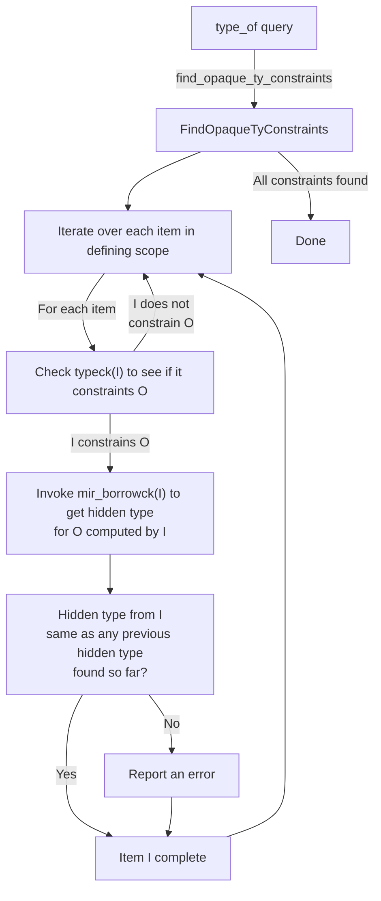
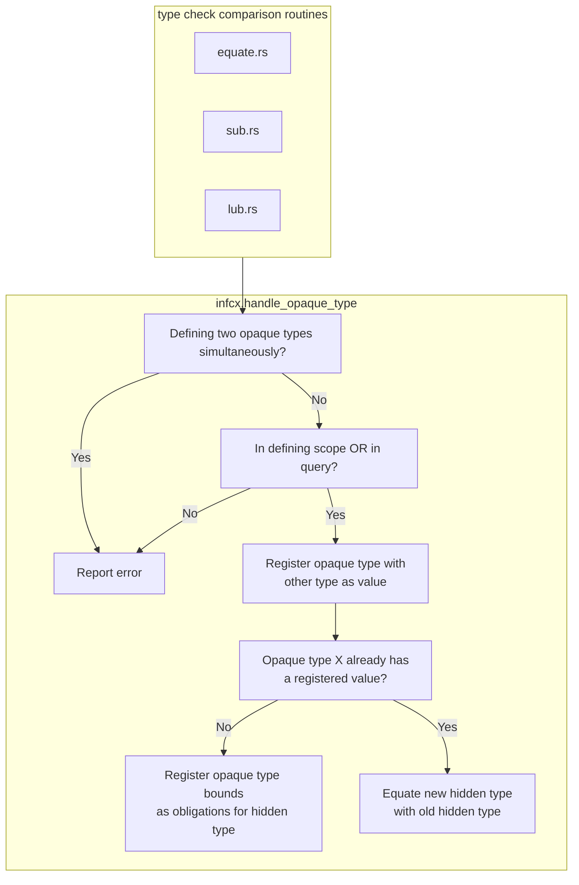

# Variance of type and lifetime parameters

For a more general background on variance, see the [background] appendix.

[background]: ./appendix/background.html

During type checking we must infer the variance of type and lifetime
parameters. The algorithm is taken from Section 4 of the paper ["Taming the
Wildcards: Combining Definition- and Use-Site Variance"][pldi11] published in
PLDI'11 and written by Altidor et al., and hereafter referred to as The Paper.

[pldi11]: https://people.cs.umass.edu/~yannis/variance-extended2011.pdf

This inference is explicitly designed *not* to consider the uses of
types within code. To determine the variance of type parameters
defined on type `X`, we only consider the definition of the type `X`
and the definitions of any types it references.

We only infer variance for type parameters found on *data types*
like structs and enums. In these cases, there is a fairly straightforward
explanation for what variance means. The variance of the type
or lifetime parameters defines whether `T<A>` is a subtype of `T<B>`
(resp. `T<'a>` and `T<'b>`) based on the relationship of `A` and `B`
(resp. `'a` and `'b`).

We do not infer variance for type parameters found on traits, functions,
or impls. Variance on trait parameters can indeed make sense
(and we used to compute it) but it is actually rather subtle in
meaning and not that useful in practice, so we removed it. See the
[addendum] for some details. Variances on function/impl parameters, on the
other hand, doesn't make sense because these parameters are instantiated and
then forgotten, they don't persist in types or compiled byproducts.

[addendum]: #addendum

> **Notation**
>
> We use the notation of The Paper throughout this chapter:
>
> - `+` is _covariance_.
> - `-` is _contravariance_.
> - `*` is _bivariance_.
> - `o` is _invariance_.

## The algorithm

The basic idea is quite straightforward. We iterate over the types
defined and, for each use of a type parameter `X`, accumulate a
constraint indicating that the variance of `X` must be valid for the
variance of that use site. We then iteratively refine the variance of
`X` until all constraints are met. There is *always* a solution, because at
the limit we can declare all type parameters to be invariant and all
constraints will be satisfied.

As a simple example, consider:

```rust,ignore
enum Option<A> { Some(A), None }
enum OptionalFn<B> { Some(|B|), None }
enum OptionalMap<C> { Some(|C| -> C), None }
```

Here, we will generate the constraints:

```text
1. V(A) <= +
2. V(B) <= -
3. V(C) <= +
4. V(C) <= -
```

These indicate that (1) the variance of A must be at most covariant;
(2) the variance of B must be at most contravariant; and (3, 4) the
variance of C must be at most covariant *and* contravariant. All of these
results are based on a variance lattice defined as follows:

```text
   *      Top (bivariant)
-     +
   o      Bottom (invariant)
```

Based on this lattice, the solution `V(A)=+`, `V(B)=-`, `V(C)=o` is the
optimal solution. Note that there is always a naive solution which
just declares all variables to be invariant.

You may be wondering why fixed-point iteration is required. The reason
is that the variance of a use site may itself be a function of the
variance of other type parameters. In full generality, our constraints
take the form:

```text
V(X) <= Term
Term := + | - | * | o | V(X) | Term x Term
```

Here the notation `V(X)` indicates the variance of a type/region
parameter `X` with respect to its defining class. `Term x Term`
represents the "variance transform" as defined in the paper:

>  If the variance of a type variable `X` in type expression `E` is `V2`
  and the definition-site variance of the corresponding type parameter
  of a class `C` is `V1`, then the variance of `X` in the type expression
  `C<E>` is `V3 = V1.xform(V2)`.

## Constraints

If I have a struct or enum with where clauses:

```rust,ignore
struct Foo<T: Bar> { ... }
```

you might wonder whether the variance of `T` with respect to `Bar` affects the
variance `T` with respect to `Foo`. I claim no.  The reason: assume that `T` is
invariant with respect to `Bar` but covariant with respect to `Foo`. And then
we have a `Foo<X>` that is upcast to `Foo<Y>`, where `X <: Y`. However, while
`X : Bar`, `Y : Bar` does not hold.  In that case, the upcast will be illegal,
but not because of a variance failure, but rather because the target type
`Foo<Y>` is itself just not well-formed. Basically we get to assume
well-formedness of all types involved before considering variance.

### Dependency graph management

Because variance is a whole-crate inference, its dependency graph
can become quite muddled if we are not careful. To resolve this, we refactor
into two queries:

- `crate_variances` computes the variance for all items in the current crate.
- `variances_of` accesses the variance for an individual reading; it
  works by requesting `crate_variances` and extracting the relevant data.

If you limit yourself to reading `variances_of`, your code will only
depend then on the inference of that particular item.

Ultimately, this setup relies on the [red-green algorithm][rga]. In particular,
every variance query effectively depends on all type definitions in the entire
crate (through `crate_variances`), but since most changes will not result in a
change to the actual results from variance inference, the `variances_of` query
will wind up being considered green after it is re-evaluated.

[rga]: ./queries/incremental-compilation.html

<a id="addendum"></a>

## Addendum: Variance on traits

As mentioned above, we used to permit variance on traits. This was
computed based on the appearance of trait type parameters in
method signatures and was used to represent the compatibility of
vtables in trait objects (and also "virtual" vtables or dictionary
in trait bounds). One complication was that variance for
associated types is less obvious, since they can be projected out
and put to myriad uses, so it's not clear when it is safe to allow
`X<A>::Bar` to vary (or indeed just what that means). Moreover (as
covered below) all inputs on any trait with an associated type had
to be invariant, limiting the applicability. Finally, the
annotations (`MarkerTrait`, `PhantomFn`) needed to ensure that all
trait type parameters had a variance were confusing and annoying
for little benefit.

Just for historical reference, I am going to preserve some text indicating how
one could interpret variance and trait matching.

### Variance and object types

Just as with structs and enums, we can decide the subtyping
relationship between two object types `&Trait<A>` and `&Trait<B>`
based on the relationship of `A` and `B`. Note that for object
types we ignore the `Self` type parameter – it is unknown, and
the nature of dynamic dispatch ensures that we will always call a
function that is expected the appropriate `Self` type. However, we
must be careful with the other type parameters, or else we could
end up calling a function that is expecting one type but provided
another.

To see what I mean, consider a trait like so:

```rust
trait ConvertTo<A> {
    fn convertTo(&self) -> A;
}
```

Intuitively, If we had one object `O=&ConvertTo<Object>` and another
`S=&ConvertTo<String>`, then `S <: O` because `String <: Object`
(presuming Java-like "string" and "object" types, my go to examples
for subtyping). The actual algorithm would be to compare the
(explicit) type parameters pairwise respecting their variance: here,
the type parameter A is covariant (it appears only in a return
position), and hence we require that `String <: Object`.

You'll note though that we did not consider the binding for the
(implicit) `Self` type parameter: in fact, it is unknown, so that's
good. The reason we can ignore that parameter is precisely because we
don't need to know its value until a call occurs, and at that time (as
you said) the dynamic nature of virtual dispatch means the code we run
will be correct for whatever value `Self` happens to be bound to for
the particular object whose method we called. `Self` is thus different
from `A`, because the caller requires that `A` be known in order to
know the return type of the method `convertTo()`. (As an aside, we
have rules preventing methods where `Self` appears outside of the
receiver position from being called via an object.)

### Trait variance and vtable resolution

But traits aren't only used with objects. They're also used when
deciding whether a given impl satisfies a given trait bound. To set the
scene here, imagine I had a function:

```rust,ignore
fn convertAll<A,T:ConvertTo<A>>(v: &[T]) { ... }
```

Now imagine that I have an implementation of `ConvertTo` for `Object`:

```rust,ignore
impl ConvertTo<i32> for Object { ... }
```

And I want to call `convertAll` on an array of strings. Suppose
further that for whatever reason I specifically supply the value of
`String` for the type parameter `T`:

```rust,ignore
let mut vector = vec!["string", ...];
convertAll::<i32, String>(vector);
```

Is this legal? To put another way, can we apply the `impl` for
`Object` to the type `String`? The answer is yes, but to see why
we have to expand out what will happen:

- `convertAll` will create a pointer to one of the entries in the
  vector, which will have type `&String`
- It will then call the impl of `convertTo()` that is intended
  for use with objects. This has the type `fn(self: &Object) -> i32`.

  It is OK to provide a value for `self` of type `&String` because
  `&String <: &Object`.

OK, so intuitively we want this to be legal, so let's bring this back
to variance and see whether we are computing the correct result. We
must first figure out how to phrase the question "is an impl for
`Object,i32` usable where an impl for `String,i32` is expected?"

Maybe it's helpful to think of a dictionary-passing implementation of
type classes. In that case, `convertAll()` takes an implicit parameter
representing the impl. In short, we *have* an impl of type:

```text
V_O = ConvertTo<i32> for Object
```

and the function prototype expects an impl of type:

```text
V_S = ConvertTo<i32> for String
```

As with any argument, this is legal if the type of the value given
(`V_O`) is a subtype of the type expected (`V_S`). So is `V_O <: V_S`?
The answer will depend on the variance of the various parameters. In
this case, because the `Self` parameter is contravariant and `A` is
covariant, it means that:

```text
V_O <: V_S iff
    i32 <: i32
    String <: Object
```

These conditions are satisfied and so we are happy.

### Variance and associated types

Traits with associated types – or at minimum projection
expressions – must be invariant with respect to all of their
inputs. To see why this makes sense, consider what subtyping for a
trait reference means:

```text
<T as Trait> <: <U as Trait>
```

means that if I know that `T as Trait`, I also know that `U as
Trait`. Moreover, if you think of it as dictionary passing style,
it means that a dictionary for `<T as Trait>` is safe to use where
a dictionary for `<U as Trait>` is expected.

The problem is that when you can project types out from `<T as
Trait>`, the relationship to types projected out of `<U as Trait>`
is completely unknown unless `T==U` (see #21726 for more
details). Making `Trait` invariant ensures that this is true.

Another related reason is that if we didn't make traits with
associated types invariant, then projection is no longer a
function with a single result. Consider:

```rust,ignore
trait Identity { type Out; fn foo(&self); }
impl<T> Identity for T { type Out = T; ... }
```

Now if I have `<&'static () as Identity>::Out`, this can be
validly derived as `&'a ()` for any `'a`:

```text
<&'a () as Identity> <: <&'static () as Identity>
if &'static () < : &'a ()   -- Identity is contravariant in Self
if 'static : 'a             -- Subtyping rules for relations
```

This change otoh means that `<'static () as Identity>::Out` is
always `&'static ()` (which might then be upcast to `'a ()`,
separately). This was helpful in solving #21750.


---

# Coherence

> NOTE: this is based on [notes by @lcnr](https://github.com/rust-lang/rust/pull/121848)

Coherence checking is what detects both of trait impls and inherent impls overlapping with others.
(reminder: [inherent impls](https://doc.rust-lang.org/reference/items/implementations.html#inherent-implementations) are impls of concrete types like `impl MyStruct {}`)

Overlapping trait impls always produce an error,
while overlapping inherent impls result in an error only if they have methods with the same name.

Checking for overlaps is split in two parts. First there's the [overlap check(s)](#overlap-checks), 
which finds overlaps between traits and inherent implementations that the compiler currently knows about.

However, Coherence also results in an error if any other impls **could** exist,
even if they are currently unknown. 
This affects impls which may get added to upstream crates in a backwards compatible way,
and impls from downstream crates. 
This is called the Orphan check.

## Overlap checks

Overlap checks are performed for both inherent impls, and for trait impls.
This uses the same overlap checking code, really done as two separate analyses.
Overlap checks always consider pairs of implementations, comparing them to each other.

Overlap checking for inherent impl blocks is done through `fn check_item` (in coherence/inherent_impls_overlap.rs),
where you can very clearly see that (at least for small `n`), the check really performs `n^2`
comparisons between impls. 

In the case of traits, this check is currently done as part of building the [specialization graph](traits/specialization.md),
to handle specializing impls overlapping with their parent, but this may change in the future.

In both cases, all pairs of impls are checked for overlap.

Overlapping is sometimes partially allowed:

1. for marker traits
2. under [specialization](traits/specialization.md)

but normally isn't. 

The overlap check has various modes (see [`OverlapMode`]).
Importantly, there's the explicit negative impl check, and the implicit negative impl check.
Both try to prove that an overlap is definitely impossible.

[`OverlapMode`]: https://doc.rust-lang.org/beta/nightly-rustc/rustc_middle/traits/specialization_graph/enum.OverlapMode.html

### The explicit negative impl check

This check is done in [`impl_intersection_has_negative_obligation`]. 

This check tries to find a negative trait implementation. 
For example:

```rust
struct MyCustomErrorType;

// both in your own crate
impl From<&str> for MyCustomErrorType {}
impl<E> From<E> for MyCustomErrorType where E: Error {}
```

In this example, we'd get:
`MyCustomErrorType: From<&str>` and `MyCustomErrorType: From<?E>`, giving `?E = &str`.

And thus, these two implementations would overlap.
However, libstd provides `&str: !Error`, and therefore guarantees that there 
will never be a positive implementation of `&str: Error`, and thus there is no overlap.

Note that for this kind of negative impl check, we must have explicit negative implementations provided.
This is not currently stable.

[`impl_intersection_has_negative_obligation`]: https://doc.rust-lang.org/beta/nightly-rustc/rustc_trait_selection/traits/coherence/fn.impl_intersection_has_negative_obligation.html

### The implicit negative impl check

This check is done in [`impl_intersection_has_impossible_obligation`],
and does not rely on negative trait implementations and is stable.

Let's say there's a 
```rust
impl From<MyLocalType> for Box<dyn Error> {}  // in your own crate
impl<E> From<E> for Box<dyn Error> where E: Error {} // in std
```

This would give: `Box<dyn Error>: From<MyLocalType>`, and `Box<dyn Error>: From<?E>`,  
giving `?E = MyLocalType`.

In your crate there's no `MyLocalType: Error`, downstream crates cannot implement `Error` (a remote trait) for `MyLocalType` (a remote type).
Therefore, these two impls do not overlap.
Importantly, this works even if there isn't a `impl !Error for MyLocalType`.

[`impl_intersection_has_impossible_obligation`]: https://doc.rust-lang.org/beta/nightly-rustc/rustc_trait_selection/traits/coherence/fn.impl_intersection_has_impossible_obligation.html


---

# HIR Type checking

The [`hir_analysis`] crate contains the source for "type collection" as well
as a bunch of related functionality.
Checking the bodies of functions is implemented in the [`hir_typeck`] crate.
These crates draw heavily on the [type inference] and [trait solving].

[`hir_analysis`]: https://doc.rust-lang.org/nightly/nightly-rustc/rustc_hir_analysis/index.html
[`hir_typeck`]: https://doc.rust-lang.org/nightly/nightly-rustc/rustc_hir_typeck/index.html
[type inference]: ./../type-inference.md
[trait solving]: ./../traits/resolution.md

## Type collection

Type "collection" is the process of converting the types found in the HIR
(`hir::Ty`), which represent the syntactic things that the user wrote, into the
**internal representation** used by the compiler (`Ty<'tcx>`) – we also do
similar conversions for where-clauses and other bits of the function signature.

To try and get a sense of the difference, consider this function:

```rust,ignore
struct Foo { }
fn foo(x: Foo, y: self::Foo) { ... }
//        ^^^     ^^^^^^^^^
```

Those two parameters `x` and `y` each have the same type: but they will have
distinct `hir::Ty` nodes. Those nodes will have different spans, and of course
they encode the path somewhat differently. But once they are "collected" into
`Ty<'tcx>` nodes, they will be represented by the exact same internal type.

Collection is defined as a bundle of [queries] for computing information about
the various functions, traits, and other items in the crate being compiled.
Note that each of these queries is concerned with *interprocedural* things –
for example, for a function definition, collection will figure out the type and
signature of the function, but it will not visit the *body* of the function in
any way, nor examine type annotations on local variables (that's the job of
type *checking*).

For more details, see the [`collect`][collect] module.

[queries]: ../query.md
[collect]: https://doc.rust-lang.org/nightly/nightly-rustc/rustc_hir_analysis/collect/index.html

**TODO**: actually talk about type checking... [#1161](https://github.com/rust-lang/rustc-dev-guide/issues/1161)


---

# Coercions
<!-- date-check: Dec 2025 -->
 
Coercions are implicit operations which transform a value into a different type. A coercion *site* is a position where a coercion is able to be implicitly performed. There are two kinds of coercion sites: 
- one-to-one
- LUB (Least-Upper-Bound)

```rust
let one_to_one_coercion: &u32 = &mut 8;

let lub_coercion = match my_bool {
    true => &mut 10,
    false => &12,
};
```

See the Reference page on coercions for descriptions of what coercions exist and what expressions are coercion sites: <https://doc.rust-lang.org/reference/type-coercions.html>

## one-to-one coercions

With a one-to-one coercion we coerce from one singular type to a known target type. In the above example this would be the coercion from `&mut u32` to `&u32`.

A one-to-one coercion can be performed by calling [`FnCtxt::coerce`][fnctxt_coerce].

## LUB coercions

With a LUB coercion we coerce a set of source types to some unknown target type. Unlike one-to-one coercions, a LUB coercion *produces* the target type that all of the source types coerce to.

In the above example this would be the LUB coercion of both `&mut i32` and `&i32`, where we produce the target type `&i32`.

The name "LUB coercion" (Least-Upper-Bound coercion) comes from how this coercion takes a set of types and computes the least coerced/subtyped type that both source types are coercable/subtypeable into.

The general process for performing a LUB coercion is as follows:

```rust ignore
// * 1
let mut coerce = CoerceMany::new(intial_lub_ty);
for expr in exprs {
    // * 2
    let expr_ty = fcx.check_expr_with_expectation(expr, expectation);
    coerce.coerce(fcx, &cause, expr, expr_ty);
}
// * 3
let final_ty = coerce.complete(fcx);
```

There are a few key steps here:
1. Creating the [`CoerceMany`][coerce_many] value and picking an initial lub
2. Typechecking each expression and registering its type as part of the LUB coercion
3. Completing the LUB coercion to get the resulting lubbed type

### Step 1

First we create a [`CoerceMany`][coerce_many] value, this stores all of the state required for the LUB coercion. Unlike one-to-one coercions, a LUB coercion isn't a single function call as we want to intermix typechecking with advancing the LUB coercion.

Creating a `CoerceMany` takes some `initial_lub` type. This is different from the *target* of the coercion which is an output of a LUB coercion rather than an input (unlike a one-to-one coercion).

The initial lub ty should be derived from the [`Expectation`][expectation] for whatever expression this LUB coercion is for. It allows for inference constraints from computing the LUB coercion to propagate into the `Expectation`s used for type checking later expressions participating in the LUB coercion.

See the ["unnecessary inference constraints"][unnecessary_inference_constraints] header for some more information about the effects this has.

If there's no `Expectation` to use then some new infer var should be made for the initial lub ty.

### Step 2

Next, for each expression participating in the LUB coercion, we typecheck it then invoke [`CoerceMany::coerce`][coerce_many_coerce] with its type.

In some cases the expression participating in the LUB coercion doesn't actually exist in the HIR. For example when handling an operand-less `break` or `return` expression we need `()` to participate in the LUB coercion.

In these cases the [`CoerceMany::coerce_forced_unit`][coerce_many_coerce_forced_unit] method can be used.

The `CoerceMany::coerce` and `coerce_forced_unit` methods will both emit errors if the new type causes the LUB coercion to be unsatisfiable. In this case the final type of the LUB coercion will be an error type.

### Step 3

Finally once all expressions have been coerced the final type of the LUB coercion can be obtained by calling [`CoerceMany::complete`][coerce_many_complete].

The resulting type of the LUB coercion is meaningfully different from the initial lub type passed in when constructing the [`CoerceMany`][coerce_many]. You should always take the resulting type of the LUB coercion and perform any necessary checks on it.

## Implementation nuances

### Adjustments

When a coerce operation succeeds we record what kind of coercion it was, for example an unsize coercion or an autoderef etc. This is handled as part of the coerce operation by writing a list of *adjustments* into the in-progress [`TypeckResults`][typeck_results].

When building THIR we take the adjustments stored in the `TypeckResults` and make all of the coercion steps explicit. After this point in the compiler there isn't really a notion of coercions, only explicit casts and subtyping in the MIR.

TODO: write and link to an adjustments chapter here

### How does `CoerceMany` work

[`CoerceMany`][coerce_many] works by repeatedly taking the current lub ty and some new source type, and computing a new lub ty which both types can coerce to. The core logic of taking a pair of types and computing some new third type can be found in [`try_find_coercion_lub`][try_find_coercion_lub].

```rust
fn foo() {}
fn bar() {}

let a = match my_bool {
    true => foo,
    true if other_bool => foo,
    false => bar,
}
```

In this example when type checking the `match` expression a LUB coercion is performed. This LUB coercion starts out with an initial lub ty of some inference variable `?x` due to the let statement having no known type.

There are three expressions that participate in this LUB coercion. The first expression of a LUB coercion is special, instead of computing a new type with the existing initial lub ty, we coerce directly from the first expression to the initial lub ty.

1. After type checking `true => foo,` we wind up with the type `FnDef(Foo)`. We then call [`CoerceMany::coerce`][coerce_many_coerce] which will perform a one-to-one coercion of `FnDef(Foo)` to `?x`. This infers `?x=FnDef(Foo)` giving us a new lub ty for the LUB coercion.
2. After type checking `true if other_bool => foo,` we once again wind up with the type `FnDef(Foo)`. We'll then call `CoerceMany::coerce` which will attempt to compute a new lub ty from our previous lub ty (`FnDef(Foo)`) and the type of this expression (`FnDef(Foo)`). This gives us a lub ty of `FnDef(Foo)`.
3. After type checking `false => bar,` we'll wind up with the type `FnDef(Bar)`. We'll then call `CoerceMany::coerce` which will attempt to compute a new lub ty from our previous lub ty (`FnDef(Foo)`) and the type of this expression (`FnDef(Bar)`). In this case we get the type `fn() -> ()` as we choose to coerce both function item types to a function pointer.

This gives us a final type for the LUB coercion of `fn() -> ()`.

### Transitive coercions

[`CoerceMany`][coerce_many]'s algorithm of repeatedly attempting to coerce the currrent target type to the new type currently results in "Transitive Coercions". It's possible for a step in a LUB coercion to coerce an expression, and then a later step to coerce that expression further. 

```rust
struct Foo;

use std::ops::Deref;

impl Deref for Foo {
    type Target = [u8; 2];
    
    fn deref(&self) -> &[u8; 2] {
        &[1; _]
    }
}

fn main() {
    match () {
        _ if true => &Foo,
        _ if true => &[1_u8; 2],
        _ => &[1_u8; 2] as &[u8],
    };
}
```

Here we have a LUB coercion with an initial lub ty of `?x`. In the first step we do a one-to-one coercion of `&Foo` to `?x` (reminder the first step is special).

In the second step we compute a new lub ty from the current lub ty of `&Foo` and the new type of `&[u8; 2]`. This new lub ty would be `&[u8; 2]` by performing a deref coercion of `&Foo` to `&[u8; 2]` on the first expression.

In the third step we compute a new lub ty from the current lub ty of `&[u8; 2]` and the new type of `&[u8]`. This new lub ty would be `&[u8]` by performing an unsizing coercion of `&[u8; 2]` to `&[u8]` on the first two expressions.

Note how the first expression is coerced twice. Once a deref coercion from `&Foo` to `&[u8; 2]`, and then an unsizing coercion from `&[u8; 2]` to `&[u8]`.

The current implementation of transitive coercions is broken, the previous example actually ICEs on stable. While the logic for performing a LUB coercion can produce transitive coercions just fine, the rest of the compiler is not set up to handle them.

One-to-one coercions are also not capable of producing a lot of the kinds of transitive coercions that LUB coercions can. For example if we take the previous example and turn it into a one-to-one coercion we get a compile error:
```rust
struct Foo;

use std::ops::Deref;

impl Deref for Foo {
    type Target = [u8; 2];
    
    fn deref(&self) -> &[u8; 2] {
        &[1; _]
    }
}

fn main() {
    let a: &[u8] = &Foo;
}
```

Here we try to perform a one-to-one coercion from `&Foo` to `&[u8]` which fails as we can only perform a deref coercion *or* an unsizing coercion, we can't compose the two.

### How does `try_find_coercion_lub` work

There are three ways that we can compute a new lub ty for a LUB coercion:
1. Coerce both the current lub ty and the new type to a function pointer
2. Coerce the current lub ty to the new type (or vice versa)
3. Compute a mutual supertype of the current lub ty and the new type

Unfortunately the actual implementation obsfucates this a fair amount. 

Computing a mutual supertype happens implicitly due to reusing the logic for one-to-one coercions which already handles subtyping if coercing fails.

Additionally when trying to coerce both the current lub ty and the new type to function pointers we eagerly try to compute a mutual supertype to avoid unnecessary coercions.

There is likely room for improving the structure of this function to make it more closely align with the conceptual model.

### `use_lub` field in one-to-one coercions

The implementation of one-to-one coercions is reused as part of LUB coercions.

It would be wrong for LUB coercions to use one way subtyping when relating signatures or falling back to subtyping in the case of no coercions being possible. Instead we want to compute a mutual supertype of the two types.

The `use_lub` field on [`Coerce`][coerce_ty] exists to toggle whether to perform normal subtyping (in the case of a one-to-one coercion), or whether to compute a mutual supertype (in the case of a LUB coercion).

### Lubbing

In theory computing a mutual supertype should be as simple as creating some new infer var `?mutual_sup` and then requiring `lub_ty <: ?mutual_sup` and `new_ty <: ?mutual_sup`. In reality LUB coercions use a special [`TypeRelation`][type_relation], [`LatticeOp`][lattice_op].

This is primarily to work around subtyping/generalization for higher ranked types being fairly broken. Unlike normal subtyping, when encountering higher ranked types the lub type relation will switch to invariance.

This enforces that the binders of the higher ranked types are equivalent which avoids the need to pick a "most general" binder, which would be quite difficult to do.

It also avoids the process of computing a mutual supertype being *order dependent*. Given the types `a` and `b`, it may be nice if computing the mutual supertype of `a` and `b` would yield the same result as computing the mutual supertype of `b` and `a`.

The current issues with higher ranked types and subtyping would cause this property to not hold if we were to use the naive method of computing a mutual supertype.

Coercions being turned into explicit MIR operations during MIR building means that the process of computing the final type of a LUB coercion only occurs during HIR typeck. This also means the behaviour of computing a mutual supertype only matters for type inference, and is not soundness relevant.

## Cautionary notes

### Probes

Care should be taken when coercing from inside of a probe as both one-to-one coercions and LUB coercions have side effects that can't be rolled back by a probe.

LUB coercions will emit error when a coercion step fails, this makes it entirely suitable for use inside of probes.

1-to-1 and LUB coercions will both apply *adjustments* to the coerced expressions on success. This means that if inside of a probe and an attempt to coerce succeeds, then the probe must not rollback anything.

It's therefore correct to wrap a [`FnCtxt::coerce`][fnctxt_coerce] call inside of a [`commit_if_ok`][commit_if_ok], but would be wrong to do so if returning `Err` after the coerce call. It would also be wrong to call `FnCtxt::coerce` from within a [`probe`][probe].

[`CoerceMany`][coerce_many] should never be used from within a `probe` or `commit_if_ok`.

### Never-to-Any coercions

Coercing from the never type (`!`) to an inference variable will result in a [`NeverToAny`][never_to_any] coercion with a target type of the inference variable. This is subtly different from *unifying* the inference variable with the never type.

Unifying some infer var `?x` with `!` requires that `?x` actually be *equal* to `!`. However, a `NeverToAny` coercion allows for `?x` to be inferred to any possible type.

This distinction means that in cases where the initial lub ty of a coercion is an inference variable (e.g. there's no [`Expectation`][expectation] to use for the initial lub ty), it's still important to use a coercion instead of subtyping.

See PR [#147834](https://github.com/rust-lang/rust/pull/147834) which fixes a bug where we were incorrectly inferring things to the never type instead of going through a coercion.

### Fallback to subtyping

Even though subtyping is not a coercion, both [`FnCtxt::coerce`][fnctxt_coerce] and [`CoerceMany::coerce`][coerce_many_coerce]/[`coerce_forced_unit`][coerce_many_coerce_forced_unit] are able to succeed due to subtyping.

For one-to-one coercions we will try to enforce the source type is a subtype of the target type. For LUB coercions we will try to compute a type that is a supertype of all the existing types.

For example performing a one-to-one coercion of `?x` to `u32` will fallback to subtyping, inferring `?x eq u32`. This means that when a coercion fails there's no need to attempt subtyping afterwards.

### Unnecessary inference constraints

Using types from [`Expectation`][expectation]s as the initial lub ty can cause infer vars to be constrained by the types of the expressions participating in the LUB coercion. This is not always desirable as these infer vars actually only need to be constrained by the final type of the LUB coercion.

```rust
fn foo<T>(_: T) {}

fn a() {}
fn b() {}

foo::<?x>(match my_bool {
    true => a,
    false => b,
})
```

Here we have a LUB coercion with the first expression being of type `FnDef(a)` and the second expression being of type `FnDef(b)`. If we use `?x` as the initial lub ty of the LUB coercion then we would get the following behaviour:
- expression 1: infer `?x=FnDef(a)`
- expression 2: find a coercion lub between `FnDef(a), FnDef(b)` resulting in `fn() -> ()`
- the final type of the LUB coercion is `fn() -> ()`. equate `?x eq fn() -> ()`, where `?x` actually already has been inferred to `FnDef(a)`, so this is actually equating `FnDef(a) eq fn() -> ()` which does not hold

To avoid some (but not all) of these undesirable inference constraints, if the `Expectation` for the LUB coercion is an inference variable then we won't use it as the initial lub ty. Instead we create a new infer var, for example in the above code snippet we would actually make some new infer var `?y` for the initial lub ty instead of using `?x`.
- expression 1: infer `?y=FnDef(a)`
- expression 2: find a coercion lub between `FnDef(a), FnDef(b)` resulting in `fn() -> ()`
- the final type of the LUB coercion is `fn() -> ()`, infer `?x=fn() -> ()`

See [#140283](https://github.com/rust-lang/rust/pull/140283) for a case where we had undesirable inference constraints caused by not creating a new infer var.

This doesn't avoid unnecessary constraints in *all* cases, only the most common case of having an infer var as our `Expectation`. In theory it would be desirable to avoid these constraints in all cases but it would be quite involved to do so.

[coerce_many]: https://doc.rust-lang.org/nightly/nightly-rustc/rustc_hir_typeck/coercion/struct.CoerceMany.html
[coerce_many_coerce]: https://doc.rust-lang.org/nightly/nightly-rustc/rustc_hir_typeck/coercion/struct.CoerceMany.html#method.coerce
[coerce_many_coerce_forced_unit]: https://doc.rust-lang.org/nightly/nightly-rustc/rustc_hir_typeck/coercion/struct.CoerceMany.html#method.coerce_forced_unit
[coerce_many_complete]: https://doc.rust-lang.org/nightly/nightly-rustc/rustc_hir_typeck/coercion/struct.CoerceMany.html#method.complete
[try_find_coercion_lub]: https://doc.rust-lang.org/nightly/nightly-rustc/rustc_hir_typeck/fn_ctxt/struct.FnCtxt.html#method.try_find_coercion_lub
[expectation]: https://doc.rust-lang.org/nightly/nightly-rustc/rustc_hir_typeck/expectation/enum.Expectation.html
[unnecessary_inference_constraints]: #unnecessary-inference-constraints
[typeck_results]: https://doc.rust-lang.org/nightly/nightly-rustc/rustc_middle/ty/struct.TypeckResults.html
[type_relation]: https://doc.rust-lang.org/nightly/nightly-rustc/rustc_infer/infer/canonical/ir/relate/trait.TypeRelation.html
[lattice_op]: https://doc.rust-lang.org/nightly/nightly-rustc/rustc_infer/infer/relate/lattice/struct.LatticeOp.html
[fnctxt_coerce]: https://doc.rust-lang.org/nightly/nightly-rustc/rustc_hir_typeck/fn_ctxt/struct.FnCtxt.html#method.coerce
[coerce_ty]: https://doc.rust-lang.org/nightly/nightly-rustc/rustc_hir_typeck/coercion/struct.Coerce.html
[commit_if_ok]: https://doc.rust-lang.org/nightly/nightly-rustc/rustc_infer/infer/struct.InferCtxt.html#method.commit_if_ok
[probe]: https://doc.rust-lang.org/nightly/nightly-rustc/rustc_infer/infer/struct.InferCtxt.html#method.probe
[never_to_any]: https://doc.rust-lang.org/nightly/nightly-rustc/rustc_middle/ty/adjustment/enum.Adjust.html#variant.NeverToAny


---

# Method lookup

Method lookup can be rather complex due to the interaction of a number
of factors, such as self types, autoderef, trait lookup, etc. This
file provides an overview of the process. More detailed notes are in
the code itself, naturally.

One way to think of method lookup is that we convert an expression of
the form `receiver.method(...)` into a more explicit [fully-qualified syntax][]
(formerly called [UFCS][]):

- `Trait::method(ADJ(receiver), ...)` for a trait call
- `ReceiverType::method(ADJ(receiver), ...)` for an inherent method call

Here `ADJ` is some kind of adjustment, which is typically a series of
autoderefs and then possibly an autoref (e.g., `&**receiver`). However
we sometimes do other adjustments and coercions along the way, in
particular unsizing (e.g., converting from `[T; n]` to `[T]`).

Method lookup is divided into two major phases:

1. Probing ([`probe.rs`][probe]). The probe phase is when we decide what method
   to call and how to adjust the receiver.
2. Confirmation ([`confirm.rs`][confirm]). The confirmation phase "applies"
   this selection, updating the side-tables, unifying type variables, and
   otherwise doing side-effectful things.

One reason for this division is to be more amenable to caching.  The
probe phase produces a "pick" (`probe::Pick`), which is designed to be
cacheable across method-call sites. Therefore, it does not include
inference variables or other information.

[fully-qualified syntax]: https://doc.rust-lang.org/nightly/book/ch19-03-advanced-traits.html#fully-qualified-syntax-for-disambiguation-calling-methods-with-the-same-name
[UFCS]: https://github.com/rust-lang/rfcs/blob/master/text/0132-ufcs.md
[probe]: https://doc.rust-lang.org/nightly/nightly-rustc/rustc_hir_typeck/method/probe/
[confirm]: https://doc.rust-lang.org/nightly/nightly-rustc/rustc_hir_typeck/method/confirm/

## The Probe phase

### Steps

The first thing that the probe phase does is to create a series of
*steps*. This is done by progressively dereferencing the receiver type
until it cannot be deref'd anymore, as well as applying an optional
"unsize" step. So if the receiver has type `Rc<Box<[T; 3]>>`, this
might yield:

1. `Rc<Box<[T; 3]>>`
2. `Box<[T; 3]>`
3. `[T; 3]`
4. `[T]`

### Candidate assembly

We then search along those steps to create a list of *candidates*. A
`Candidate` is a method item that might plausibly be the method being
invoked. For each candidate, we'll derive a "transformed self type"
that takes into account explicit self.

Candidates are grouped into two kinds, inherent and extension.

**Inherent candidates** are those that are derived from the
type of the receiver itself.  So, if you have a receiver of some
nominal type `Foo` (e.g., a struct), any methods defined within an
impl like `impl Foo` are inherent methods.  Nothing needs to be
imported to use an inherent method, they are associated with the type
itself (note that inherent impls can only be defined in the same
crate as the type itself).

<!--
FIXME: Inherent candidates are not always derived from impls.  If you
have a trait object, such as a value of type `Box<ToString>`, then the
trait methods (`to_string()`, in this case) are inherently associated
with it. Another case is type parameters, in which case the methods of
their bounds are inherent. However, this part of the rules is subject
to change: when DST's "impl Trait for Trait" is complete, trait object
dispatch could be subsumed into trait matching, and the type parameter
behavior should be reconsidered in light of where clauses.

Is this still accurate?
-->

**Extension candidates** are derived from imported traits.  If I have
the trait `ToString` imported, and I call `to_string()` as a method,
then we will list the `to_string()` definition in each impl of
`ToString` as a candidate. These kinds of method calls are called
"extension methods".

So, let's continue our example. Imagine that we were calling a method
`foo` with the receiver `Rc<Box<[T; 3]>>` and there is a trait `Foo`
that defines it with `&self` for the type `Rc<U>` as well as a method
on the type `Box` that defines `foo` but with `&mut self`. Then we
might have two candidates:

- `&Rc<U>` as an extension candidate
- `&mut Box<U>` as an inherent candidate

### Candidate search

Finally, to actually pick the method, we will search down the steps,
trying to match the receiver type against the candidate types. At
each step, we also consider an auto-ref and auto-mut-ref to see whether
that makes any of the candidates match. For each resulting receiver
type, we consider inherent candidates before extension candidates.
If there are multiple matching candidates in a group, we report an
error, except that multiple impls of the same trait are treated as a
single match. Otherwise we pick the first match we find.

In the case of our example, the first step is `Rc<Box<[T; 3]>>`,
which does not itself match any candidate. But when we autoref it, we
get the type `&Rc<Box<[T; 3]>>` which matches `&Rc<U>`. We would then
recursively consider all where-clauses that appear on the impl: if
those match (or we cannot rule out that they do), then this is the
method we would pick. Otherwise, we would continue down the series of
steps.


---

# Const Generics

## Kinds of const arguments

Most of the kinds of `ty::Const` that exist have direct parallels to kinds of types that exist, for example `ConstKind::Param` is equivalent to `TyKind::Param`.

The main interesting points here are:
- [`ConstKind::Unevaluated`], which is equivalent to `TyKind::Alias` and in the long term should be renamed (as well as introducing an `AliasConstKind` to parallel `ty::AliasKind`).
- [`ConstKind::Value`], which is the final value of a `ty::Const` after monomorphization.
  This is somewhat similar to fully concrete things like `TyKind::Str` or `TyKind::ADT`.

For a complete list of *all* kinds of const arguments and how they are actually represented in the type system, see the [`ConstKind`] type.

Inference Variables are quite boring and treated equivalently to type inference variables almost everywhere.
Const Parameters are also similarly boring and equivalent to uses of type parameters almost everywhere.
However, there are some interesting subtleties with how they are handled during parsing, name resolution, and AST lowering: [ambig-unambig-ty-and-consts].

## Anon Consts

Anon Consts (short for anonymous const items) are how arbitrary expression are represented in const generics, for example an array length of `1 + 1` or `foo()` or even just `0`.
These are unique to const generics and have no real type equivalent.

### Desugaring

```rust
struct Foo<const N: usize>;
type Alias = [u8; 1 + 1];
```

In this example we have a const argument of `1 + 1` (the array length) which is represented as an *anon const*. The desugaring would look something like:
```rust
struct Foo<const N: usize>;

const ANON: usize = 1 + 1;
type Alias = [u8; ANON];
```

Where the array length in `[u8; ANON]` isn't itself an anon const containing a usage of `ANON`, but a kind of "direct" usage of the `ANON` const item ([`ConstKind::Unevaluated`]).

Anon consts do not inherit any generic parameters of the item they are inside of:
```rust
struct Foo<const N: usize>;
type Alias<T: Sized> = [T; 1 + 1];

// Desugars To;

struct Foo<const N: usize>;

const ANON: usize = 1 + 1;
type Alias<T: Sized> = [T; ANON];
```

Note how the `ANON` const has no generic parameters or where clauses, even though `Alias` has both a type parameter `T` and a where clauses `T: Sized`.
This desugaring is part of how we enforce that anon consts can't make use of generic parameters.

While it's useful to think of anon consts as being desugared to real const items, the compiler does not actually implement things this way.

At AST lowering time we do not yet know the *type* of the anon const, so we can't desugar to a real HIR item with an explicitly written type.
To work around this, we have [`DefKind::AnonConst`] and [`hir::Node::AnonConst`],
which are used to represent these anonymous const items that can't actually be desugared.

The types of these anon consts are obtainable from the [`type_of`] query.
However, the `type_of` query does not actually contain logic for computing the type (and, in fact, it just ICEs when called).
Instead, HIR Ty lowering is responsible for *feeding* the value of the `type_of` query for any anon consts that get lowered.
HIR Ty lowering can determine the type of the anon const by looking at the type of the Const Parameter that the anon const is an argument to.

TODO: write a chapter on query feeding and link it here

In some sense the desugarings from the previous examples are to:
```rust
struct Foo<const N: usize>;
type Alias = [u8; 1 + 1];

// sort-of desugars to pseudo-rust:
struct Foo<const N: usize>;

const ANON = 1 + 1;
type Alias = [u8; ANON];
```

When we go through HIR ty lowering for the array type in `Alias`, we will lower the array length too, and feed `type_of(ANON) -> usize`.
This will effectively set the type of the `ANON` const item during some later part of the compiler rather than when constructing the HIR.

After all of this desugaring has taken place the final representation in the type system (ie as a `ty::Const`) is a `ConstKind::Unevaluated` with the `DefId` of the `AnonConst`. This is equivalent to how we would representa a usage of an actual const item if we were to represent them without going through an anon const (e.g. when `min_generic_const_args` is enabled).

This allows the representation for const "aliases" to be the same as the representation of `TyKind::Alias`. Having a proper HIR body also allows for a *lot* of code re-use, e.g. we can reuse HIR typechecking and all of the lowering steps to MIR where we can then reuse const eval.

### Enforcing lack of Generic Parameters

There are three ways that we enforce anon consts can't use generic parameters:
1. Name Resolution will not resolve paths to generic parameters when inside of an anon const
2. HIR Ty lowering will error when a `Self` type alias to a type referencing generic parameters is encountered inside of an anon const
3. Anon Consts do not inherit where clauses or generics from their parent definition (ie [`generics_of`] does not contain a parent for anon consts)

```rust
// *1* Errors in name resolution
type Alias<const N: usize> = [u8; N + 1];
//~^ ERROR: generic parameters may not be used in const operations

// *2* Errors in HIR Ty lowering:
struct Foo<T>(T);
impl<T> Foo<T> {
    fn assoc() -> [u8; { let a: Self; 0 }] {}
    //~^ ERROR: generic `Self` types are currently not permitted in anonymous constants
}

// *3* Errors due to lack of where clauses on the desugared anon const
trait Trait<T> {
    const ASSOC: usize;
}
fn foo<T>() -> [u8; <()>::ASSOC]
//~^ ERROR: no associated item named `ASSOC` found for unit type `()`
where
    (): Trait<T> {}
```

The second point is particularly subtle as it is very easy to get HIR Ty lowering wrong and not properly enforce that anon consts can't use generic parameters.
The existing check is too conservative and accidentally permits some generic parameters to wind up in the body of the anon const [#144547](https://github.com/rust-lang/rust/issues/144547).

Erroneously allowing generic parameters in anon consts can sometimes lead to ICEs but can also lead to accepting illformed programs.

The third point is also somewhat subtle, by not inheriting any of the where clauses of the parent item we can't wind up with the trait solving inferring inference variables to generic parameters based off where clauses in scope that mention generic parameters.
For example, inferring `?x=T` from the expression `<() as Trait<?x>>::ASSOC` and an in-scope where clause of `(): Trait<T>`.

This also makes it much more likely that the compiler will ICE or atleast incidentally emit some kind of error if we *do* accidentally allow generic parameters in an anon const, as the anon const will have none of the necessary information in its environment to properly handle the generic parameters.

#### Array repeat expressions
The one exception to all of the above is repeat counts of array expressions.
As a *backwards compatibility hack*, we allow the repeat count const argument to use generic parameters.

```rust
fn foo<T: Sized>() {
    let a = [1_u8; size_of::<T>()];
}
```

However, to avoid most of the problems involved in allowing generic parameters in anon const const arguments we require that the constant be evaluated before monomorphization (e.g. during type checking). In some sense we only allow generic parameters here when they are semantically unused.

In the previous example the anon const can be evaluated for any type parameter `T` because raw pointers to sized types always have the same size (e.g. `8` on 64bit platforms).

When detecting that we evaluated an anon const that syntactically contained generic parameters, but did not actually depend on them for evaluation to succeed, we emit the [`const_evaluatable_unchecked` FCW][cec_fcw].
This is intended to become a hard error once we stabilize more ways of using generic parameters in const arguments, for example `min_generic_const_args` or (the now dead) `generic_const_exprs`.

The implementation for this FCW can be found here: [`const_eval_resolve_for_typeck`]

### Incompatibilities with `generic_const_parameter_types`

Supporting const parameters such as `const N: [u8; M]` or `const N: Foo<T>` does not work very nicely with the current anon consts setup.
There are two reasons for this:
1. As anon consts cannot use generic parameters, their type *also* can't reference generic parameters.
   This means it is fundamentally not possible to use an anon const as an argument to a const parameter whose type still references generic parameters.

    ```rust
    #![feature(adt_const_params, generic_const_parameter_types)]

    fn foo<const N: usize, const M: [u8; N]>() {}

    fn bar<const N: usize>() {
        // There is no way to specify the const argument to `M`
        foo::<N, { [1_u8; N] }>();
    }
    ```

2. We currently require knowing the type of anon consts when lowering them during HIR ty lowering.
   With generic const parameter types it may be the case that the currently known type contains inference variables (ie may not be fully known yet).

    ```rust
    #![feature(adt_const_params, generic_const_parameter_types)]

    fn foo<const N: usize, const M: [u8; N]>() {}

    fn bar() {
        // The const argument to `N` must be explicitly specified
        // even though it is able to be inferred
        foo::<_, { [1_u8; 3] }>();
    }
    ```

It is currently unclear what the right way to make `generic_const_parameter_types` work nicely with the rest of const generics is.

`generic_const_exprs` would have allowed for anon consts with types referencing generic parameters, but that design wound up unworkable.

`min_generic_const_args` will allow for some expressions (for example array construction) to be representable without an anon const and therefore without running into these issues, though whether this is *enough* has yet to be determined.

## Checking types of Const Arguments

In order for a const argument to be well formed it must have the same type as the const parameter it is an argument to.
For example, a const argument of type `bool` for an array length is not well formed, as an array's length parameter has type `usize`.

```rust
type Alias<const B: bool> = [u8; B];
//~^ ERROR:
```

To check this, we have [`ClauseKind::ConstArgHasType(ty::Const, Ty)`][const_arg_has_type], where,
for each Const Parameter defined on an item,
we also desugar an equivalent `ConstArgHasType` clause into its list of where cluases.
This ensures that whenever we check wellformedness of anything by proving all of its clauses,
we also check happen to check that all of the Const Arguments have the correct type.

```rust
fn foo<const N: usize>() {}

// desugars to in pseudo-rust

fn foo<const N>()
where
//  ConstArgHasType(N, usize)
    N: usize, {}
```

Proving `ConstArgHasType` goals is implemented by first computing the type of the const argument, then equating it with the provided type.
A rough outline of how the type of a Const Argument may be computed:
- [`ConstKind::Param(N)`][`ConstKind::Param`] can be looked up in the [`ParamEnv`] to find a `ConstArgHasType(N, ty)` clause
- [`ConstKind::Value`] stores the type of the value inside itself so can trivially be accessed
- [`ConstKind::Unevaluated`] can have its type computed by calling the `type_of` query
- See the implementation of proving `ConstArgHasType` goals for more detailed information

`ConstArgHasType` is *the* soundness critical way that we check Const Arguments have the correct type.
However, we do *indirectly* check the types of Const Arguments a different way in some cases.

```rust
type Alias = [u8; true];

// desugars to

const ANON: usize = true;
type Alias = [u8; ANON];
```

By feeding the type of an anon const with the type of the Const Parameter,
we guarantee that the `ConstArgHasType` goal involving the anon const will succeed.
In cases where the type of the anon const doesn't match the type of the Const Parameter,
what actually happens is a *type checking* error when type checking the anon const's body.

Looking at the above example, this corresponds to `[u8; ANON]` being a well formed type because `ANON` has type `usize`, but the *body* of `ANON` being illformed and resulting in a type checking error because `true` can't be returned from a const item of type `usize`.

[ambig-unambig-ty-and-consts]: ./ambig-unambig-ty-and-consts.md
[`ConstKind`]: https://doc.rust-lang.org/nightly/nightly-rustc/rustc_middle/ty/type.ConstKind.html
[`ConstKind::Infer`]: https://doc.rust-lang.org/nightly/nightly-rustc/rustc_middle/ty/type.ConstKind.html#variant.Infer
[`ConstKind::Param`]: https://doc.rust-lang.org/nightly/nightly-rustc/rustc_middle/ty/type.ConstKind.html#variant.Param
[`ConstKind::Unevaluated`]: https://doc.rust-lang.org/nightly/nightly-rustc/rustc_middle/ty/type.ConstKind.html#variant.Unevaluated
[`ConstKind::Value`]: https://doc.rust-lang.org/nightly/nightly-rustc/rustc_middle/ty/type.ConstKind.html#variant.Value
[const_arg_has_type]: https://doc.rust-lang.org/nightly/nightly-rustc/rustc_middle/ty/type.ClauseKind.html#variant.ConstArgHasType
[`ParamEnv`]: https://doc.rust-lang.org/nightly/nightly-rustc/rustc_middle/ty/struct.ParamEnv.html
[`generics_of`]: https://doc.rust-lang.org/nightly/nightly-rustc/rustc_middle/ty/struct.TyCtxt.html#impl-TyCtxt%3C'tcx%3E/method.generics_of
[`type_of`]: https://doc.rust-lang.org/nightly/nightly-rustc/rustc_middle/ty/struct.TyCtxt.html#method.type_of
[`DefKind::AnonConst`]: https://doc.rust-lang.org/nightly/nightly-rustc/rustc_hir/def/enum.DefKind.html#variant.AnonConst
[`hir::Node::AnonConst`]: https://doc.rust-lang.org/nightly/nightly-rustc/rustc_hir/hir/enum.Node.html#variant.AnonConst#
[cec_fcw]: https://github.com/rust-lang/rust/issues/76200
[`const_eval_resolve_for_typeck`]: https://doc.rust-lang.org/nightly/nightly-rustc/rustc_middle/ty/struct.TyCtxt.html#method.const_eval_resolve_for_typeck


---

# Opaque types (type alias `impl Trait`)

Opaque types are syntax to declare an opaque type alias that only
exposes a specific set of traits as their interface; the concrete type in the
background is inferred from a certain set of use sites of the opaque type.

This is expressed by using `impl Trait` within type aliases, for example:

```rust,ignore
type Foo = impl Bar;
```

This declares an opaque type named `Foo`, of which the only information is that
it implements `Bar`. Therefore, any of `Bar`'s interface can be used on a `Foo`,
but nothing else (regardless of whether the concrete type implements any other traits).

Since there needs to be a concrete background type,
you can (as of <!-- date-check --> May 2025) express that type
by using the opaque type in a "defining use site".

```rust,ignore
struct Struct;
impl Bar for Struct { /* stuff */ }
#[define_opaque(Foo)]
fn foo() -> Foo {
    Struct
}
```

Any other "defining use site" needs to produce the exact same type.

Note that defining a type alias to an opaque type is an unstable feature.
To use it, you need `nightly` and the annotations `#![feature(type_alias_impl_trait)]` on the file and `#[define_opaque(Foo)]` on the method that links the opaque type to the concrete type.
Complete example:

```rust
#![feature(type_alias_impl_trait)]

trait Bar { /* stuff */ }

type Foo = impl Bar;

struct Struct;

impl Bar for Struct { /* stuff */ }

#[define_opaque(Foo)]
fn foo() -> Foo {
    Struct
}
```

## Defining use site(s)

Currently only the return value of a function can be a defining use site
of an opaque type (and only if the return type of that function contains
the opaque type).

The defining use of an opaque type can be any code *within* the parent
of the opaque type definition. This includes any siblings of the
opaque type and all children of the siblings.

The initiative for *"not causing fatal brain damage to developers due to
accidentally running infinite loops in their brain while trying to
comprehend what the type system is doing"* has decided to disallow children
of opaque types to be defining use sites.

### Associated opaque types

Associated opaque types can be defined by any other associated item
on the same trait `impl` or a child of these associated items. For instance:

```rust,ignore
trait Baz {
    type Foo;
    fn foo() -> Self::Foo;
}

struct Quux;

impl Baz for Quux {
    type Foo = impl Bar;
    fn foo() -> Self::Foo { ... }
}
```

For this you would also need to use `nightly` and the (different) `#![feature(impl_trait_in_assoc_type)]` annotation.
Note that you don't need a `#[define_opaque(Foo)]` on the method anymore as the opaque type is mentioned in the function signature (behind the associated type).
Complete example:

```
#![feature(impl_trait_in_assoc_type)]

trait Bar {}
struct Zap;

impl Bar for Zap {}

trait Baz {
    type Foo;
    fn foo() -> Self::Foo;
}

struct Quux;

impl Baz for Quux {
    type Foo = impl Bar;
    fn foo() -> Self::Foo { Zap }
}
```


---

# Inference of opaque types (`impl Trait`)

This page describes how the compiler infers the [hidden type] for an [opaque type].
This kind of type inference is particularly complex because,
unlike other kinds of type inference,
it can work across functions and function bodies.

[hidden type]: ./borrow-check/region-inference/member-constraints.html?highlight=%22hidden%20type%22#member-constraints
[opaque type]: ./opaque-types-type-alias-impl-trait.md

## Running example

To help explain how it works, let's consider an example.

```rust
#![feature(type_alias_impl_trait)]
mod m {
    pub type Seq<T> = impl IntoIterator<Item = T>;

    #[define_opaque(Seq)]
    pub fn produce_singleton<T>(t: T) -> Seq<T> {
        vec![t]
    }

    #[define_opaque(Seq)]
    pub fn produce_doubleton<T>(t: T, u: T) -> Seq<T> {
        vec![t, u]
    }
}

fn is_send<T: Send>(_: &T) {}

pub fn main() {
    let elems = m::produce_singleton(22);

    is_send(&elems);

    for elem in elems {
        println!("elem = {:?}", elem);
    }
}
```

In this code, the *opaque type* is `Seq<T>`.
Its defining scope is the module `m`.
Its *hidden type* is `Vec<T>`,
which is inferred from `m::produce_singleton` and `m::produce_doubleton`.

In the `main` function, the opaque type is out of its defining scope.
When `main` calls `m::produce_singleton`, it gets back a reference to the opaque type `Seq<i32>`.
The `is_send` call checks that `Seq<i32>: Send`.
`Send` is not listed amongst the bounds of the impl trait,
but because of auto-trait leakage, we are able to infer that it holds.
The `for` loop desugaring requires that `Seq<T>: IntoIterator`,
which is provable from the bounds declared on `Seq<T>`.

### Type-checking `main`

Let's start by looking what happens when we type-check `main`.
Initially we invoke `produce_singleton` and the return type is an opaque type
[`OpaqueTy`](https://doc.rust-lang.org/nightly/nightly-rustc/rustc_hir/hir/enum.ItemKind.html#variant.OpaqueTy).

#### Type-checking the for loop

The for loop desugars the `in elems` part to `IntoIterator::into_iter(elems)`.
`elems` is of type `Seq<T>`, so the type checker registers a `Seq<T>: IntoIterator` obligation.
This obligation is trivially satisfied,
because `Seq<T>` is an opaque type (`impl IntoIterator<Item = T>`) that has a bound for the trait.
Similar to how a `U: Foo` where bound allows `U` to trivially satisfy `Foo`,
opaque types' bounds are available to the type checker and are used to fulfill obligations.

The type of `elem` in the for loop is inferred to be `<Seq<T> as IntoIterator>::Item`, which is `T`.
At no point is the type checker interested in the hidden type.

#### Type-checking the `is_send` call

When trying to prove auto trait bounds,
we first repeat the process as above,
to see if the auto trait is in the bound list of the opaque type.
If that fails, we reveal the hidden type of the opaque type,
but only to prove this specific trait bound, not in general.
Revealing is done by invoking the `type_of` query on the `DefId` of the opaque type.
The query will internally request the hidden types from the defining function(s)
and return that (see [the section on `type_of`](#within-the-type_of-query) for more details).

#### Flowchart of type checking steps

```mermaid
flowchart TD
    TypeChecking["type checking `main`"]
    subgraph TypeOfSeq["type_of(Seq<T>) query"]
        WalkModuleHir["Walk the HIR for the module `m`\nto find the hidden types from each\nfunction/const/static within"]
        VisitProduceSingleton["visit `produce_singleton`"]
        InterimType["`produce_singleton` hidden type is `Vec<T>`\nkeep searching"]
        VisitProduceDoubleton["visit `produce_doubleton`"]
        CompareType["`produce_doubleton` hidden type is also Vec<T>\nthis matches what we saw before ✅"]
        Done["No more items to look at in scope\nReturn `Vec<T>`"]
    end

    BorrowCheckProduceSingleton["`borrow_check(produce_singleton)`"]
    TypeCheckProduceSingleton["`type_check(produce_singleton)`"]

    BorrowCheckProduceDoubleton["`borrow_check(produce_doubleton)`"]
    TypeCheckProduceDoubleton["`type_check(produce_doubleton)`"]

    Substitute["Substitute `T => u32`,\nyielding `Vec<i32>` as the hidden type"]
    CheckSend["Check that `Vec<i32>: Send` ✅"]

    TypeChecking -- trait code for auto traits --> TypeOfSeq
    TypeOfSeq --> WalkModuleHir
    WalkModuleHir --> VisitProduceSingleton
    VisitProduceSingleton --> BorrowCheckProduceSingleton
    BorrowCheckProduceSingleton --> TypeCheckProduceSingleton
    TypeCheckProduceSingleton --> InterimType
    InterimType --> VisitProduceDoubleton
    VisitProduceDoubleton --> BorrowCheckProduceDoubleton
    BorrowCheckProduceDoubleton --> TypeCheckProduceDoubleton
    TypeCheckProduceDoubleton --> CompareType --> Done
    Done --> Substitute --> CheckSend
```

### Within the `type_of` query

The `type_of` query, when applied to an opaque type O, returns the hidden type.
That hidden type is computed by combining the results
from each constraining function within the defining scope of O.



### Relating an opaque type to another type

There is one central place where an opaque type gets its hidden type constrained,
and that is the `handle_opaque_type` function.
Amusingly it takes two types, so you can pass any two types,
but one of them should be an opaque type.
The order is only important for diagnostics.



### Interactions with queries

When queries handle opaque types,
they cannot figure out whether they are in a defining scope,
so they just assume they are.

The registered hidden types are stored into the `QueryResponse` struct
in the `opaque_types` field (the function
`take_opaque_types_for_query_response` reads them out).

When the `QueryResponse` is instantiated into the surrounding infcx in
`query_response_substitution_guess`,
we convert each hidden type constraint by invoking `handle_opaque_type` (as above).

There is one bit of "weirdness".
The instantiated opaque types have an order
(if one opaque type was compared with another,
and we have to pick one opaque type to use as the one that gets its hidden type assigned).
We use the one that is considered "expected".
But really both of the opaque types may have defining uses.
When the query result is instantiated,
that will be re-evaluated from the context that is using the query.
The final context (typeck of a function, mir borrowck or wf-checks)
will know which opaque type can actually be instantiated
and then handle it correctly.

### Within the MIR borrow checker

The MIR borrow checker relates things via `nll_relate` and only cares about regions.
Any type relation will trigger the binding of hidden types,
so the borrow checker is doing the same thing as the type checker,
but ignores obviously dead code (e.g. after a panic).
The borrow checker is also the source of truth when it comes to hidden types,
as it is the only one who can properly figure out what lifetimes on the hidden type correspond
to which lifetimes on the opaque type declaration.

## Backwards compatibility hacks

`impl Trait` in return position has various quirks that were not part
of any RFCs and are likely accidental stabilization.
To support these,
the `replace_opaque_types_with_inference_vars` is being used to reintroduce the previous behaviour.

There are three backwards compatibility hacks:

1. All return sites share the same inference variable,
   so some return sites may only compile if another return site uses a concrete type.
    ```rust
    fn foo() -> impl Debug {
        if false {
            return std::iter::empty().collect();
        }
        vec![42]
    }
    ```
2. Associated type equality constraints for `impl Trait` can be used
   as long as the hidden type  satisfies the trait bounds on the associated type.
   The opaque `impl Trait` signature does not need to satisfy them.

    ```rust
    trait Duh {}

    impl Duh for i32 {}

    trait Trait {
        type Assoc: Duh;
    }

    // the fact that `R` is the `::Output` projection on `F` causes
    // an intermediate inference var to be generated which is then later
    // compared against the actually found `Assoc` type.
    impl<R: Duh, F: FnMut() -> R> Trait for F {
        type Assoc = R;
    }

    // The `impl Send` here is then later compared against the inference var
    // created, causing the inference var to be set to `impl Send` instead of
    // the hidden type. We already have obligations registered on the inference
    // var to make it uphold the `: Duh` bound on `Trait::Assoc`. The opaque
    // type does not implement `Duh`, even if its hidden type does.
    // Lazy TAIT would error out, but we inserted a hack to make it work again,
    // keeping backwards compatibility.
    fn foo() -> impl Trait<Assoc = impl Send> {
        || 42
    }
    ```
3. Closures cannot create hidden types for their parent function's `impl Trait`.
   This point is mostly moot,
   because of point 1 introducing inference vars,
   so the closure only ever sees the inference var, but should we fix 1, this will become a problem.


---

# Return Position Impl Trait In Trait

Return-position impl trait in trait (RPITIT) is conceptually (and as of
[#112988], literally) sugar that turns RPITs in trait methods into
generic associated types (GATs) without the user having to define that
GAT either on the trait side or impl side.

RPITIT was originally implemented in [#101224], which added support for
async fn in trait (AFIT), since the implementation for RPITIT came for
free as a part of implementing AFIT which had been RFC'd previously. It
was then RFC'd independently in [RFC 3425], which was recently approved
by T-lang.

## How does it work?

This doc is ordered mostly via the compilation pipeline:

1. AST lowering (AST -> HIR)
2. HIR ty lowering (HIR -> rustc_middle::ty data types)
3. typeck

### AST lowering

AST lowering for RPITITs is almost the same as lowering RPITs. We
still lower them as
[`hir::ItemKind::OpaqueTy`](https://doc.rust-lang.org/nightly/nightly-rustc/rustc_hir/hir/struct.OpaqueTy.html).
The two differences are that:

We record `in_trait` for the opaque. This will signify that the opaque
is an RPITIT for HIR ty lowering, diagnostics that deal with HIR, etc.

We record `lifetime_mapping`s for the opaque type, described below.

#### Aside: Opaque lifetime duplication

*All opaques* (not just RPITITs) end up duplicating their captured
lifetimes into new lifetime parameters local to the opaque. The main
reason we do this is because RPITs need to be able to "reify"[^1] any
captured late-bound arguments, or make them into early-bound ones. This
is so they can be used as generic args for the opaque, and later to
instantiate hidden types. Since we don't know which lifetimes are early-
or late-bound during AST lowering, we just do this for all lifetimes.

[^1]: This is compiler-errors terminology, I'm not claiming it's accurate :^)

The main addition for RPITITs is that during lowering we track the
relationship between the captured lifetimes and the corresponding
duplicated lifetimes in an additional field,
[`OpaqueTy::lifetime_mapping`](https://doc.rust-lang.org/nightly/nightly-rustc/rustc_hir/hir/struct.OpaqueTy.html#structfield.lifetime_mapping).
We use this lifetime mapping later on in `predicates_of` to install
bounds that enforce equality between these duplicated lifetimes and
their source lifetimes in order to properly typecheck these GATs, which
will be discussed below.

##### Note

It may be better if we were able to lower without duplicates and for
that I think we would need to stop distinguishing between early and late
bound lifetimes. So we would need a solution like [Account for
late-bound lifetimes in generics
#103448](https://github.com/rust-lang/rust/pull/103448) and then also a
PR similar to [Inherit function lifetimes for impl-trait
#103449](https://github.com/rust-lang/rust/pull/103449).

### HIR ty lowering

The main change to HIR ty lowering is that we lower `hir::TyKind::OpaqueDef`
for an RPITIT to a projection instead of an opaque, using a newly
synthesized def-id for a new associated type in the trait. We'll
describe how exactly we get this def-id in the next section.

This means that any time we call `lower_ty` on the RPITIT, we end up
getting a projection back instead of an opaque. This projection can then
be normalized to the right value -- either the original opaque if we're
in the trait, or the inferred type of the RPITIT if we're in an impl.

#### Lowering to synthetic associated types

Using query feeding, we synthesize new associated types on both the
trait side and impl side for RPITITs that show up in methods.

##### Lowering RPITITs in traits

When `tcx.associated_item_def_ids(trait_def_id)` is called on a trait to
gather all of the trait's associated types, the query previously just
returned the def-ids of the HIR items that are children of the trait.
After [#112988], additionally, for each method in the trait, we add the
def-ids returned by
`tcx.associated_types_for_impl_traits_in_associated_fn(trait_method_def_id)`,
which walks through each trait method, gathers any RPITITs that show up
in the signature, and then calls
`associated_type_for_impl_trait_in_trait` for each RPITIT, which
synthesizes a new associated type.

##### Lowering RPITITs in impls

Similarly, along with the impl's HIR items, for each impl method, we
additionally add all of the
`associated_types_for_impl_traits_in_associated_fn` for the impl method.
This calls `associated_type_for_impl_trait_in_impl`, which will
synthesize an associated type definition for each RPITIT that comes from
the corresponding trait method.

#### Synthesizing new associated types

We use query feeding
([`TyCtxtAt::create_def`](https://doc.rust-lang.org/nightly/nightly-rustc/rustc_middle/query/plumbing/struct.TyCtxtAt.html#method.create_def))
to synthesize a new def-id for the synthetic GATs for each RPITIT.

Locally, most of rustc's queries match on the HIR of an item to compute
their values. Since the RPITIT doesn't really have HIR associated with
it, or at least not HIR that corresponds to an associated type, we must
compute many queries eagerly and
[feed](https://github.com/rust-lang/rust/pull/104940) them, like
`opt_def_kind`, `associated_item`, `visibility`, and`defaultness`.

The values for most of these queries is obvious, since the RPITIT
conceptually inherits most of its information from the parent function
(e.g. `visibility`), or because it's trivially knowable because it's an
associated type (`opt_def_kind`).

Some other queries are more involved, or cannot be fed, and we
document the interesting ones of those below:

##### `generics_of` for the trait

The GAT for an RPITIT conceptually inherits the same generics as the
RPIT it comes from. However, instead of having the method as the
generics' parent, the trait is the parent.

Currently we get away with taking the RPIT's generics and method
generics and flattening them both into a new generics list, preserving
the def-id of each of the parameters. (This may cause issues with
def-ids having the wrong parents, but in the worst case this will cause
diagnostics issues. If this ends up being an issue, we can synthesize
new def-ids for generic params whose parent is the GAT.)

<details>
<summary> <b>An illustrated example</b> </summary>

```rust
trait Foo {
    fn method<'early: 'early, 'late, T>() -> impl Sized + Captures<'early, 'late>;
}
```

Would desugar to...
```rust
trait Foo {
    //       vvvvvvvvv method's generics
    //                  vvvvvvvvvvvvvvvvvvvvvvvv opaque's generics
    type Gat<'early, T, 'early_duplicated, 'late>: Sized + Captures<'early_duplicated, 'late>;

    fn method<'early: 'early, 'late, T>() -> Self::Gat<'early, T, 'early, 'late>;
}
```
</details>

##### `generics_of` for the impl

The generics for an impl's GAT are a bit more interesting. They are
composed of RPITIT's own generics (from the trait definition), appended
onto the impl's methods generics. This has the same issue as above,
where the generics for the GAT have parameters whose def-ids have the
wrong parent, but this should only cause issues in diagnostics.

We could fix this similarly if we were to synthesize new generics
def-ids, but this can be done later in a forwards-compatible way,
perhaps by a interested new contributor.

##### `opt_rpitit_info`

Some queries rely on computing information that would result in cycles
if we were to feed them eagerly, like `explicit_predicates_of`.
Therefore we defer to the `predicates_of` provider to return the right
value for our RPITIT's GAT. We do this by detecting early on in the
query if the associated type is synthetic by using
[`opt_rpitit_info`](https://doc.rust-lang.org/nightly/nightly-rustc/rustc_middle/ty/context/struct.TyCtxt.html#method.opt_rpitit_info),
which returns `Some` if the associated type is synthetic.

Then, during a query like `explicit_predicates_of`, we can detect if an
associated type is synthetic like:

```rust
fn explicit_predicates_of(tcx: TyCtxt<'_>, def_id: LocalDefId) -> ... {
    if let Some(rpitit_info) = tcx.opt_rpitit_info(def_id) {
        // Do something special for RPITITs...
        return ...;
    }

    // The regular computation which relies on access to the HIR of `def_id`.
}
```

##### `explicit_predicates_of`

RPITITs begin by copying the predicates of the method that defined it,
both on the trait and impl side.

Additionally, we install "bidirectional outlives" predicates.
Specifically, we add region-outlives predicates in both directions for
each captured early-bound lifetime that constrains it to be equal to the
duplicated early-bound lifetime that results from lowering. This is best
illustrated in an example:

```rust
trait Foo<'a> {
    fn bar() -> impl Sized + 'a;
}

// Desugars into...

trait Foo<'a> {
    type Gat<'a_duplicated>: Sized + 'a
    where
        'a: 'a_duplicated,
        'a_duplicated: 'a;
    //~^ Specifically, we should be able to assume that the
    // duplicated `'a_duplicated` lifetime always stays in
    // sync with the `'a` lifetime.

    fn bar() -> Self::Gat<'a>;
}
```

##### `assumed_wf_types`

The GATs in both the trait and impl inherit the `assumed_wf_types` of
the trait method that defines the RPITIT. This is to make sure that the
following code is well formed when lowered.

```rust
trait Foo {
    fn iter<'a, T>(x: &'a [T]) -> impl Iterator<Item = &'a T>;
}

// which is lowered to...

trait FooDesugared {
    type Iter<'a, T>: Iterator<Item = &'a T>;
    //~^ assumed wf: `&'a [T]`
    // Without assumed wf types, the GAT would not be well-formed on its own.

    fn iter<'a, T>(x: &'a [T]) -> Self::Iter<'a, T>;
}
```

Because `assumed_wf_types` is only defined for local def ids, in order
to properly implement `assumed_wf_types` for impls of foreign traits
with RPITs, we need to encode the assumed wf types of RPITITs in an
extern query
[`assumed_wf_types_for_rpitit`](https://github.com/rust-lang/rust/blob/a17c7968b727d8413801961fc4e89869b6ab00d3/compiler/rustc_ty_utils/src/implied_bounds.rs#L14).

### Typechecking

#### The RPITIT inference algorithm

The RPITIT inference algorithm is implemented in
[`collect_return_position_impl_trait_in_trait_tys`](https://doc.rust-lang.org/nightly/nightly-rustc/rustc_hir_analysis/check/compare_impl_item/fn.collect_return_position_impl_trait_in_trait_tys.html).

**High-level:** Given a impl method and a trait method, we take the
trait method and instantiate each RPITIT in the signature with an infer
var. We then equate this trait method signature with the impl method
signature, and process all obligations that fall out in order to infer
the type of all of the RPITITs in the method.

The method is also responsible for making sure that the hidden types for
each RPITIT actually satisfy the bounds of the `impl Trait`, i.e. that
if we infer `impl Trait = Foo`, that `Foo: Trait` holds.

<details>
    <summary><b>An example...</b></summary>

```rust
#![feature(return_position_impl_trait_in_trait)]

use std::ops::Deref;

trait Foo {
    fn bar() -> impl Deref<Target = impl Sized>;
             // ^- RPITIT ?0        ^- RPITIT ?1
}

impl Foo for () {
    fn bar() -> Box<String> { Box::new(String::new()) }
}
```

We end up with the trait signature that looks like `fn() -> ?0`, and
nested obligations `?0: Deref<Target = ?1>`, `?1: Sized`. The impl
signature is `fn() -> Box<String>`.

Equating these signatures gives us `?0 = Box<String>`, which then after
processing the obligation `Box<String>: Deref<Target = ?1>` gives us `?1
= String`, and the other obligation `String: Sized` evaluates to true.

By the end of the algorithm, we end up with a mapping between associated
type def-ids to concrete types inferred from the signature. We can then
use this mapping to implement `type_of` for the synthetic associated
types in the impl, since this mapping describes the type that should
come after the `=` in `type Assoc = ...` for each RPITIT.
</details>

##### Implied bounds in RPITIT hidden type inference

Since `collect_return_position_impl_trait_in_trait_tys` does fulfillment and
region resolution, we must provide it `assumed_wf_types` so that we can prove
region obligations with the same expected implied bounds as
`compare_method_predicate_entailment` does.

Since the return type of a method is understood to be one of the assumed WF
types, and we eagerly fold the return type with inference variables to do
opaque type inference, after opaque type inference, the return type will
resolve to contain the hidden types of the RPITITs. this would mean that the
hidden types of the RPITITs would be assumed to be well-formed without having
independently proven that they are. This resulted in a
[subtle unsoundness bug](https://github.com/rust-lang/rust/pull/116072). In
order to prevent this cyclic reasoning, we instead replace the hidden types of
the RPITITs in the return type of the method with *placeholders*, which lead
to no implied well-formedness bounds.

#### Default trait body

Type-checking a default trait body, like:

```rust
trait Foo {
    fn bar() -> impl Sized {
        1i32
    }
}
```

requires one interesting hack. We need to install a projection predicate
into the param-env of `Foo::bar` allowing us to assume that the RPITIT's
GAT normalizes to the RPITIT's opaque type. This relies on the
observation that a trait method and RPITIT's GAT will always be "in
sync". That is, one will only ever be overridden if the other one is as
well.

Compare this to a similar desugaring of the code above, which would fail
because we cannot rely on this same assumption:

```rust
#![feature(impl_trait_in_assoc_type)]
#![feature(associated_type_defaults)]

trait Foo {
    type RPITIT = impl Sized;

    fn bar() -> Self::RPITIT {
        01i32
    }
}
```

Failing because a down-stream impl could theoretically provide an
implementation for `RPITIT` without providing an implementation of
`bar`:

```text
error[E0308]: mismatched types
--> src/lib.rs:8:9
 |
5 |     type RPITIT = impl Sized;
 |     ------------------------- associated type defaults can't be assumed inside the trait defining them
6 |
7 |     fn bar() -> Self::RPITIT {
 |                 ------------ expected `<Self as Foo>::RPITIT` because of return type
8 |         01i32
 |         ^^^^^ expected associated type, found `i32`
 |
 = note: expected associated type `<Self as Foo>::RPITIT`
                       found type `i32`
```

#### Well-formedness checking

We check well-formedness of RPITITs just like regular associated types.

Since we added lifetime bounds in `predicates_of` that link the
duplicated early-bound lifetimes to their original lifetimes, and we
implemented `assumed_wf_types` which inherits the WF types of the method
from which the RPITIT originates ([#113704]), we have no issues
WF-checking the GAT as if it were a regular GAT.

### What's broken, what's weird, etc.

##### Specialization is super busted

The "default trait methods" described above does not interact well with
specialization, because we only install those projection bounds in trait
default methods, and not in impl methods. Given that specialization is
already pretty busted, I won't go into detail, but it's currently a bug
tracked in:
    * `tests/ui/impl-trait/in-trait/specialization-broken.rs`

##### Projections don't have variances

This code fails because projections don't have variances:
```rust
#![feature(return_position_impl_trait_in_trait)]

trait Foo {
    // Note that the RPITIT below does *not* capture `'lt`.
    fn bar<'lt: 'lt>() -> impl Eq;
}

fn test<'a, 'b, T: Foo>() -> bool {
    <T as Foo>::bar::<'a>() == <T as Foo>::bar::<'b>()
    //~^ ERROR
    // (requires that `'a == 'b`)
}
```

This is because we can't relate `<T as Foo>::Rpitit<'a>` and `<T as
Foo>::Rpitit<'b>`, even if they don't capture their lifetime. If we were
using regular opaque types, this would work, because they would be
bivariant in that lifetime parameter:
```rust
#![feature(return_position_impl_trait_in_trait)]

fn bar<'lt: 'lt>() -> impl Eq {
    ()
}

fn test<'a, 'b>() -> bool {
    bar::<'a>() == bar::<'b>()
}
```

This is probably okay though, since RPITITs will likely have their
captures behavior changed to capture all in-scope lifetimes anyways.
This could also be relaxed later in a forwards-compatible way if we were
to consider variances of RPITITs when relating projections.

[#112988]: https://github.com/rust-lang/rust/pull/112988
[RFC 3425]: https://github.com/rust-lang/rfcs/pull/3425
[#101224]: https://github.com/rust-lang/rust/pull/101224
[#113704]: https://github.com/rust-lang/rust/pull/113704


---

# Opaque types region inference restrictions

In this chapter we discuss the various restrictions we impose on the generic arguments of
opaque types when defining their hidden types
`Opaque<'a, 'b, .., A, B, ..> := SomeHiddenType`.

These restrictions are implemented in borrow checking ([Source][source-borrowck-opaque])
as it is the final step opaque types inference.

[source-borrowck-opaque]: https://github.com/rust-lang/rust/blob/435b5255148617128f0a9b17bacd3cc10e032b23/compiler/rustc_borrowck/src/region_infer/opaque_types.rs

## Background: type and const generic arguments
For type arguments, two restrictions are necessary: each type argument must be
(1) a type parameter and
(2) is unique among the generic arguments.
The same is applied to const arguments.

Example of case (1):
```rust
type Opaque<X> = impl Sized;

// `T` is a type parameter.
// Opaque<T> := ();
fn good<T>() -> Opaque<T> {}

// `()` is not a type parameter.
// Opaque<()> := ();
fn bad() -> Opaque<()> {} //~ ERROR
```

Example of case (2):
```rust
type Opaque<X, Y> = impl Sized;

// `T` and `U` are unique in the generic args.
// Opaque<T, U> := T;
fn good<T, U>(t: T, _u: U) -> Opaque<T, U> { t }

// `T` appears twice in the generic args.
// Opaque<T, T> := T;
fn bad<T>(t: T) -> Opaque<T, T> { t } //~ ERROR
```
**Motivation:** In the first case `Opaque<()> := ()`, the hidden type is ambiguous because
it is compatible with two different interpretaions: `Opaque<X> := X` and `Opaque<X> := ()`.
Similarly for the second case `Opaque<T, T> := T`, it is ambiguous whether it should be
interpreted as `Opaque<X, Y> := X` or as `Opaque<X, Y> := Y`.
Because of this ambiguity, both cases are rejected as invalid defining uses.

## Uniqueness restriction

Each lifetime argument must be unique in the arguments list and must not be `'static`.
This is in order to avoid an ambiguity with hidden type inference similar to the case of
type parameters.
For example, the invalid defining use below `Opaque<'static> := Inv<'static>` is compatible with
both `Opaque<'x> := Inv<'static>` and `Opaque<'x> := Inv<'x>`.

```rust
type Opaque<'x> = impl Sized + 'x;
type Inv<'a> = Option<*mut &'a ()>;

fn good<'a>() -> Opaque<'a> { Inv::<'static>::None }

fn bad() -> Opaque<'static> { Inv::<'static>::None }
//~^ ERROR
```

```rust
type Opaque<'x, 'y> = impl Trait<'x, 'y>;

fn good<'a, 'b>() -> Opaque<'a, 'b> {}

fn bad<'a>() -> Opaque<'a, 'a> {}
//~^ ERROR
```

**Semantic lifetime equality:**
One complexity with lifetimes compared to type parameters is that
two lifetimes that are syntactically different may be semantically equal.
Therefore, we need to be cautious when verifying that the lifetimes are unique.

```rust
// This is also invalid because `'a` is *semantically* equal to `'static`.
fn still_bad_1<'a: 'static>() -> Opaque<'a> {}
//~^ Should error!

// This is also invalid because `'a` and `'b` are *semantically* equal.
fn still_bad_2<'a: 'b, 'b: 'a>() -> Opaque<'a, 'b> {}
//~^ Should error!
```

## An exception to uniqueness rule

An exception to the uniqueness rule above is when the bounds at the opaque type's definition require
a lifetime parameter to be equal to another one or to the `'static` lifetime.
```rust
// The definition requires `'x` to be equal to `'static`.
type Opaque<'x: 'static> = impl Sized + 'x;

fn good() -> Opaque<'static> {}
```

**Motivation:** an attempt to implement the uniqueness restriction for RPITs resulted in a
[breakage found by crater]( https://github.com/rust-lang/rust/pull/112842#issuecomment-1610057887).
This can be mitigated by this exception to the rule.
An example of the code that would otherwise break:
```rust
struct Type<'a>(&'a ());
impl<'a> Type<'a> {
    // `'b == 'a`
    fn do_stuff<'b: 'a>(&'b self) -> impl Trait<'a, 'b> {}
}
```

**Why this is correct:** for such a defining use like `Opaque<'a, 'a> := &'a str`,
it can be interpreted in either way—either as `Opaque<'x, 'y> := &'x str` or as
`Opaque<'x, 'y> := &'y str` and it wouldn't matter because every use of `Opaque`
will guarantee that both parameters are equal as per the well-formedness rules.

## Universal lifetimes restriction

Only universally quantified lifetimes are allowed in the opaque type arguments.
This includes lifetime parameters and placeholders.

```rust
type Opaque<'x> = impl Sized + 'x;

fn test<'a>() -> Opaque<'a> {
    // `Opaque<'empty> := ()`
    let _: Opaque<'_> = ();
    //~^ ERROR
}
```

**Motivation:**
This makes the lifetime and type arguments behave consistently but this is only as a bonus.
The real reason behind this restriction is purely technical, as the [member constraints] algorithm
faces a fundamental limitation:
When encountering an opaque type definition `Opaque<'?1> := &'?2 u8`,
a member constraint `'?2 member-of ['static, '?1]` is registered.
In order for the algorithm to pick the right choice, the *complete* set of "outlives" relationships
between the choice regions `['static, '?1]` must already be known *before* doing the region
inference. This can be satisfied only if each choice region is either:
1. a universal region, i.e. `RegionKind::Re{EarlyParam,LateParam,Placeholder,Static}`,
because the relations between universal regions are completely known, prior to region inference,
from the explicit and implied bounds.
1. or an existential region that is "strictly equal" to a universal region.
Strict lifetime equality is defined below and is required here because it is the only type of
equality that can be evaluated prior to full region inference.

**Strict lifetime equality:**
We say that two lifetimes are strictly equal if there are bidirectional outlives constraints
between them. In NLL terms, this means the lifetimes are part of the same [SCC].
Importantly this type of equality can be evaluated prior to full region inference
(but of course after constraint collection).
The other type of equality is when region inference ends up giving two lifetimes variables
the same value even if they are not strictly equal.
See [#113971] for how we used to conflate the difference.

[#113971]: https://github.com/rust-lang/rust/issues/113971
[SCC]: https://en.wikipedia.org/wiki/Strongly_connected_component
[member constraints]: region-inference/member-constraints.md

**interaction with "once modulo regions" restriction**
In the example above, note the opaque type in the signature is `Opaque<'a>` and the one in the
invalid defining use is `Opaque<'empty>`.
In the proposed MiniTAIT plan, namely the ["once modulo regions"][#116935] rule,
we already disallow this.
Although it might appear that "universal lifetimes" restriction becomes redundant as it logically
follows from "MiniTAIT" restrictions, the subsequent related discussion on lifetime equality and
closures remains relevant.

[#116935]: https://github.com/rust-lang/rust/pull/116935


## Closure restrictions

When the opaque type is defined in a closure/coroutine/inline-const body, universal lifetimes that
are "external" to the closure are not allowed in the opaque type arguments.
External regions are defined in [`RegionClassification::External`][source-external-region]

[source-external-region]: https://github.com/rust-lang/rust/blob/caf730043232affb6b10d1393895998cb4968520/compiler/rustc_borrowck/src/universal_regions.rs#L201.

Example: (This one happens to compile in the current nightly but more practical examples are
already rejected with confusing errors.)
```rust
type Opaque<'x> = impl Sized + 'x;

fn test<'a>() -> Opaque<'a> {
    let _ = || {
        // `'a` is external to the closure
        let _: Opaque<'a> = ();
        //~^ Should be an error!
    };
    ()
}
```

**Motivation:**
In closure bodies, external lifetimes, although being categorized as "universal" lifetimes,
behave more like existential lifetimes in that the relations between them are not known ahead of
time, instead their values are inferred just like existential lifetimes and the requirements are
propagated back to the parent fn. This breaks the member constraints algorithm as described above:
> In order for the algorithm to pick the right choice, the complete set of “outlives” relationships
between the choice regions `['static, '?1]` must already be known before doing the region inference

Here is an example that details how :

```rust
type Opaque<'x, 'y> = impl Sized;

//
fn test<'a, 'b>(s: &'a str) -> impl FnOnce() -> Opaque<'a, 'b> {
    move || { s }
    //~^ ERROR hidden type for `Opaque<'_, '_>` captures lifetime that does not appear in bounds
}

// The above closure body is desugared into something like:
fn test::{closure#0}(_upvar: &'?8 str) -> Opaque<'?6, '?7> {
    return _upvar
}

// where `['?8, '?6, ?7]` are universal lifetimes *external* to the closure.
// There are no known relations between them *inside* the closure.
// But in the parent fn it is known that `'?6: '?8`.
//
// When encountering an opaque definition `Opaque<'?6, '?7> := &'8 str`,
// The member constraints algorithm does not know enough to safely make `?8 = '?6`.
// For this reason, it errors with a sensible message:
// "hidden type captures lifetime that does not appear in bounds".
```

Without these restrictions, error messages are confusing and, more importantly, there is a risk that
we accept code that would likely break in the future because member constraints are super broken
in closures.

**Output types:**
I believe the most common scenario where this causes issues in real-world code is with
closure/async-block output types. It is worth noting that there is a discrepancy between closures
and async blocks that further demonstrates this issue and is attributed to the
[hack of `replace_opaque_types_with_inference_vars`][source-replace-opaques],
which is applied to futures only.

[source-replace-opaques]: https://github.com/rust-lang/rust/blob/9cf18e98f82d85fa41141391d54485b8747da46f/compiler/rustc_hir_typeck/src/closure.rs#L743

```rust
type Opaque<'x> = impl Sized + 'x;
fn test<'a>() -> impl FnOnce() -> Opaque<'a> {
    // Output type of the closure is Opaque<'a>
    // -> hidden type definition happens *inside* the closure
    // -> rejected.
    move || {}
    //~^ ERROR expected generic lifetime parameter, found `'_`
}
```
```rust
use std::future::Future;
type Opaque<'x> = impl Sized + 'x;
fn test<'a>() -> impl Future<Output = Opaque<'a>> {
    // Output type of the async block is unit `()`
    // -> hidden type definition happens in the parent fn
    // -> accepted.
    async move {}
}
```


---

# Effects, const traits, and const condition checking

## The `HostEffect` predicate

[`HostEffectPredicate`]s are a kind of predicate from `[const] Tr` or `const Tr` bounds.
It has a trait reference, and a `constness` which could be `Maybe` or
`Const` depending on the bound.
Because `[const] Tr`, or rather `Maybe` bounds
apply differently based on whichever contexts they are in, they have different
behavior than normal bounds.
Where normal trait bounds on a function such as
`T: Tr` are collected within the [`predicates_of`] query to be proven when a
function is called and to be assumed within the function, bounds such as
`T: [const] Tr` will behave as a normal trait bound and add `T: Tr` to the result
from `predicates_of`, but also adds a `HostEffectPredicate` to the [`const_conditions`] query.

On the other hand, `T: const Tr` bounds do not change meaning across contexts,
therefore they will result in `HostEffect(T: Tr, const)` being added to
`predicates_of`, and not `const_conditions`.

[`HostEffectPredicate`]: https://doc.rust-lang.org/nightly/nightly-rustc/rustc_type_ir/predicate/struct.HostEffectPredicate.html
[`predicates_of`]: https://doc.rust-lang.org/nightly/nightly-rustc/rustc_middle/ty/struct.TyCtxt.html#method.predicates_of
[`const_conditions`]: https://doc.rust-lang.org/nightly/nightly-rustc/rustc_middle/ty/struct.TyCtxt.html#method.const_conditions

## The `const_conditions` query

`predicates_of` represents a set of predicates that need to be proven to use an item.
For example, to use `foo` in the example below:

```rust
fn foo<T>() where T: Default {}
```

We must be able to prove that `T` implements `Default`.
In a similar vein,
`const_conditions` represents a set of predicates that need to be proven to use
an item *in const contexts*. If we adjust the example above to use `const` trait bounds:

```rust
const fn foo<T>() where T: [const] Default {}
```

Then `foo` would get a `HostEffect(T: Default, maybe)` in the `const_conditions`
query, suggesting that in order to call `foo` from const contexts, one must
prove that `T` has a const implementation of `Default`.

## Enforcement of `const_conditions`

`const_conditions` are currently checked in various places.

Every call in HIR from a const context (which includes `const fn` and `const`
items) will check that `const_conditions` of the function we are calling hold.
This is done in [`FnCtxt::enforce_context_effects`].
Note that we don't check
if the function is only referred to but not called, as the following code needs to compile:

```rust
const fn hi<T: [const] Default>() -> T {
    T::default()
}
const X: fn() -> u32 = hi::<u32>;
```

For a trait `impl` to be well-formed, we must be able to prove the
`const_conditions` of the trait from the `impl`'s environment.
This is checked in [`wfcheck::check_impl`].

Here's an example:

```rust
const trait Bar {}
const trait Foo: [const] Bar {}
// `const_conditions` contains `HostEffect(Self: Bar, maybe)`

impl const Bar for () {}
impl const Foo for () {}
// ^ here we check `const_conditions` for the impl to be well-formed
```

Methods of trait impls must not have stricter bounds than the method of the
trait that they are implementing.
To check that the methods are compatible, a
hybrid environment is constructed with the predicates of the `impl` plus the
predicates of the trait method, and we attempt to prove the predicates of the impl method.
We do the same for `const_conditions`:

```rust
const trait Foo {
    fn hi<T: [const] Default>();
}

impl<T: [const] Clone> Foo for Vec<T> {
    fn hi<T: [const] PartialEq>();
    // ^ we can't prove `T: [const] PartialEq` given `T: [const] Clone` and
    // `T: [const] Default`, therefore we know that the method on the impl
    // is stricter than the method on the trait.
}
```

These checks are done in [`compare_method_predicate_entailment`].
A similar function that does the same check for associated types is called
[`compare_type_predicate_entailment`].
Both of these need to consider `const_conditions` when in const contexts.

In MIR, as part of const checking, `const_conditions` of items that are called
are revalidated again in [`Checker::revalidate_conditional_constness`].

[`compare_method_predicate_entailment`]: https://doc.rust-lang.org/nightly/nightly-rustc/rustc_hir_analysis/check/compare_impl_item/fn.compare_method_predicate_entailment.html
[`compare_type_predicate_entailment`]: https://doc.rust-lang.org/nightly/nightly-rustc/rustc_hir_analysis/check/compare_impl_item/fn.compare_type_predicate_entailment.html
[`FnCtxt::enforce_context_effects`]: https://doc.rust-lang.org/nightly/nightly-rustc/rustc_hir_typeck/fn_ctxt/struct.FnCtxt.html#method.enforce_context_effects
[`wfcheck::check_impl`]: https://doc.rust-lang.org/nightly/nightly-rustc/rustc_hir_analysis/check/wfcheck/fn.check_impl.html
[`Checker::revalidate_conditional_constness`]: https://doc.rust-lang.org/nightly/nightly-rustc/rustc_const_eval/check_consts/check/struct.Checker.html#method.revalidate_conditional_constness

## `explicit_implied_const_bounds` on associated types and traits

Bounds on associated types, opaque types, and supertraits such as the following
have their bounds represented differently:

```rust
trait Foo: [const] PartialEq {
    type X: [const] PartialEq;
}

fn foo() -> impl [const] PartialEq {
    // ^ unimplemented syntax
}
```

Unlike `const_conditions`, which need to be proved for callers,
and can be assumed inside the definition (e.g. trait
bounds on functions), these bounds need to be proved at definition (at the impl,
or when returning the opaque) but can be assumed for callers.
The non-const equivalent of these bounds are called [`explicit_item_bounds`].

These bounds are checked in [`compare_impl_item::check_type_bounds`] for HIR
typeck, [`evaluate_host_effect_from_item_bounds`] in the old solver and
[`consider_additional_alias_assumptions`] in the new solver.

[`explicit_item_bounds`]: https://doc.rust-lang.org/nightly/nightly-rustc/rustc_middle/ty/struct.TyCtxt.html#method.explicit_item_bounds
[`compare_impl_item::check_type_bounds`]: https://doc.rust-lang.org/nightly/nightly-rustc/rustc_hir_analysis/check/compare_impl_item/fn.check_type_bounds.html
[`evaluate_host_effect_from_item_bounds`]: https://doc.rust-lang.org/nightly/nightly-rustc/rustc_trait_selection/traits/effects/fn.evaluate_host_effect_from_item_bounds.html
[`consider_additional_alias_assumptions`]: https://doc.rust-lang.org/nightly/nightly-rustc/rustc_next_trait_solver/solve/assembly/trait.GoalKind.html#tymethod.consider_additional_alias_assumptions

## Proving `HostEffectPredicate`s

`HostEffectPredicate`s are implemented both in the [old solver] and the [new trait solver].
In general, we can prove a `HostEffect` predicate when either of these conditions are met:

* The predicate can be assumed from caller bounds;
* The type has a `const` `impl` for the trait, *and* that const conditions on
  the impl holds, *and* that the `explicit_implied_const_bounds` on the trait holds; or
* The type has a built-in implementation for the trait in const contexts.
  For example, `Fn` may be implemented by function items if their const conditions
  are satisfied, or `Destruct` is implemented in const contexts if the type can
  be dropped at compile time.

[old solver]: https://doc.rust-lang.org/nightly/nightly-rustc/src/rustc_trait_selection/traits/effects.rs.html
[new trait solver]: https://doc.rust-lang.org/nightly/nightly-rustc/src/rustc_next_trait_solver/solve/effect_goals.rs.html

## More on const traits

To be expanded later.

### The `#[rustc_non_const_trait_method]` attribute

This is intended for internal (standard library) usage only.
With this attribute applied to a trait method, the compiler will not check the default body of this
method for ability to run in compile time.
Users of the trait will also not be allowed to use this trait method in const contexts.
This attribute is primarily
used for constifying large traits such as `Iterator` without having to make all
its methods `const` at the same time.

This attribute should not be present while stabilizing the trait as `const`.


---

# Pattern and exhaustiveness checking

In Rust, pattern matching and bindings have a few very helpful properties. The
compiler will check that bindings are irrefutable when made and that match arms
are exhaustive.

## Pattern usefulness

The central question that usefulness checking answers is:
"in this match expression, is that branch redundant?".
More precisely, it boils down to computing whether,
given a list of patterns we have already seen,
a given new pattern might match any new value.

For example, in the following match expression,
we ask in turn whether each pattern might match something
that wasn't matched by the patterns above it.
Here we see the 4th pattern is redundant with the 1st;
that branch will get an "unreachable" warning.
The 3rd pattern may or may not be useful,
depending on whether `Foo` has other variants than `Bar`.
Finally, we can ask whether the whole match is exhaustive
by asking whether the wildcard pattern (`_`)
is useful relative to the list of all the patterns in that match.
Here we can see that `_` is useful (it would catch `(false, None)`);
this expression would therefore get a "non-exhaustive match" error.

```rust
// x: (bool, Option<Foo>)
match x {
    (true, _) => {} // 1
    (false, Some(Foo::Bar)) => {} // 2
    (false, Some(_)) => {} // 3
    (true, None) => {} // 4
}
```

Thus usefulness is used for two purposes:
detecting unreachable code (which is useful to the user),
and ensuring that matches are exhaustive (which is important for soundness,
because a match expression can return a value).

## Where it happens

This check is done anywhere you can write a pattern: `match` expressions, `if let`, `let else`,
plain `let`, and function arguments.

```rust
// `match`
// Usefulness can detect unreachable branches and forbid non-exhaustive matches.
match foo() {
    Ok(x) => x,
    Err(_) => panic!(),
}

// `if let`
// Usefulness can detect unreachable branches.
if let Some(x) = foo() {
    // ...
}

// `while let`
// Usefulness can detect infinite loops and dead loops.
while let Some(x) = it.next() {
    // ...
}

// Destructuring `let`
// Usefulness can forbid non-exhaustive patterns.
let Foo::Bar(x, y) = foo();

// Destructuring function arguments
// Usefulness can forbid non-exhaustive patterns.
fn foo(Foo { x, y }: Foo) {
    // ...
}
```

## The algorithm

Exhaustiveness checking is run before MIR building in [`check_match`].
It is implemented in the [`rustc_pattern_analysis`] crate,
with the core of the algorithm in the [`usefulness`] module.
That file contains a detailed description of the algorithm.

## Important concepts

### Constructors and fields

In the value `Pair(Some(0), true)`, `Pair` is called the constructor of the value, and `Some(0)` and
`true` are its fields. Every matchable value can be decomposed in this way. Examples of
constructors are: `Some`, `None`, `(,)` (the 2-tuple constructor), `Foo {..}` (the constructor for
a struct `Foo`), and `2` (the constructor for the number `2`).

Each constructor takes a fixed number of fields; this is called its arity. `Pair` and `(,)` have
arity 2, `Some` has arity 1, `None` and `42` have arity 0. Each type has a known set of
constructors. Some types have many constructors (like `u64`) or even an infinitely many (like `&str`
and `&[T]`).

Patterns are similar: `Pair(Some(_), _)` has constructor `Pair` and two fields. The difference is
that we get some extra pattern-only constructors, namely: the wildcard `_`, variable bindings,
integer ranges like `0..=10`, and variable-length slices like `[_, .., _]`. We treat or-patterns
separately.

Now to check if a value `v` matches a pattern `p`, we check if `v`'s constructor matches `p`'s
constructor, then recursively compare their fields if necessary. A few representative examples:

- `matches!(v, _) := true`
- `matches!((v0,  v1), (p0,  p1)) := matches!(v0, p0) && matches!(v1, p1)`
- `matches!(Foo { a: v0, b: v1 }, Foo { a: p0, b: p1 }) := matches!(v0, p0) && matches!(v1, p1)`
- `matches!(Ok(v0), Ok(p0)) := matches!(v0, p0)`
- `matches!(Ok(v0), Err(p0)) := false` (incompatible variants)
- `matches!(v, 1..=100) := matches!(v, 1) || ... || matches!(v, 100)`
- `matches!([v0], [p0, .., p1]) := false` (incompatible lengths)
- `matches!([v0, v1, v2], [p0, .., p1]) := matches!(v0, p0) && matches!(v2, p1)`

This concept is absolutely central to pattern analysis. The [`constructor`] module provides
functions to extract, list and manipulate constructors. This is a useful enough concept that
variations of it can be found in other places of the compiler, like in the MIR-lowering of a match
expression and in some clippy lints.

### Constructor grouping and splitting

The pattern-only constructors (`_`, ranges and variable-length slices) each stand for a set of
normal constructors, e.g. `_: Option<T>` stands for the set {`None`, `Some`} and `[_, .., _]` stands
for the infinite set {`[,]`, `[,,]`, `[,,,]`, ...} of the slice constructors of arity >= 2.

In order to manage these constructors, we keep them as grouped as possible. For example:

```rust
match (0, false) {
    (0 ..=100, true) => {}
    (50..=150, false) => {}
    (0 ..=200, _) => {}
}
```

In this example, all of `0`, `1`, .., `49` match the same arms, and thus can be treated as a group.
In fact, in this match, the only ranges we need to consider are: `0..50`, `50..=100`,
`101..=150`,`151..=200` and `201..`. Similarly:

```rust
enum Direction { North, South, East, West }
# let wind = (Direction::North, 0u8);
match wind {
    (Direction::North, 50..) => {}
    (_, _) => {}
}
```

Here we can treat all the non-`North` constructors as a group, giving us only two cases to handle:
`North`, and everything else.

This is called "constructor splitting" and is crucial to having exhaustiveness run in reasonable
time.

### Usefulness vs reachability in the presence of empty types

This is likely the subtlest aspect of exhaustiveness. To be fully precise, a match doesn't operate
on a value, it operates on a place. In certain unsafe circumstances, it is possible for a place to
not contain valid data for its type. This has subtle consequences for empty types. Take the
following:

```rust
enum Void {}
let x: u8 = 0;
let ptr: *const Void = &x as *const u8 as *const Void;
unsafe {
    match *ptr {
        _ => println!("Reachable!"),
    }
}
```

In this example, `ptr` is a valid pointer pointing to a place with invalid data. The `_` pattern
does not look at the contents of the place `*ptr`, so this code is ok and the arm is taken. In other
words, despite the place we are inspecting being of type `Void`, there is a reachable arm. If the
arm had a binding however:

```rust
# #[derive(Copy, Clone)]
# enum Void {}
# let x: u8 = 0;
# let ptr: *const Void = &x as *const u8 as *const Void;
# unsafe {
match *ptr {
    _a => println!("Unreachable!"),
}
# }
```

Here the binding loads the value of type `Void` from the `*ptr` place. In this example, this causes
UB since the data is not valid. In the general case, this asserts validity of the data at `*ptr`.
Either way, this arm will never be taken.

Finally, let's consider the empty match `match *ptr {}`. If we consider this exhaustive, then
having invalid data at `*ptr` is invalid. In other words, the empty match is semantically
equivalent to the `_a => ...` match. In the interest of explicitness, we prefer the case with an
arm, hence we won't tell the user to remove the `_a` arm. In other words, the `_a` arm is
unreachable yet not redundant. This is why we lint on redundant arms rather than unreachable
arms, despite the fact that the lint says "unreachable".

These considerations only affects certain places, namely those that can contain non-valid data
without UB. These are: pointer dereferences, reference dereferences, and union field accesses. We
track during exhaustiveness checking whether a given place is known to contain valid data.

Having said all that, the current implementation of exhaustiveness checking does not follow the
above considerations. On stable, empty types are for the most part treated as non-empty. The
[`exhaustive_patterns`] feature errs on the other end: it allows omitting arms that could be
reachable in unsafe situations. The [`never_patterns`] experimental feature aims to fix this and
permit the correct behavior of empty types in patterns.

[`check_match`]: https://doc.rust-lang.org/nightly/nightly-rustc/rustc_mir_build/thir/pattern/check_match/index.html
[`rustc_pattern_analysis`]: https://doc.rust-lang.org/nightly/nightly-rustc/rustc_pattern_analysis/index.html
[`usefulness`]: https://doc.rust-lang.org/nightly/nightly-rustc/rustc_pattern_analysis/usefulness/index.html
[`constructor`]: https://doc.rust-lang.org/nightly/nightly-rustc/rustc_pattern_analysis/constructor/index.html
[`never_patterns`]: https://github.com/rust-lang/rust/issues/118155
[`exhaustive_patterns`]: https://github.com/rust-lang/rust/issues/51085


---

# Unsafety checking

Certain expressions in Rust can violate memory safety and as such need to be
inside an `unsafe` block or function. The compiler will also warn if an unsafe
block is used without any corresponding unsafe operations.

## Overview

The unsafety check is located in the [`check_unsafety`] module. It performs a
walk over the [THIR] of a function and all of its closures and inline constants.
It keeps track of the unsafe context: whether it has entered an `unsafe` block.
If an unsafe operation is used outside of an `unsafe` block, then an error is
reported. If an unsafe operation is used in an unsafe block then that block is
marked as used for [the unused_unsafe lint](#the-unused_unsafe-lint).

The unsafety check needs type information so could potentially be done on the
HIR, making use of typeck results, THIR or MIR. THIR is chosen because there are
fewer cases to consider than in HIR, for example unsafe function calls and
unsafe method calls have the same representation in THIR. The check is not done
on MIR because safety checks do not depend on control flow so MIR is not
necessary to use and MIR doesn't have as precise spans for some expressions.

Most unsafe operations can be identified by checking the `ExprKind` in THIR and
checking the type of the argument. For example, dereferences of a raw pointer
correspond to `ExprKind::Deref`s with an argument that has a raw pointer type.

Looking for unsafe Union field accesses is a bit more complex because writing to
a field of a union is safe. The checker tracks when it's visiting the left-hand
side of an assignment expression and allows union fields to directly appear
there, while erroring in all other cases. Union field accesses can also occur
in patterns, so those have to be walked as well.

The other complicated safety check is for writes to fields of layout constrained
structs (such as [`NonNull`]). These are found by looking for the borrow or
assignment expression and then visiting the subexpression being borrowed or
assigned with a separate visitor.

[THIR]: ./thir.md
[`check_unsafety`]: https://doc.rust-lang.org/nightly/nightly-rustc/rustc_mir_build/check_unsafety/index.html
[`NonNull`]: https://doc.rust-lang.org/std/ptr/struct.NonNull.html

## The unused_unsafe lint

The unused_unsafe lint reports `unsafe` blocks that can be removed. The unsafety
checker records whenever it finds an operation that requires unsafe. The lint is
then reported if either:

- An `unsafe` block contains no unsafe operations
- An `unsafe` block is within another unsafe block, and the outer block
  isn't considered unused

```rust
#![deny(unused_unsafe)]
let y = 0;
let x: *const u8 = core::ptr::addr_of!(y);
unsafe { // lint reported for this block
    unsafe {
        let z = *x;
    }
    let safe_expr = 123;
}
unsafe {
    unsafe { // lint reported for this block
        let z = *x;
    }
    let unsafe_expr = *x;
}
```

## Other checks involving `unsafe`

[Unsafe traits] require an `unsafe impl` to be implemented, the check for this
is done as part of [coherence]. The `unsafe_code` lint is run as a lint pass on
the ast that searches for unsafe blocks, functions and implementations, as well
as certain unsafe attributes.

[Unsafe traits]: https://doc.rust-lang.org/reference/items/traits.html#unsafe-traits
[coherence]: https://github.com/rust-lang/rust/blob/HEAD/compiler/rustc_hir_analysis/src/coherence/unsafety.rs
